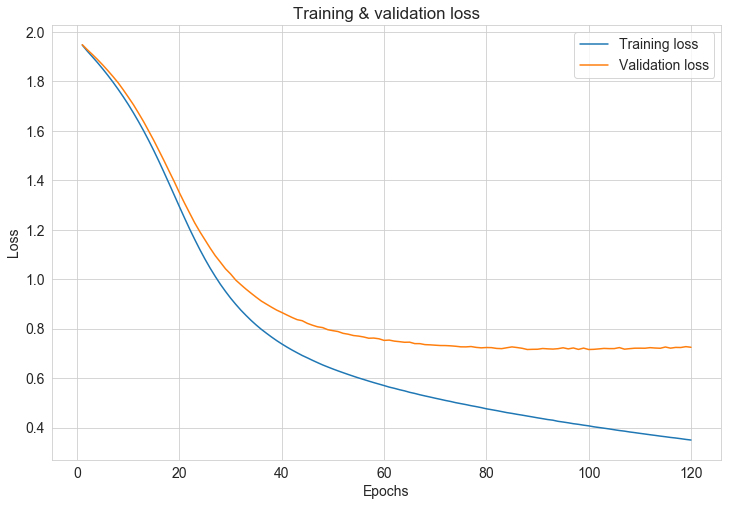
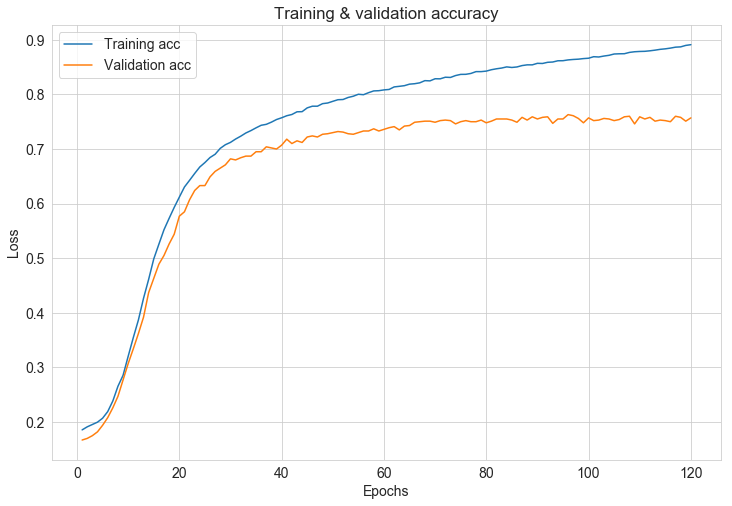
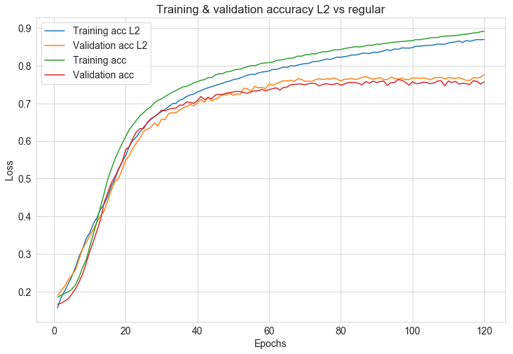
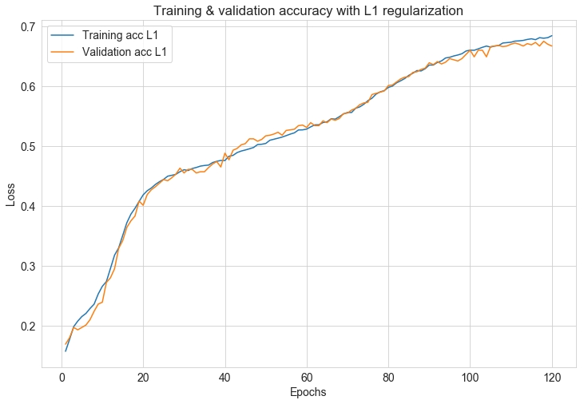
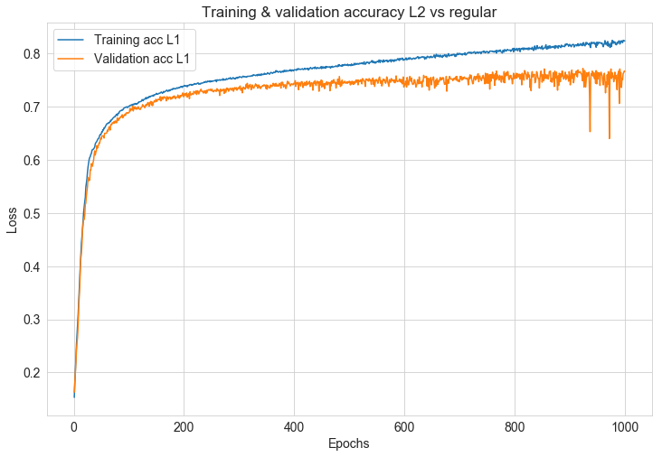

# Tuning Neural Networks with Regularization - Lab

## Introduction

Recall from the last lab that you had a training accuracy close to 90% and a test set accuracy close to 76%.

As with your previous machine learning work, you should be asking a couple of questions:
- Is there high bias? yes/no
- Is there high variance? yes/no 

In this lab, you'll use the a train-validate-test partition as well as a validation set to get better insights of how to tune neural networks using regularization techniques. You'll start by repeating the process from the last section: importing the data and performing preprocessing including one-hot encoding. From there, you'll define and compile the model like before. However, this time, when you are presented with the `history` dictionary of the model, you will have additional data entries for not only the train and test set but also the validation set.

## Objectives

You will be able to:

* Construct and run a basic model in Keras
* Construct a validation set and explain potential benefits
* Apply L1 and L2 regularization
* Apply dropout regularization
* Observe and comment on the effect of using more data

## Import the libraries

As usual, start by importing some of the packages and modules that you intend to use. The first thing you'll be doing is importing the data and taking a random sample, so that should clue you in to what tools to import. If you need more tools down the line, you can always import additional packages later.


```python
import matplotlib.pyplot as plt
import seaborn as sns
sns.set_style("whitegrid")
import pandas as pd
import numpy as np
import random
from sklearn.model_selection import train_test_split
from keras.utils.np_utils import to_categorical
from sklearn import preprocessing
from keras.preprocessing.text import Tokenizer
from keras import models
from keras import layers
from keras import optimizers
from sklearn.preprocessing import StandardScaler, LabelBinarizer
import warnings
warnings.filterwarnings('ignore')

```

    Using TensorFlow backend.
    

## Load the Data

As with the previous lab, the data is stored in a file **Bank_complaints.csv**. Load and preview the dataset.


```python
df = pd.read_csv('Bank_complaints.csv')
df.head()
```


<div>
<style scoped>
    .dataframe tbody tr th:only-of-type {
        vertical-align: middle;
    }

    .dataframe tbody tr th {
        vertical-align: top;
    }

    .dataframe thead th {
        text-align: right;
    }
</style>
<table border="1" class="dataframe">
  <thead>
    <tr style="text-align: right;">
      <th></th>
      <th>Product</th>
      <th>Consumer complaint narrative</th>
    </tr>
  </thead>
  <tbody>
    <tr>
      <th>0</th>
      <td>Student loan</td>
      <td>In XX/XX/XXXX I filled out the Fedlaon applica...</td>
    </tr>
    <tr>
      <th>1</th>
      <td>Student loan</td>
      <td>I am being contacted by a debt collector for p...</td>
    </tr>
    <tr>
      <th>2</th>
      <td>Student loan</td>
      <td>I cosigned XXXX student loans at SallieMae for...</td>
    </tr>
    <tr>
      <th>3</th>
      <td>Student loan</td>
      <td>Navient has sytematically and illegally failed...</td>
    </tr>
    <tr>
      <th>4</th>
      <td>Student loan</td>
      <td>My wife became eligible for XXXX Loan Forgiven...</td>
    </tr>
  </tbody>
</table>
</div>


## Preprocessing Overview

Before you begin to practice some of your new tools regarding regularization and optimization, let's practice munging some data as you did in the previous section with bank complaints. Recall some techniques:

* Train - test split
* Sampling in order to reduce training time (investigate model accuracy vs data size later on)
* One-hot encoding your complaint text
* Transforming your category labels

## Preprocessing: Generate a Random Sample

Since you have quite a bit of data and training networks takes a substantial amount of time and resources, downsample in order to test your initial pipeline. Going forward, these can be interesting areas of investigation: how does your models performance change as you increase (or decrease) the size of your dataset?  

Generate the random sample using seed 123 for consistency of results. Make your new sample have 10,000 observations.


```python
df = df.sample(10_000, random_state=123)
y = df["Product"]
X = df["Consumer complaint narrative"]
```

## Train-test Split

Below, perform an appropriate train test split.


```python
X_train, X_test, y_train, y_test = train_test_split(X, y, test_size=1500, random_state=42)
```

## Running the model using a validation set.

## Creating the Validation Set

In the lecture, you saw that in deep learning, you generally set aside a validation set, which is then used during hyperparameter tuning. Afterwards, when you have decided upon a final model, the test can then be used to define the final model perforance. 

In this example, take the first 1000 cases out of the training set to create a validation set. You should do this for both `train` and `label_train`.


```python
#Just run this block of code 

X_train_final, X_val, y_train_final, y_val = train_test_split(X_train, y_train, test_size=1000, random_state=123)
```

## Preprocessing: One-hot Encoding of the Complaints

As before, you need to do some preprocessing and data manipulationg before building the neural network. 

Keep the 2,000 most common words and use one-hot encoding to reformat the complaints into a matrix of vectors.


```python
#Your code here; use one-hot encoding to reformat the complaints into a matrix of vectors.
#Only keep the 2000 most common words.

tokenizer = Tokenizer(num_words=2000)
tokenizer.fit_on_texts(X_train_final)

X_train_tok = tokenizer.texts_to_matrix(X_train_final, mode='binary')
X_val = tokenizer.texts_to_matrix(X_val, mode='binary')
```

## Preprocessing: Encoding the Products

Similarly, now transform the descriptive product labels to integers labels. After transforming them to integer labels, retransform them into a matrix of binary flags, one for each of the various product labels.  
  
> **Note**: This is similar to your previous work with dummy variables. Each of the various product categories will be its own column, and each observation will be a row. In turn, each of these observation rows will have a 1 in the column associated with it's label, and all other entries for the row will be zero.


```python
#Your code here; transform the product labels to numerical values
lb = LabelBinarizer()
lb.fit(y_train_final)

y_train_lb = to_categorical(lb.transform(y_train_final))[:, :, 1]
y_val = to_categorical(lb.transform(y_val))[:, :, 1]
```

## Creating the Model

Rebuild a fully connected (Dense) layer network with relu activations in Keras.

Recall that you used 2 hidden with 50 units in the first layer and 25 in the second, both with a `relu` activation function. Because you are dealing with a multiclass problem (classifying the complaints into 7 classes), use a softmax classifyer in order to output 7 class probabilities per case. 


```python
np.shape(X_train)
```


    (8500,)


```python
#Your code here; build a neural network using Keras as described above.
model = models.Sequential()
model.add(layers.Dense(50, activation='relu', input_shape=(2000,))) #2 hidden layers
model.add(layers.Dense(25, activation='relu'))
model.add(layers.Dense(7, activation='softmax'))
```

## Compiling the Model
In the compiler, you'll be passing the optimizer, loss function, and metrics. Train the model for 120 epochs in mini-batches of 256 samples. This time, include the argument `validation_data` and assign it `(val, label_val)`


```python
model.compile(optimizer=optimizers.SGD(),
              loss='categorical_crossentropy',
              metrics=['accuracy'])
```


```python
X_train_tok
```


    array([[0., 1., 1., ..., 0., 0., 0.],
           [0., 1., 1., ..., 0., 0., 0.],
           [0., 1., 1., ..., 0., 0., 0.],
           ...,
           [0., 1., 1., ..., 0., 0., 0.],
           [0., 1., 1., ..., 0., 0., 0.],
           [0., 1., 1., ..., 0., 0., 0.]])


## Training the Model

Ok, now for the resource intensive part: time to train your model! Note that this is where you also introduce the validation data to the model.


```python
#Code provided; note the extra validation parameter passed.
model_val = model.fit(x= X_train_tok,
                    y=y_train_lb,
                    epochs=120,
                    batch_size=256,
                    validation_data=(X_val, y_val))
```

    Train on 7500 samples, validate on 1000 samples
    Epoch 1/120
    7500/7500 [==============================] - 1s 81us/step - loss: 1.9466 - acc: 0.1856 - val_loss: 1.9481 - val_acc: 0.1670
    Epoch 2/120
    7500/7500 [==============================] - 0s 58us/step - loss: 1.9217 - acc: 0.1912 - val_loss: 1.9275 - val_acc: 0.1700
    Epoch 3/120
    7500/7500 [==============================] - 0s 54us/step - loss: 1.8986 - acc: 0.1955 - val_loss: 1.9081 - val_acc: 0.1750
    Epoch 4/120
    7500/7500 [==============================] - 0s 52us/step - loss: 1.8751 - acc: 0.1997 - val_loss: 1.8878 - val_acc: 0.1820
    Epoch 5/120
    7500/7500 [==============================] - 0s 49us/step - loss: 1.8502 - acc: 0.2069 - val_loss: 1.8662 - val_acc: 0.1940
    Epoch 6/120
    7500/7500 [==============================] - 0s 54us/step - loss: 1.8241 - acc: 0.2191 - val_loss: 1.8433 - val_acc: 0.2080
    Epoch 7/120
    7500/7500 [==============================] - 0s 46us/step - loss: 1.7969 - acc: 0.2385 - val_loss: 1.8195 - val_acc: 0.2260
    Epoch 8/120
    7500/7500 [==============================] - 0s 54us/step - loss: 1.7682 - acc: 0.2655 - val_loss: 1.7945 - val_acc: 0.2470
    Epoch 9/120
    7500/7500 [==============================] - 0s 57us/step - loss: 1.7379 - acc: 0.2855 - val_loss: 1.7661 - val_acc: 0.2770
    Epoch 10/120
    7500/7500 [==============================] - 0s 40us/step - loss: 1.7062 - acc: 0.3204 - val_loss: 1.7361 - val_acc: 0.3070
    Epoch 11/120
    7500/7500 [==============================] - 0s 38us/step - loss: 1.6725 - acc: 0.3545 - val_loss: 1.7055 - val_acc: 0.3340
    Epoch 12/120
    7500/7500 [==============================] - 0s 53us/step - loss: 1.6369 - acc: 0.3869 - val_loss: 1.6715 - val_acc: 0.3620
    Epoch 13/120
    7500/7500 [==============================] - 0s 46us/step - loss: 1.5996 - acc: 0.4265 - val_loss: 1.6366 - val_acc: 0.3920
    Epoch 14/120
    7500/7500 [==============================] - 0s 44us/step - loss: 1.5602 - acc: 0.4612 - val_loss: 1.5984 - val_acc: 0.4370
    Epoch 15/120
    7500/7500 [==============================] - 0s 40us/step - loss: 1.5190 - acc: 0.4987 - val_loss: 1.5603 - val_acc: 0.4630
    Epoch 16/120
    7500/7500 [==============================] - 0s 42us/step - loss: 1.4758 - acc: 0.5256 - val_loss: 1.5194 - val_acc: 0.4890
    Epoch 17/120
    7500/7500 [==============================] - 0s 40us/step - loss: 1.4309 - acc: 0.5521 - val_loss: 1.4783 - val_acc: 0.5050
    Epoch 18/120
    7500/7500 [==============================] - 0s 41us/step - loss: 1.3852 - acc: 0.5729 - val_loss: 1.4357 - val_acc: 0.5260
    Epoch 19/120
    7500/7500 [==============================] - 0s 40us/step - loss: 1.3390 - acc: 0.5931 - val_loss: 1.3936 - val_acc: 0.5440
    Epoch 20/120
    7500/7500 [==============================] - 0s 40us/step - loss: 1.2927 - acc: 0.6119 - val_loss: 1.3491 - val_acc: 0.5770
    Epoch 21/120
    7500/7500 [==============================] - 0s 45us/step - loss: 1.2470 - acc: 0.6304 - val_loss: 1.3071 - val_acc: 0.5850
    Epoch 22/120
    7500/7500 [==============================] - 0s 47us/step - loss: 1.2023 - acc: 0.6427 - val_loss: 1.2669 - val_acc: 0.6070
    Epoch 23/120
    7500/7500 [==============================] - 0s 48us/step - loss: 1.1600 - acc: 0.6552 - val_loss: 1.2270 - val_acc: 0.6240
    Epoch 24/120
    7500/7500 [==============================] - 0s 54us/step - loss: 1.1192 - acc: 0.6671 - val_loss: 1.1915 - val_acc: 0.6330
    Epoch 25/120
    7500/7500 [==============================] - 0s 43us/step - loss: 1.0807 - acc: 0.6752 - val_loss: 1.1586 - val_acc: 0.6330
    Epoch 26/120
    7500/7500 [==============================] - 0s 40us/step - loss: 1.0445 - acc: 0.6844 - val_loss: 1.1256 - val_acc: 0.6490
    Epoch 27/120
    7500/7500 [==============================] - 0s 40us/step - loss: 1.0110 - acc: 0.6904 - val_loss: 1.0949 - val_acc: 0.6590
    Epoch 28/120
    7500/7500 [==============================] - 0s 42us/step - loss: 0.9793 - acc: 0.7012 - val_loss: 1.0686 - val_acc: 0.6650
    Epoch 29/120
    7500/7500 [==============================] - 0s 43us/step - loss: 0.9504 - acc: 0.7079 - val_loss: 1.0418 - val_acc: 0.6710
    Epoch 30/120
    7500/7500 [==============================] - 0s 48us/step - loss: 0.9232 - acc: 0.7121 - val_loss: 1.0209 - val_acc: 0.6820
    Epoch 31/120
    7500/7500 [==============================] - 0s 45us/step - loss: 0.8983 - acc: 0.7183 - val_loss: 0.9964 - val_acc: 0.6800
    Epoch 32/120
    7500/7500 [==============================] - 0s 41us/step - loss: 0.8748 - acc: 0.7235 - val_loss: 0.9778 - val_acc: 0.6840
    Epoch 33/120
    7500/7500 [==============================] - 0s 51us/step - loss: 0.8536 - acc: 0.7293 - val_loss: 0.9598 - val_acc: 0.6870
    Epoch 34/120
    7500/7500 [==============================] - 0s 42us/step - loss: 0.8333 - acc: 0.7337 - val_loss: 0.9431 - val_acc: 0.6870
    Epoch 35/120
    7500/7500 [==============================] - 0s 45us/step - loss: 0.8146 - acc: 0.7388 - val_loss: 0.9269 - val_acc: 0.6950
    Epoch 36/120
    7500/7500 [==============================] - 0s 50us/step - loss: 0.7972 - acc: 0.7435 - val_loss: 0.9114 - val_acc: 0.6950
    Epoch 37/120
    7500/7500 [==============================] - 0s 41us/step - loss: 0.7814 - acc: 0.7452 - val_loss: 0.8990 - val_acc: 0.7040
    Epoch 38/120
    7500/7500 [==============================] - 0s 43us/step - loss: 0.7660 - acc: 0.7492 - val_loss: 0.8866 - val_acc: 0.7020
    Epoch 39/120
    7500/7500 [==============================] - 0s 39us/step - loss: 0.7515 - acc: 0.7540 - val_loss: 0.8749 - val_acc: 0.7000
    Epoch 40/120
    7500/7500 [==============================] - 0s 42us/step - loss: 0.7381 - acc: 0.7572 - val_loss: 0.8652 - val_acc: 0.7070
    Epoch 41/120
    7500/7500 [==============================] - 0s 43us/step - loss: 0.7255 - acc: 0.7609 - val_loss: 0.8551 - val_acc: 0.7180
    Epoch 42/120
    7500/7500 [==============================] - 0s 51us/step - loss: 0.7135 - acc: 0.7632 - val_loss: 0.8452 - val_acc: 0.7100
    Epoch 43/120
    7500/7500 [==============================] - 0s 46us/step - loss: 0.7023 - acc: 0.7681 - val_loss: 0.8362 - val_acc: 0.7150
    Epoch 44/120
    7500/7500 [==============================] - 0s 45us/step - loss: 0.6913 - acc: 0.7684 - val_loss: 0.8319 - val_acc: 0.7120
    Epoch 45/120
    7500/7500 [==============================] - 0s 40us/step - loss: 0.6817 - acc: 0.7753 - val_loss: 0.8212 - val_acc: 0.7220
    Epoch 46/120
    7500/7500 [==============================] - 0s 40us/step - loss: 0.6718 - acc: 0.7784 - val_loss: 0.8137 - val_acc: 0.7240
    Epoch 47/120
    7500/7500 [==============================] - 0s 40us/step - loss: 0.6623 - acc: 0.7784 - val_loss: 0.8073 - val_acc: 0.7220
    Epoch 48/120
    7500/7500 [==============================] - 0s 42us/step - loss: 0.6531 - acc: 0.7831 - val_loss: 0.8040 - val_acc: 0.7270
    Epoch 49/120
    7500/7500 [==============================] - 0s 41us/step - loss: 0.6448 - acc: 0.7843 - val_loss: 0.7955 - val_acc: 0.7280
    Epoch 50/120
    7500/7500 [==============================] - 0s 41us/step - loss: 0.6367 - acc: 0.7873 - val_loss: 0.7916 - val_acc: 0.7300
    Epoch 51/120
    7500/7500 [==============================] - 0s 40us/step - loss: 0.6290 - acc: 0.7903 - val_loss: 0.7881 - val_acc: 0.7320
    Epoch 52/120
    7500/7500 [==============================] - 0s 43us/step - loss: 0.6217 - acc: 0.7907 - val_loss: 0.7808 - val_acc: 0.7310
    Epoch 53/120
    7500/7500 [==============================] - 0s 39us/step - loss: 0.6145 - acc: 0.7944 - val_loss: 0.7773 - val_acc: 0.7280
    Epoch 54/120
    7500/7500 [==============================] - 0s 36us/step - loss: 0.6075 - acc: 0.7967 - val_loss: 0.7720 - val_acc: 0.7270
    Epoch 55/120
    7500/7500 [==============================] - 0s 37us/step - loss: 0.6006 - acc: 0.8003 - val_loss: 0.7698 - val_acc: 0.7300
    Epoch 56/120
    7500/7500 [==============================] - 0s 37us/step - loss: 0.5943 - acc: 0.7995 - val_loss: 0.7662 - val_acc: 0.7330
    Epoch 57/120
    7500/7500 [==============================] - 0s 36us/step - loss: 0.5878 - acc: 0.8032 - val_loss: 0.7611 - val_acc: 0.7330
    Epoch 58/120
    7500/7500 [==============================] - 0s 53us/step - loss: 0.5816 - acc: 0.8064 - val_loss: 0.7617 - val_acc: 0.7370
    Epoch 59/120
    7500/7500 [==============================] - 0s 38us/step - loss: 0.5756 - acc: 0.8068 - val_loss: 0.7588 - val_acc: 0.7330
    Epoch 60/120
    7500/7500 [==============================] - 0s 52us/step - loss: 0.5697 - acc: 0.8083 - val_loss: 0.7523 - val_acc: 0.7360
    Epoch 61/120
    7500/7500 [==============================] - 0s 42us/step - loss: 0.5634 - acc: 0.8091 - val_loss: 0.7536 - val_acc: 0.7390
    Epoch 62/120
    7500/7500 [==============================] - 0s 50us/step - loss: 0.5586 - acc: 0.8137 - val_loss: 0.7494 - val_acc: 0.7410
    Epoch 63/120
    7500/7500 [==============================] - 0s 47us/step - loss: 0.5530 - acc: 0.8148 - val_loss: 0.7472 - val_acc: 0.7350
    Epoch 64/120
    7500/7500 [==============================] - 0s 42us/step - loss: 0.5483 - acc: 0.8160 - val_loss: 0.7447 - val_acc: 0.7420
    Epoch 65/120
    7500/7500 [==============================] - 0s 37us/step - loss: 0.5424 - acc: 0.8188 - val_loss: 0.7452 - val_acc: 0.7430
    Epoch 66/120
    7500/7500 [==============================] - 0s 37us/step - loss: 0.5378 - acc: 0.8196 - val_loss: 0.7393 - val_acc: 0.7490
    Epoch 67/120
    7500/7500 [==============================] - 0s 53us/step - loss: 0.5325 - acc: 0.8212 - val_loss: 0.7392 - val_acc: 0.7500
    Epoch 68/120
    7500/7500 [==============================] - 0s 47us/step - loss: 0.5277 - acc: 0.8252 - val_loss: 0.7352 - val_acc: 0.7510
    Epoch 69/120
    7500/7500 [==============================] - 0s 45us/step - loss: 0.5232 - acc: 0.8248 - val_loss: 0.7343 - val_acc: 0.7510
    Epoch 70/120
    7500/7500 [==============================] - 0s 37us/step - loss: 0.5185 - acc: 0.8287 - val_loss: 0.7329 - val_acc: 0.7490
    Epoch 71/120
    7500/7500 [==============================] - 0s 37us/step - loss: 0.5141 - acc: 0.8285 - val_loss: 0.7316 - val_acc: 0.7520
    Epoch 72/120
    7500/7500 [==============================] - 0s 37us/step - loss: 0.5094 - acc: 0.8315 - val_loss: 0.7314 - val_acc: 0.7530
    Epoch 73/120
    7500/7500 [==============================] - 0s 37us/step - loss: 0.5054 - acc: 0.8311 - val_loss: 0.7303 - val_acc: 0.7520
    Epoch 74/120
    7500/7500 [==============================] - 0s 37us/step - loss: 0.5005 - acc: 0.8345 - val_loss: 0.7286 - val_acc: 0.7460
    Epoch 75/120
    7500/7500 [==============================] - 0s 39us/step - loss: 0.4966 - acc: 0.8367 - val_loss: 0.7263 - val_acc: 0.7500
    Epoch 76/120
    7500/7500 [==============================] - 0s 37us/step - loss: 0.4927 - acc: 0.8368 - val_loss: 0.7261 - val_acc: 0.7520
    Epoch 77/120
    7500/7500 [==============================] - 0s 43us/step - loss: 0.4883 - acc: 0.8384 - val_loss: 0.7275 - val_acc: 0.7500
    Epoch 78/120
    7500/7500 [==============================] - 0s 39us/step - loss: 0.4846 - acc: 0.8417 - val_loss: 0.7241 - val_acc: 0.7500
    Epoch 79/120
    7500/7500 [==============================] - 0s 42us/step - loss: 0.4804 - acc: 0.8417 - val_loss: 0.7222 - val_acc: 0.7530
    Epoch 80/120
    7500/7500 [==============================] - 0s 41us/step - loss: 0.4757 - acc: 0.8427 - val_loss: 0.7235 - val_acc: 0.7480
    Epoch 81/120
    7500/7500 [==============================] - 0s 43us/step - loss: 0.4721 - acc: 0.8452 - val_loss: 0.7230 - val_acc: 0.7510
    Epoch 82/120
    7500/7500 [==============================] - 0s 40us/step - loss: 0.4684 - acc: 0.8469 - val_loss: 0.7198 - val_acc: 0.7550
    Epoch 83/120
    7500/7500 [==============================] - 0s 38us/step - loss: 0.4644 - acc: 0.8483 - val_loss: 0.7190 - val_acc: 0.7550
    Epoch 84/120
    7500/7500 [==============================] - 0s 43us/step - loss: 0.4603 - acc: 0.8504 - val_loss: 0.7226 - val_acc: 0.7550
    Epoch 85/120
    7500/7500 [==============================] - 0s 43us/step - loss: 0.4571 - acc: 0.8493 - val_loss: 0.7260 - val_acc: 0.7530
    Epoch 86/120
    7500/7500 [==============================] - 0s 42us/step - loss: 0.4534 - acc: 0.8503 - val_loss: 0.7235 - val_acc: 0.7490
    Epoch 87/120
    7500/7500 [==============================] - 0s 41us/step - loss: 0.4501 - acc: 0.8528 - val_loss: 0.7204 - val_acc: 0.7580
    Epoch 88/120
    7500/7500 [==============================] - 0s 43us/step - loss: 0.4464 - acc: 0.8541 - val_loss: 0.7155 - val_acc: 0.7530
    Epoch 89/120
    7500/7500 [==============================] - 0s 39us/step - loss: 0.4429 - acc: 0.8541 - val_loss: 0.7162 - val_acc: 0.7590
    Epoch 90/120
    7500/7500 [==============================] - 0s 44us/step - loss: 0.4392 - acc: 0.8569 - val_loss: 0.7165 - val_acc: 0.7550
    Epoch 91/120
    7500/7500 [==============================] - 0s 38us/step - loss: 0.4358 - acc: 0.8567 - val_loss: 0.7195 - val_acc: 0.7580
    Epoch 92/120
    7500/7500 [==============================] - 0s 39us/step - loss: 0.4322 - acc: 0.8588 - val_loss: 0.7181 - val_acc: 0.7590
    Epoch 93/120
    7500/7500 [==============================] - 0s 44us/step - loss: 0.4296 - acc: 0.8593 - val_loss: 0.7172 - val_acc: 0.7470
    Epoch 94/120
    7500/7500 [==============================] - 0s 38us/step - loss: 0.4251 - acc: 0.8616 - val_loss: 0.7188 - val_acc: 0.7550
    Epoch 95/120
    7500/7500 [==============================] - 0s 44us/step - loss: 0.4222 - acc: 0.8617 - val_loss: 0.7225 - val_acc: 0.7550
    Epoch 96/120
    7500/7500 [==============================] - 0s 39us/step - loss: 0.4191 - acc: 0.8632 - val_loss: 0.7180 - val_acc: 0.7630
    Epoch 97/120
    7500/7500 [==============================] - 0s 38us/step - loss: 0.4155 - acc: 0.8640 - val_loss: 0.7217 - val_acc: 0.7610
    Epoch 98/120
    7500/7500 [==============================] - 0s 37us/step - loss: 0.4129 - acc: 0.8645 - val_loss: 0.7159 - val_acc: 0.7560
    Epoch 99/120
    7500/7500 [==============================] - 0s 38us/step - loss: 0.4095 - acc: 0.8656 - val_loss: 0.7211 - val_acc: 0.7480
    Epoch 100/120
    7500/7500 [==============================] - 0s 38us/step - loss: 0.4067 - acc: 0.8663 - val_loss: 0.7155 - val_acc: 0.7570
    Epoch 101/120
    7500/7500 [==============================] - 0s 38us/step - loss: 0.4029 - acc: 0.8691 - val_loss: 0.7162 - val_acc: 0.7520
    Epoch 102/120
    7500/7500 [==============================] - 0s 39us/step - loss: 0.4001 - acc: 0.8685 - val_loss: 0.7179 - val_acc: 0.7530
    Epoch 103/120
    7500/7500 [==============================] - 0s 38us/step - loss: 0.3972 - acc: 0.8703 - val_loss: 0.7199 - val_acc: 0.7560
    Epoch 104/120
    7500/7500 [==============================] - 0s 38us/step - loss: 0.3943 - acc: 0.8716 - val_loss: 0.7191 - val_acc: 0.7550
    Epoch 105/120
    7500/7500 [==============================] - 0s 37us/step - loss: 0.3910 - acc: 0.8740 - val_loss: 0.7192 - val_acc: 0.7520
    Epoch 106/120
    7500/7500 [==============================] - 0s 38us/step - loss: 0.3879 - acc: 0.8744 - val_loss: 0.7232 - val_acc: 0.7540
    Epoch 107/120
    7500/7500 [==============================] - 0s 38us/step - loss: 0.3854 - acc: 0.8745 - val_loss: 0.7168 - val_acc: 0.7590
    Epoch 108/120
    7500/7500 [==============================] - 0s 39us/step - loss: 0.3820 - acc: 0.8769 - val_loss: 0.7189 - val_acc: 0.7600
    Epoch 109/120
    7500/7500 [==============================] - 0s 38us/step - loss: 0.3794 - acc: 0.8781 - val_loss: 0.7207 - val_acc: 0.7460
    Epoch 110/120
    7500/7500 [==============================] - 0s 38us/step - loss: 0.3765 - acc: 0.8787 - val_loss: 0.7208 - val_acc: 0.7590
    Epoch 111/120
    7500/7500 [==============================] - 0s 38us/step - loss: 0.3737 - acc: 0.8789 - val_loss: 0.7206 - val_acc: 0.7550
    Epoch 112/120
    7500/7500 [==============================] - 0s 38us/step - loss: 0.3708 - acc: 0.8799 - val_loss: 0.7229 - val_acc: 0.7580
    Epoch 113/120
    7500/7500 [==============================] - 0s 41us/step - loss: 0.3681 - acc: 0.8811 - val_loss: 0.7214 - val_acc: 0.7510
    Epoch 114/120
    7500/7500 [==============================] - 0s 39us/step - loss: 0.3653 - acc: 0.8825 - val_loss: 0.7205 - val_acc: 0.7530
    Epoch 115/120
    7500/7500 [==============================] - 0s 38us/step - loss: 0.3627 - acc: 0.8835 - val_loss: 0.7256 - val_acc: 0.7520
    Epoch 116/120
    7500/7500 [==============================] - 0s 39us/step - loss: 0.3599 - acc: 0.8848 - val_loss: 0.7209 - val_acc: 0.7500
    Epoch 117/120
    7500/7500 [==============================] - 0s 38us/step - loss: 0.3576 - acc: 0.8865 - val_loss: 0.7239 - val_acc: 0.7600
    Epoch 118/120
    7500/7500 [==============================] - 0s 39us/step - loss: 0.3548 - acc: 0.8871 - val_loss: 0.7235 - val_acc: 0.7580
    Epoch 119/120
    7500/7500 [==============================] - 0s 38us/step - loss: 0.3519 - acc: 0.8897 - val_loss: 0.7270 - val_acc: 0.7510
    Epoch 120/120
    7500/7500 [==============================] - 0s 37us/step - loss: 0.3494 - acc: 0.8911 - val_loss: 0.7245 - val_acc: 0.7570
    

## Retrieving Performance Results: the `history` dictionary

The dictionary `history` contains four entries this time: one per metric that was being monitored during training and during validation.


```python
model_val_dict = model_val.history
model_val_dict.keys()
```


    dict_keys(['val_loss', 'val_acc', 'loss', 'acc'])


```python
results_train = model.evaluate(X_train_tok, y_train_lb)
print(f'Training Loss: {results_train[0]:.3} Training Accuracy: {results_train[1]:.3}')
```

    7500/7500 [==============================] - 0s 43us/step
    Training Loss: 0.346 Training Accuracy: 0.891
    

## Preprocess then evaluate our models performance on the test set


```python
X_test_tok = tokenizer.texts_to_matrix(X_test, mode='binary')
y_test_cat = to_categorical(lb.transform(y_test))[:, :, 1]

results_test = model.evaluate(X_test_tok, y_test_cat)
print(f'Testing Loss: {results_test[0]:.3} Testing Accuracy: {results_test[1]:.3}')
```

    1500/1500 [==============================] - 0s 41us/step
    Testing Loss: 0.613 Testing Accuracy: 0.784
    


```python
model.metrics_names
```


    ['loss', 'acc']


The first element of the list returned by `model.evaluate` is the loss, and the second is the accuracy score. 

Note that the result you obtained here isn't exactly the same as before. This is because the training set is slightly different! You removed 1000 instances for validation!

## Plotting the Results

Plot the loss function versus the number of epochs. Be sure to include the training and the validation loss in the same plot. Then, create a second plot comparing training and validation accuracy to the number of epochs.


```python
# Loss vs number of epochs with train and val set
fig, ax = plt.subplots(figsize=(12, 8))

loss_values = model_val_dict['loss']
val_loss_values = model_val_dict['val_loss']

epochs = range(1, len(loss_values) + 1)
ax.plot(epochs, loss_values, label='Training loss')
ax.plot(epochs, val_loss_values, label='Validation loss')

ax.set_title('Training & validation loss')
ax.set_xlabel('Epochs')
ax.set_ylabel('Loss')
ax.legend();


```





```python
# Accuracy vs number of epochs with train and val set
fig, ax = plt.subplots(figsize=(12, 8))

acc_values = model_val_dict['acc'] 
val_acc_values = model_val_dict['val_acc']

ax.plot(epochs, acc_values, label='Training acc')
ax.plot(epochs, val_acc_values, label='Validation acc')
ax.set_title('Training & validation accuracy')
ax.set_xlabel('Epochs')
ax.set_ylabel('Loss')
ax.legend();
```





Notice an interesting pattern here: although the training accuracy keeps increasing when going through more epochs, and the training loss keeps decreasing, the validation accuracy and loss seem to be reaching a limit around the 60th epoch. This means that you're probably **overfitting** the model to the training data when you train for many epochs past this dropoff point of around 40 epochs. Luckily, you learned how to tackle overfitting in the previous lecture! Since it seems clear that you are training too long, include early stopping at the 60th epoch first.

## Early Stopping

Below, observe how to update the model to include an earlier cutoff point:


```python
random.seed(123)
model = models.Sequential()
model.add(layers.Dense(50, activation='relu', input_shape=(2000,))) #2 hidden layers
model.add(layers.Dense(25, activation='relu'))
model.add(layers.Dense(7, activation='softmax'))

model.compile(optimizer='SGD',
              loss='categorical_crossentropy',
              metrics=['accuracy'])

final_model = model.fit(X_train_tok,
                    y_train_lb,
                    epochs=60,
                    batch_size=256,
                    validation_data=(X_val, y_val))
```

    Train on 7500 samples, validate on 1000 samples
    Epoch 1/60
    7500/7500 [==============================] - 0s 66us/step - loss: 1.9632 - acc: 0.1417 - val_loss: 1.9395 - val_acc: 0.1470
    Epoch 2/60
    7500/7500 [==============================] - 0s 41us/step - loss: 1.9302 - acc: 0.1616 - val_loss: 1.9189 - val_acc: 0.1680
    Epoch 3/60
    7500/7500 [==============================] - 0s 44us/step - loss: 1.9074 - acc: 0.1853 - val_loss: 1.8997 - val_acc: 0.1830
    Epoch 4/60
    7500/7500 [==============================] - 0s 39us/step - loss: 1.8836 - acc: 0.2124 - val_loss: 1.8784 - val_acc: 0.2090
    Epoch 5/60
    7500/7500 [==============================] - 0s 43us/step - loss: 1.8574 - acc: 0.2348 - val_loss: 1.8540 - val_acc: 0.2390
    Epoch 6/60
    7500/7500 [==============================] - 0s 41us/step - loss: 1.8280 - acc: 0.2688 - val_loss: 1.8260 - val_acc: 0.2680
    Epoch 7/60
    7500/7500 [==============================] - 0s 41us/step - loss: 1.7942 - acc: 0.3033 - val_loss: 1.7934 - val_acc: 0.2990
    Epoch 8/60
    7500/7500 [==============================] - 0s 44us/step - loss: 1.7557 - acc: 0.3345 - val_loss: 1.7562 - val_acc: 0.3300
    Epoch 9/60
    7500/7500 [==============================] - 0s 52us/step - loss: 1.7128 - acc: 0.3692 - val_loss: 1.7145 - val_acc: 0.3860
    Epoch 10/60
    7500/7500 [==============================] - 0s 43us/step - loss: 1.6663 - acc: 0.4039 - val_loss: 1.6698 - val_acc: 0.4090
    Epoch 11/60
    7500/7500 [==============================] - 0s 48us/step - loss: 1.6159 - acc: 0.4400 - val_loss: 1.6223 - val_acc: 0.4380
    Epoch 12/60
    7500/7500 [==============================] - 0s 53us/step - loss: 1.5627 - acc: 0.4691 - val_loss: 1.5729 - val_acc: 0.4510
    Epoch 13/60
    7500/7500 [==============================] - 0s 41us/step - loss: 1.5078 - acc: 0.4976 - val_loss: 1.5220 - val_acc: 0.4710
    Epoch 14/60
    7500/7500 [==============================] - 0s 41us/step - loss: 1.4523 - acc: 0.5216 - val_loss: 1.4692 - val_acc: 0.5140
    Epoch 15/60
    7500/7500 [==============================] - 0s 42us/step - loss: 1.3977 - acc: 0.5507 - val_loss: 1.4203 - val_acc: 0.5280
    Epoch 16/60
    7500/7500 [==============================] - 0s 41us/step - loss: 1.3442 - acc: 0.5691 - val_loss: 1.3710 - val_acc: 0.5470
    Epoch 17/60
    7500/7500 [==============================] - 0s 41us/step - loss: 1.2925 - acc: 0.5864 - val_loss: 1.3253 - val_acc: 0.5580
    Epoch 18/60
    7500/7500 [==============================] - 0s 42us/step - loss: 1.2437 - acc: 0.6065 - val_loss: 1.2800 - val_acc: 0.5840
    Epoch 19/60
    7500/7500 [==============================] - 0s 42us/step - loss: 1.1974 - acc: 0.6232 - val_loss: 1.2393 - val_acc: 0.5940
    Epoch 20/60
    7500/7500 [==============================] - 0s 40us/step - loss: 1.1541 - acc: 0.6359 - val_loss: 1.2007 - val_acc: 0.6120
    Epoch 21/60
    7500/7500 [==============================] - 0s 40us/step - loss: 1.1140 - acc: 0.6501 - val_loss: 1.1658 - val_acc: 0.6190
    Epoch 22/60
    7500/7500 [==============================] - 0s 45us/step - loss: 1.0764 - acc: 0.6611 - val_loss: 1.1336 - val_acc: 0.6230
    Epoch 23/60
    7500/7500 [==============================] - 0s 45us/step - loss: 1.0418 - acc: 0.6705 - val_loss: 1.1020 - val_acc: 0.6440
    Epoch 24/60
    7500/7500 [==============================] - 0s 51us/step - loss: 1.0094 - acc: 0.6797 - val_loss: 1.0747 - val_acc: 0.6430
    Epoch 25/60
    7500/7500 [==============================] - 0s 41us/step - loss: 0.9801 - acc: 0.6848 - val_loss: 1.0479 - val_acc: 0.6550
    Epoch 26/60
    7500/7500 [==============================] - 0s 41us/step - loss: 0.9522 - acc: 0.6939 - val_loss: 1.0235 - val_acc: 0.6590
    Epoch 27/60
    7500/7500 [==============================] - 0s 43us/step - loss: 0.9269 - acc: 0.7027 - val_loss: 1.0021 - val_acc: 0.6640
    Epoch 28/60
    7500/7500 [==============================] - 0s 41us/step - loss: 0.9031 - acc: 0.7061 - val_loss: 0.9829 - val_acc: 0.6720
    Epoch 29/60
    7500/7500 [==============================] - 0s 43us/step - loss: 0.8815 - acc: 0.7116 - val_loss: 0.9638 - val_acc: 0.6770
    Epoch 30/60
    7500/7500 [==============================] - 0s 42us/step - loss: 0.8614 - acc: 0.7157 - val_loss: 0.9472 - val_acc: 0.6830
    Epoch 31/60
    7500/7500 [==============================] - 0s 42us/step - loss: 0.8427 - acc: 0.7192 - val_loss: 0.9324 - val_acc: 0.6810
    Epoch 32/60
    7500/7500 [==============================] - 0s 42us/step - loss: 0.8252 - acc: 0.7220 - val_loss: 0.9172 - val_acc: 0.6930
    Epoch 33/60
    7500/7500 [==============================] - 0s 44us/step - loss: 0.8089 - acc: 0.7276 - val_loss: 0.9050 - val_acc: 0.6980
    Epoch 34/60
    7500/7500 [==============================] - 0s 42us/step - loss: 0.7938 - acc: 0.7311 - val_loss: 0.8933 - val_acc: 0.7000
    Epoch 35/60
    7500/7500 [==============================] - 0s 51us/step - loss: 0.7799 - acc: 0.7349 - val_loss: 0.8811 - val_acc: 0.7030
    Epoch 36/60
    7500/7500 [==============================] - 0s 55us/step - loss: 0.7662 - acc: 0.7368 - val_loss: 0.8709 - val_acc: 0.7000
    Epoch 37/60
    7500/7500 [==============================] - 0s 48us/step - loss: 0.7536 - acc: 0.7400 - val_loss: 0.8616 - val_acc: 0.7070
    Epoch 38/60
    7500/7500 [==============================] - 0s 52us/step - loss: 0.7418 - acc: 0.7473 - val_loss: 0.8536 - val_acc: 0.7060
    Epoch 39/60
    7500/7500 [==============================] - 0s 52us/step - loss: 0.7305 - acc: 0.7479 - val_loss: 0.8462 - val_acc: 0.7020
    Epoch 40/60
    7500/7500 [==============================] - 0s 38us/step - loss: 0.7197 - acc: 0.7507 - val_loss: 0.8375 - val_acc: 0.7110
    Epoch 41/60
    7500/7500 [==============================] - 0s 44us/step - loss: 0.7093 - acc: 0.7557 - val_loss: 0.8320 - val_acc: 0.7070
    Epoch 42/60
    7500/7500 [==============================] - 0s 47us/step - loss: 0.6999 - acc: 0.7575 - val_loss: 0.8249 - val_acc: 0.7130
    Epoch 43/60
    7500/7500 [==============================] - 0s 47us/step - loss: 0.6910 - acc: 0.7597 - val_loss: 0.8175 - val_acc: 0.7150
    Epoch 44/60
    7500/7500 [==============================] - 0s 46us/step - loss: 0.6816 - acc: 0.7644 - val_loss: 0.8114 - val_acc: 0.7230
    Epoch 45/60
    7500/7500 [==============================] - 0s 38us/step - loss: 0.6734 - acc: 0.7660 - val_loss: 0.8096 - val_acc: 0.7190
    Epoch 46/60
    7500/7500 [==============================] - 0s 38us/step - loss: 0.6652 - acc: 0.7684 - val_loss: 0.7999 - val_acc: 0.7130
    Epoch 47/60
    7500/7500 [==============================] - 0s 39us/step - loss: 0.6578 - acc: 0.7708 - val_loss: 0.7942 - val_acc: 0.7270
    Epoch 48/60
    7500/7500 [==============================] - 0s 49us/step - loss: 0.6495 - acc: 0.7732 - val_loss: 0.7907 - val_acc: 0.7260
    Epoch 49/60
    7500/7500 [==============================] - 0s 47us/step - loss: 0.6428 - acc: 0.7752 - val_loss: 0.7857 - val_acc: 0.7280
    Epoch 50/60
    7500/7500 [==============================] - 0s 39us/step - loss: 0.6353 - acc: 0.7781 - val_loss: 0.7849 - val_acc: 0.7260
    Epoch 51/60
    7500/7500 [==============================] - 0s 48us/step - loss: 0.6288 - acc: 0.7785 - val_loss: 0.7793 - val_acc: 0.7340
    Epoch 52/60
    7500/7500 [==============================] - 0s 45us/step - loss: 0.6223 - acc: 0.7829 - val_loss: 0.7754 - val_acc: 0.7290
    Epoch 53/60
    7500/7500 [==============================] - 0s 47us/step - loss: 0.6157 - acc: 0.7840 - val_loss: 0.7708 - val_acc: 0.7240
    Epoch 54/60
    7500/7500 [==============================] - 0s 49us/step - loss: 0.6096 - acc: 0.7857 - val_loss: 0.7669 - val_acc: 0.7390
    Epoch 55/60
    7500/7500 [==============================] - 0s 39us/step - loss: 0.6033 - acc: 0.7876 - val_loss: 0.7638 - val_acc: 0.7330
    Epoch 56/60
    7500/7500 [==============================] - 0s 50us/step - loss: 0.5975 - acc: 0.7912 - val_loss: 0.7619 - val_acc: 0.7320
    Epoch 57/60
    7500/7500 [==============================] - 0s 49us/step - loss: 0.5913 - acc: 0.7929 - val_loss: 0.7601 - val_acc: 0.7320
    Epoch 58/60
    7500/7500 [==============================] - 0s 39us/step - loss: 0.5863 - acc: 0.7943 - val_loss: 0.7564 - val_acc: 0.7350
    Epoch 59/60
    7500/7500 [==============================] - 0s 37us/step - loss: 0.5802 - acc: 0.7951 - val_loss: 0.7539 - val_acc: 0.7360
    Epoch 60/60
    7500/7500 [==============================] - 0s 39us/step - loss: 0.5750 - acc: 0.7969 - val_loss: 0.7498 - val_acc: 0.7410
    

Now, you can use the test set to make label predictions


```python
results_train = model.evaluate(X_train_tok, y_train_lb)
print(f'Training Loss: {results_train[0]:.3} Training Accuracy: {results_train[1]:.3}')

results_test = model.evaluate(X_test_tok, y_test_cat)
print(f'Testing Loss: {results_test[0]:.3} Testing Accuracy: {results_test[1]:.3}')
```

    7500/7500 [==============================] - 0s 43us/step
    Training Loss: 0.57 Training Accuracy: 0.8
    1500/1500 [==============================] - 0s 44us/step
    Testing Loss: 0.66 Testing Accuracy: 0.75
    

We've significantly reduced the variance, so this is already pretty good! your test set accuracy is slightly worse, but this model will definitely be more robust than the 120 epochs model you originally fit.

Now, take a look at how regularization techniques can further improve your model performance.

## L2 Regularization

First, take a look at L2 regularization. Keras makes L2 regularization easy. Simply add the `kernel_regularizer=keras.regularizers.l2(lambda_coeff)` parameter to any model layer. The `lambda_coeff` parameter determines the strength of the regularization you wish to perform.


```python
from keras import regularizers
random.seed(123)
model = models.Sequential()
model.add(layers.Dense(50, activation='relu',kernel_regularizer=regularizers.l2(0.005), input_shape=(2000,))) #2 hidden layers
model.add(layers.Dense(25, kernel_regularizer=regularizers.l2(0.005), activation='relu'))
model.add(layers.Dense(7, activation='softmax'))

model.compile(optimizer='SGD',
              loss='categorical_crossentropy',
              metrics=['accuracy'])

L2_model = model.fit(X_train_tok,
                    y_train_lb,
                    epochs=120,
                    batch_size=256,
                    validation_data=(X_val, y_val))
```

    Train on 7500 samples, validate on 1000 samples
    Epoch 1/120
    7500/7500 [==============================] - 0s 62us/step - loss: 2.6003 - acc: 0.1575 - val_loss: 2.5862 - val_acc: 0.1910
    Epoch 2/120
    7500/7500 [==============================] - 0s 39us/step - loss: 2.5758 - acc: 0.1853 - val_loss: 2.5683 - val_acc: 0.2020
    Epoch 3/120
    7500/7500 [==============================] - 0s 40us/step - loss: 2.5584 - acc: 0.2024 - val_loss: 2.5533 - val_acc: 0.2150
    Epoch 4/120
    7500/7500 [==============================] - 0s 39us/step - loss: 2.5419 - acc: 0.2220 - val_loss: 2.5385 - val_acc: 0.2320
    Epoch 5/120
    7500/7500 [==============================] - 0s 39us/step - loss: 2.5248 - acc: 0.2408 - val_loss: 2.5224 - val_acc: 0.2440
    Epoch 6/120
    7500/7500 [==============================] - 0s 40us/step - loss: 2.5057 - acc: 0.2652 - val_loss: 2.5036 - val_acc: 0.2580
    Epoch 7/120
    7500/7500 [==============================] - 0s 40us/step - loss: 2.4841 - acc: 0.2937 - val_loss: 2.4818 - val_acc: 0.2870
    Epoch 8/120
    7500/7500 [==============================] - 0s 39us/step - loss: 2.4601 - acc: 0.3145 - val_loss: 2.4584 - val_acc: 0.3140
    Epoch 9/120
    7500/7500 [==============================] - 0s 39us/step - loss: 2.4336 - acc: 0.3415 - val_loss: 2.4341 - val_acc: 0.3310
    Epoch 10/120
    7500/7500 [==============================] - 0s 39us/step - loss: 2.4050 - acc: 0.3568 - val_loss: 2.4068 - val_acc: 0.3490
    Epoch 11/120
    7500/7500 [==============================] - 0s 39us/step - loss: 2.3739 - acc: 0.3811 - val_loss: 2.3774 - val_acc: 0.3660
    Epoch 12/120
    7500/7500 [==============================] - 0s 40us/step - loss: 2.3406 - acc: 0.3965 - val_loss: 2.3449 - val_acc: 0.3850
    Epoch 13/120
    7500/7500 [==============================] - 0s 39us/step - loss: 2.3048 - acc: 0.4195 - val_loss: 2.3107 - val_acc: 0.4010
    Epoch 14/120
    7500/7500 [==============================] - 0s 39us/step - loss: 2.2661 - acc: 0.4328 - val_loss: 2.2733 - val_acc: 0.4150
    Epoch 15/120
    7500/7500 [==============================] - 0s 39us/step - loss: 2.2246 - acc: 0.4524 - val_loss: 2.2328 - val_acc: 0.4410
    Epoch 16/120
    7500/7500 [==============================] - 0s 40us/step - loss: 2.1806 - acc: 0.4801 - val_loss: 2.1905 - val_acc: 0.4700
    Epoch 17/120
    7500/7500 [==============================] - 0s 39us/step - loss: 2.1347 - acc: 0.4989 - val_loss: 2.1474 - val_acc: 0.4920
    Epoch 18/120
    7500/7500 [==============================] - 0s 39us/step - loss: 2.0878 - acc: 0.5237 - val_loss: 2.1038 - val_acc: 0.5000
    Epoch 19/120
    7500/7500 [==============================] - 0s 59us/step - loss: 2.0409 - acc: 0.5444 - val_loss: 2.0594 - val_acc: 0.5240
    Epoch 20/120
    7500/7500 [==============================] - 0s 44us/step - loss: 1.9937 - acc: 0.5617 - val_loss: 2.0156 - val_acc: 0.5490
    Epoch 21/120
    7500/7500 [==============================] - 0s 42us/step - loss: 1.9476 - acc: 0.5856 - val_loss: 1.9714 - val_acc: 0.5620
    Epoch 22/120
    7500/7500 [==============================] - 0s 42us/step - loss: 1.9021 - acc: 0.6015 - val_loss: 1.9302 - val_acc: 0.5810
    Epoch 23/120
    7500/7500 [==============================] - 0s 41us/step - loss: 1.8586 - acc: 0.6107 - val_loss: 1.8890 - val_acc: 0.5950
    Epoch 24/120
    7500/7500 [==============================] - 0s 42us/step - loss: 1.8170 - acc: 0.6245 - val_loss: 1.8512 - val_acc: 0.6080
    Epoch 25/120
    7500/7500 [==============================] - 0s 42us/step - loss: 1.7766 - acc: 0.6363 - val_loss: 1.8142 - val_acc: 0.6260
    Epoch 26/120
    7500/7500 [==============================] - 0s 40us/step - loss: 1.7385 - acc: 0.6476 - val_loss: 1.7797 - val_acc: 0.6310
    Epoch 27/120
    7500/7500 [==============================] - 0s 41us/step - loss: 1.7027 - acc: 0.6568 - val_loss: 1.7495 - val_acc: 0.6360
    Epoch 28/120
    7500/7500 [==============================] - 0s 41us/step - loss: 1.6693 - acc: 0.6645 - val_loss: 1.7199 - val_acc: 0.6480
    Epoch 29/120
    7500/7500 [==============================] - 0s 40us/step - loss: 1.6374 - acc: 0.6723 - val_loss: 1.6904 - val_acc: 0.6400
    Epoch 30/120
    7500/7500 [==============================] - 0s 39us/step - loss: 1.6079 - acc: 0.6777 - val_loss: 1.6619 - val_acc: 0.6580
    Epoch 31/120
    7500/7500 [==============================] - 0s 42us/step - loss: 1.5802 - acc: 0.6841 - val_loss: 1.6379 - val_acc: 0.6570
    Epoch 32/120
    7500/7500 [==============================] - 0s 39us/step - loss: 1.5539 - acc: 0.6911 - val_loss: 1.6142 - val_acc: 0.6730
    Epoch 33/120
    7500/7500 [==============================] - 0s 41us/step - loss: 1.5295 - acc: 0.6991 - val_loss: 1.5915 - val_acc: 0.6750
    Epoch 34/120
    7500/7500 [==============================] - 0s 41us/step - loss: 1.5067 - acc: 0.7000 - val_loss: 1.5732 - val_acc: 0.6750
    Epoch 35/120
    7500/7500 [==============================] - 0s 39us/step - loss: 1.4847 - acc: 0.7083 - val_loss: 1.5531 - val_acc: 0.6820
    Epoch 36/120
    7500/7500 [==============================] - 0s 40us/step - loss: 1.4644 - acc: 0.7115 - val_loss: 1.5347 - val_acc: 0.6880
    Epoch 37/120
    7500/7500 [==============================] - 0s 41us/step - loss: 1.4453 - acc: 0.7183 - val_loss: 1.5170 - val_acc: 0.6910
    Epoch 38/120
    7500/7500 [==============================] - 0s 39us/step - loss: 1.4268 - acc: 0.7221 - val_loss: 1.5026 - val_acc: 0.6970
    Epoch 39/120
    7500/7500 [==============================] - 0s 39us/step - loss: 1.4101 - acc: 0.7247 - val_loss: 1.4891 - val_acc: 0.6930
    Epoch 40/120
    7500/7500 [==============================] - 0s 41us/step - loss: 1.3940 - acc: 0.7301 - val_loss: 1.4739 - val_acc: 0.7010
    Epoch 41/120
    7500/7500 [==============================] - 0s 39us/step - loss: 1.3783 - acc: 0.7336 - val_loss: 1.4602 - val_acc: 0.7100
    Epoch 42/120
    7500/7500 [==============================] - 0s 39us/step - loss: 1.3633 - acc: 0.7381 - val_loss: 1.4487 - val_acc: 0.7030
    Epoch 43/120
    7500/7500 [==============================] - 0s 39us/step - loss: 1.3494 - acc: 0.7412 - val_loss: 1.4378 - val_acc: 0.7170
    Epoch 44/120
    7500/7500 [==============================] - 0s 38us/step - loss: 1.3362 - acc: 0.7443 - val_loss: 1.4260 - val_acc: 0.7060
    Epoch 45/120
    7500/7500 [==============================] - 0s 39us/step - loss: 1.3233 - acc: 0.7472 - val_loss: 1.4167 - val_acc: 0.7110
    Epoch 46/120
    7500/7500 [==============================] - 0s 40us/step - loss: 1.3112 - acc: 0.7503 - val_loss: 1.4054 - val_acc: 0.7150
    Epoch 47/120
    7500/7500 [==============================] - 0s 39us/step - loss: 1.2992 - acc: 0.7532 - val_loss: 1.3976 - val_acc: 0.7250
    Epoch 48/120
    7500/7500 [==============================] - 0s 39us/step - loss: 1.2877 - acc: 0.7568 - val_loss: 1.3882 - val_acc: 0.7220
    Epoch 49/120
    7500/7500 [==============================] - 0s 39us/step - loss: 1.2773 - acc: 0.7588 - val_loss: 1.3793 - val_acc: 0.7270
    Epoch 50/120
    7500/7500 [==============================] - 0s 52us/step - loss: 1.2663 - acc: 0.7628 - val_loss: 1.3706 - val_acc: 0.7210
    Epoch 51/120
    7500/7500 [==============================] - 0s 40us/step - loss: 1.2559 - acc: 0.7645 - val_loss: 1.3623 - val_acc: 0.7250
    Epoch 52/120
    7500/7500 [==============================] - 0s 39us/step - loss: 1.2461 - acc: 0.7673 - val_loss: 1.3539 - val_acc: 0.7240
    Epoch 53/120
    7500/7500 [==============================] - 0s 39us/step - loss: 1.2365 - acc: 0.7711 - val_loss: 1.3477 - val_acc: 0.7400
    Epoch 54/120
    7500/7500 [==============================] - 0s 39us/step - loss: 1.2275 - acc: 0.7747 - val_loss: 1.3387 - val_acc: 0.7380
    Epoch 55/120
    7500/7500 [==============================] - 0s 39us/step - loss: 1.2181 - acc: 0.7768 - val_loss: 1.3338 - val_acc: 0.7320
    Epoch 56/120
    7500/7500 [==============================] - 0s 39us/step - loss: 1.2095 - acc: 0.7761 - val_loss: 1.3269 - val_acc: 0.7450
    Epoch 57/120
    7500/7500 [==============================] - 0s 38us/step - loss: 1.2013 - acc: 0.7805 - val_loss: 1.3205 - val_acc: 0.7410
    Epoch 58/120
    7500/7500 [==============================] - 0s 39us/step - loss: 1.1925 - acc: 0.7829 - val_loss: 1.3171 - val_acc: 0.7420
    Epoch 59/120
    7500/7500 [==============================] - 0s 43us/step - loss: 1.1849 - acc: 0.7841 - val_loss: 1.3076 - val_acc: 0.7390
    Epoch 60/120
    7500/7500 [==============================] - 0s 39us/step - loss: 1.1767 - acc: 0.7856 - val_loss: 1.3010 - val_acc: 0.7510
    Epoch 61/120
    7500/7500 [==============================] - 0s 41us/step - loss: 1.1689 - acc: 0.7900 - val_loss: 1.2976 - val_acc: 0.7480
    Epoch 62/120
    7500/7500 [==============================] - 0s 39us/step - loss: 1.1617 - acc: 0.7897 - val_loss: 1.2902 - val_acc: 0.7520
    Epoch 63/120
    7500/7500 [==============================] - 0s 39us/step - loss: 1.1538 - acc: 0.7928 - val_loss: 1.2852 - val_acc: 0.7560
    Epoch 64/120
    7500/7500 [==============================] - 0s 40us/step - loss: 1.1462 - acc: 0.7960 - val_loss: 1.2810 - val_acc: 0.7600
    Epoch 65/120
    7500/7500 [==============================] - 0s 38us/step - loss: 1.1388 - acc: 0.7949 - val_loss: 1.2773 - val_acc: 0.7590
    Epoch 66/120
    7500/7500 [==============================] - 0s 40us/step - loss: 1.1322 - acc: 0.7997 - val_loss: 1.2723 - val_acc: 0.7610
    Epoch 67/120
    7500/7500 [==============================] - 0s 40us/step - loss: 1.1258 - acc: 0.7987 - val_loss: 1.2683 - val_acc: 0.7580
    Epoch 68/120
    7500/7500 [==============================] - 0s 39us/step - loss: 1.1190 - acc: 0.8013 - val_loss: 1.2620 - val_acc: 0.7650
    Epoch 69/120
    7500/7500 [==============================] - 0s 39us/step - loss: 1.1120 - acc: 0.8036 - val_loss: 1.2584 - val_acc: 0.7640
    Epoch 70/120
    7500/7500 [==============================] - 0s 39us/step - loss: 1.1053 - acc: 0.8053 - val_loss: 1.2546 - val_acc: 0.7580
    Epoch 71/120
    7500/7500 [==============================] - 0s 38us/step - loss: 1.0991 - acc: 0.8056 - val_loss: 1.2489 - val_acc: 0.7590
    Epoch 72/120
    7500/7500 [==============================] - 0s 40us/step - loss: 1.0928 - acc: 0.8100 - val_loss: 1.2469 - val_acc: 0.7580
    Epoch 73/120
    7500/7500 [==============================] - 0s 41us/step - loss: 1.0862 - acc: 0.8109 - val_loss: 1.2447 - val_acc: 0.7630
    Epoch 74/120
    7500/7500 [==============================] - 0s 39us/step - loss: 1.0803 - acc: 0.8120 - val_loss: 1.2392 - val_acc: 0.7650
    Epoch 75/120
    7500/7500 [==============================] - 0s 39us/step - loss: 1.0744 - acc: 0.8145 - val_loss: 1.2337 - val_acc: 0.7630
    Epoch 76/120
    7500/7500 [==============================] - 0s 38us/step - loss: 1.0681 - acc: 0.8173 - val_loss: 1.2326 - val_acc: 0.7650
    Epoch 77/120
    7500/7500 [==============================] - 0s 38us/step - loss: 1.0630 - acc: 0.8165 - val_loss: 1.2264 - val_acc: 0.7640
    Epoch 78/120
    7500/7500 [==============================] - 0s 39us/step - loss: 1.0571 - acc: 0.8192 - val_loss: 1.2227 - val_acc: 0.7670
    Epoch 79/120
    7500/7500 [==============================] - 0s 38us/step - loss: 1.0511 - acc: 0.8227 - val_loss: 1.2208 - val_acc: 0.7640
    Epoch 80/120
    7500/7500 [==============================] - 0s 39us/step - loss: 1.0458 - acc: 0.8220 - val_loss: 1.2172 - val_acc: 0.7590
    Epoch 81/120
    7500/7500 [==============================] - 0s 38us/step - loss: 1.0405 - acc: 0.8237 - val_loss: 1.2144 - val_acc: 0.7640
    Epoch 82/120
    7500/7500 [==============================] - 0s 38us/step - loss: 1.0352 - acc: 0.8253 - val_loss: 1.2086 - val_acc: 0.7640
    Epoch 83/120
    7500/7500 [==============================] - 0s 38us/step - loss: 1.0293 - acc: 0.8281 - val_loss: 1.2058 - val_acc: 0.7660
    Epoch 84/120
    7500/7500 [==============================] - 0s 38us/step - loss: 1.0242 - acc: 0.8280 - val_loss: 1.2032 - val_acc: 0.7630
    Epoch 85/120
    7500/7500 [==============================] - 0s 38us/step - loss: 1.0186 - acc: 0.8299 - val_loss: 1.1999 - val_acc: 0.7650
    Epoch 86/120
    7500/7500 [==============================] - 0s 38us/step - loss: 1.0136 - acc: 0.8329 - val_loss: 1.1960 - val_acc: 0.7690
    Epoch 87/120
    7500/7500 [==============================] - 0s 39us/step - loss: 1.0083 - acc: 0.8329 - val_loss: 1.1941 - val_acc: 0.7710
    Epoch 88/120
    7500/7500 [==============================] - 0s 38us/step - loss: 1.0036 - acc: 0.8316 - val_loss: 1.1908 - val_acc: 0.7670
    Epoch 89/120
    7500/7500 [==============================] - 0s 38us/step - loss: 0.9985 - acc: 0.8356 - val_loss: 1.1903 - val_acc: 0.7640
    Epoch 90/120
    7500/7500 [==============================] - 0s 38us/step - loss: 0.9936 - acc: 0.8348 - val_loss: 1.1849 - val_acc: 0.7660
    Epoch 91/120
    7500/7500 [==============================] - 0s 38us/step - loss: 0.9893 - acc: 0.8365 - val_loss: 1.1821 - val_acc: 0.7680
    Epoch 92/120
    7500/7500 [==============================] - 0s 38us/step - loss: 0.9838 - acc: 0.8391 - val_loss: 1.1792 - val_acc: 0.7630
    Epoch 93/120
    7500/7500 [==============================] - 0s 38us/step - loss: 0.9790 - acc: 0.8424 - val_loss: 1.1800 - val_acc: 0.7630
    Epoch 94/120
    7500/7500 [==============================] - 0s 38us/step - loss: 0.9750 - acc: 0.8395 - val_loss: 1.1735 - val_acc: 0.7690
    Epoch 95/120
    7500/7500 [==============================] - 0s 38us/step - loss: 0.9699 - acc: 0.8444 - val_loss: 1.1745 - val_acc: 0.7660
    Epoch 96/120
    7500/7500 [==============================] - 0s 39us/step - loss: 0.9654 - acc: 0.8429 - val_loss: 1.1676 - val_acc: 0.7640
    Epoch 97/120
    7500/7500 [==============================] - 0s 38us/step - loss: 0.9605 - acc: 0.8469 - val_loss: 1.1659 - val_acc: 0.7670
    Epoch 98/120
    7500/7500 [==============================] - 0s 38us/step - loss: 0.9558 - acc: 0.8467 - val_loss: 1.1650 - val_acc: 0.7630
    Epoch 99/120
    7500/7500 [==============================] - 0s 38us/step - loss: 0.9513 - acc: 0.8463 - val_loss: 1.1633 - val_acc: 0.7630
    Epoch 100/120
    7500/7500 [==============================] - 0s 40us/step - loss: 0.9474 - acc: 0.8479 - val_loss: 1.1591 - val_acc: 0.7670
    Epoch 101/120
    7500/7500 [==============================] - 0s 39us/step - loss: 0.9427 - acc: 0.8515 - val_loss: 1.1567 - val_acc: 0.7670
    Epoch 102/120
    7500/7500 [==============================] - 0s 38us/step - loss: 0.9382 - acc: 0.8515 - val_loss: 1.1527 - val_acc: 0.7660
    Epoch 103/120
    7500/7500 [==============================] - 0s 38us/step - loss: 0.9341 - acc: 0.8525 - val_loss: 1.1506 - val_acc: 0.7670
    Epoch 104/120
    7500/7500 [==============================] - 0s 38us/step - loss: 0.9298 - acc: 0.8537 - val_loss: 1.1493 - val_acc: 0.7660
    Epoch 105/120
    7500/7500 [==============================] - 0s 38us/step - loss: 0.9256 - acc: 0.8536 - val_loss: 1.1519 - val_acc: 0.7620
    Epoch 106/120
    7500/7500 [==============================] - 0s 38us/step - loss: 0.9216 - acc: 0.8547 - val_loss: 1.1463 - val_acc: 0.7680
    Epoch 107/120
    7500/7500 [==============================] - 0s 38us/step - loss: 0.9173 - acc: 0.8572 - val_loss: 1.1438 - val_acc: 0.7680
    Epoch 108/120
    7500/7500 [==============================] - 0s 39us/step - loss: 0.9132 - acc: 0.8565 - val_loss: 1.1408 - val_acc: 0.7690
    Epoch 109/120
    7500/7500 [==============================] - 0s 38us/step - loss: 0.9089 - acc: 0.8567 - val_loss: 1.1399 - val_acc: 0.7650
    Epoch 110/120
    7500/7500 [==============================] - 0s 39us/step - loss: 0.9048 - acc: 0.8597 - val_loss: 1.1370 - val_acc: 0.7680
    Epoch 111/120
    7500/7500 [==============================] - 0s 38us/step - loss: 0.9010 - acc: 0.8619 - val_loss: 1.1359 - val_acc: 0.7670
    Epoch 112/120
    7500/7500 [==============================] - 0s 38us/step - loss: 0.8971 - acc: 0.8629 - val_loss: 1.1329 - val_acc: 0.7660
    Epoch 113/120
    7500/7500 [==============================] - 0s 39us/step - loss: 0.8926 - acc: 0.8652 - val_loss: 1.1323 - val_acc: 0.7680
    Epoch 114/120
    7500/7500 [==============================] - 0s 38us/step - loss: 0.8891 - acc: 0.8613 - val_loss: 1.1296 - val_acc: 0.7650
    Epoch 115/120
    7500/7500 [==============================] - 0s 38us/step - loss: 0.8853 - acc: 0.8665 - val_loss: 1.1273 - val_acc: 0.7610
    Epoch 116/120
    7500/7500 [==============================] - 0s 38us/step - loss: 0.8815 - acc: 0.8644 - val_loss: 1.1250 - val_acc: 0.7610
    Epoch 117/120
    7500/7500 [==============================] - 0s 38us/step - loss: 0.8779 - acc: 0.8669 - val_loss: 1.1222 - val_acc: 0.7680
    Epoch 118/120
    7500/7500 [==============================] - 0s 38us/step - loss: 0.8739 - acc: 0.8692 - val_loss: 1.1221 - val_acc: 0.7670
    Epoch 119/120
    7500/7500 [==============================] - 0s 38us/step - loss: 0.8705 - acc: 0.8687 - val_loss: 1.1203 - val_acc: 0.7690
    Epoch 120/120
    7500/7500 [==============================] - 0s 38us/step - loss: 0.8668 - acc: 0.8693 - val_loss: 1.1194 - val_acc: 0.7760
    


```python
L2_model_dict = L2_model.history
L2_model_dict.keys()
```


    dict_keys(['val_loss', 'val_acc', 'loss', 'acc'])


Now, look at the training accuracy as well as the validation accuracy for both the L2 and the model without regularization (for 120 epochs).


```python
fig, ax = plt.subplots(figsize=(12, 8))

acc_values = L2_model_dict['acc'] 
val_acc_values = L2_model_dict['val_acc']
model_acc = model_val_dict['acc']
model_val_acc = model_val_dict['val_acc']

epochs = range(1, len(acc_values) + 1)
ax.plot(epochs, acc_values, label='Training acc L2')
ax.plot(epochs, val_acc_values, label='Validation acc L2')
ax.plot(epochs, model_acc, label='Training acc')
ax.plot(epochs, model_val_acc, label='Validation acc')
ax.set_title('Training & validation accuracy L2 vs regular')
ax.set_xlabel('Epochs')
ax.set_ylabel('Loss')
ax.legend();
```





The results of L2 regularization are quite disappointing here. Notice the discrepancy between validation and training accuracy seems to have decreased slightly, but the end result is definitely not getting better. 

## L1 Regularization

Have a look at L1 regularization. Will this work better?


```python
random.seed(123)
model = models.Sequential()
model.add(layers.Dense(50, activation='relu',kernel_regularizer=regularizers.l1(0.005), input_shape=(2000,))) #2 hidden layers
model.add(layers.Dense(25, kernel_regularizer=regularizers.l1(0.005), activation='relu'))
model.add(layers.Dense(7, activation='softmax'))

model.compile(optimizer='SGD',
              loss='categorical_crossentropy',
              metrics=['accuracy'])

L1_model = model.fit(X_train_tok,
                    y_train_lb,
                    epochs=120,
                    batch_size=256,
                    validation_data=(X_val, y_val))
```

    Train on 7500 samples, validate on 1000 samples
    Epoch 1/120
    7500/7500 [==============================] - 1s 69us/step - loss: 16.0098 - acc: 0.1571 - val_loss: 15.6140 - val_acc: 0.1690
    Epoch 2/120
    7500/7500 [==============================] - 0s 40us/step - loss: 15.2614 - acc: 0.1772 - val_loss: 14.8779 - val_acc: 0.1800
    Epoch 3/120
    7500/7500 [==============================] - 0s 43us/step - loss: 14.5345 - acc: 0.1983 - val_loss: 14.1634 - val_acc: 0.1970
    Epoch 4/120
    7500/7500 [==============================] - 0s 43us/step - loss: 13.8283 - acc: 0.2076 - val_loss: 13.4690 - val_acc: 0.1930
    Epoch 5/120
    7500/7500 [==============================] - 0s 43us/step - loss: 13.1417 - acc: 0.2152 - val_loss: 12.7945 - val_acc: 0.1970
    Epoch 6/120
    7500/7500 [==============================] - 0s 42us/step - loss: 12.4751 - acc: 0.2204 - val_loss: 12.1398 - val_acc: 0.2010
    Epoch 7/120
    7500/7500 [==============================] - 0s 42us/step - loss: 11.8287 - acc: 0.2287 - val_loss: 11.5057 - val_acc: 0.2100
    Epoch 8/120
    7500/7500 [==============================] - 0s 41us/step - loss: 11.2027 - acc: 0.2359 - val_loss: 10.8908 - val_acc: 0.2240
    Epoch 9/120
    7500/7500 [==============================] - 0s 45us/step - loss: 10.5965 - acc: 0.2528 - val_loss: 10.2964 - val_acc: 0.2360
    Epoch 10/120
    7500/7500 [==============================] - 0s 41us/step - loss: 10.0106 - acc: 0.2656 - val_loss: 9.7238 - val_acc: 0.2390
    Epoch 11/120
    7500/7500 [==============================] - 0s 42us/step - loss: 9.4462 - acc: 0.2736 - val_loss: 9.1715 - val_acc: 0.2720
    Epoch 12/120
    7500/7500 [==============================] - 0s 42us/step - loss: 8.9032 - acc: 0.2956 - val_loss: 8.6409 - val_acc: 0.2800
    Epoch 13/120
    7500/7500 [==============================] - 0s 56us/step - loss: 8.3804 - acc: 0.3177 - val_loss: 8.1303 - val_acc: 0.2950
    Epoch 14/120
    7500/7500 [==============================] - 0s 55us/step - loss: 7.8778 - acc: 0.3297 - val_loss: 7.6392 - val_acc: 0.3290
    Epoch 15/120
    7500/7500 [==============================] - 0s 42us/step - loss: 7.3960 - acc: 0.3508 - val_loss: 7.1700 - val_acc: 0.3420
    Epoch 16/120
    7500/7500 [==============================] - 0s 46us/step - loss: 6.9355 - acc: 0.3717 - val_loss: 6.7221 - val_acc: 0.3640
    Epoch 17/120
    7500/7500 [==============================] - 0s 47us/step - loss: 6.4966 - acc: 0.3861 - val_loss: 6.2960 - val_acc: 0.3750
    Epoch 18/120
    7500/7500 [==============================] - 0s 41us/step - loss: 6.0792 - acc: 0.3960 - val_loss: 5.8915 - val_acc: 0.3830
    Epoch 19/120
    7500/7500 [==============================] - 0s 44us/step - loss: 5.6836 - acc: 0.4073 - val_loss: 5.5074 - val_acc: 0.4080
    Epoch 20/120
    7500/7500 [==============================] - 0s 42us/step - loss: 5.3105 - acc: 0.4184 - val_loss: 5.1478 - val_acc: 0.4010
    Epoch 21/120
    7500/7500 [==============================] - 0s 42us/step - loss: 4.9594 - acc: 0.4253 - val_loss: 4.8084 - val_acc: 0.4190
    Epoch 22/120
    7500/7500 [==============================] - 0s 41us/step - loss: 4.6306 - acc: 0.4299 - val_loss: 4.4912 - val_acc: 0.4270
    Epoch 23/120
    7500/7500 [==============================] - 0s 42us/step - loss: 4.3237 - acc: 0.4359 - val_loss: 4.1973 - val_acc: 0.4320
    Epoch 24/120
    7500/7500 [==============================] - 0s 42us/step - loss: 4.0389 - acc: 0.4404 - val_loss: 3.9235 - val_acc: 0.4380
    Epoch 25/120
    7500/7500 [==============================] - 0s 41us/step - loss: 3.7757 - acc: 0.4443 - val_loss: 3.6733 - val_acc: 0.4440
    Epoch 26/120
    7500/7500 [==============================] - 0s 42us/step - loss: 3.5348 - acc: 0.4496 - val_loss: 3.4450 - val_acc: 0.4420
    Epoch 27/120
    7500/7500 [==============================] - 0s 43us/step - loss: 3.3151 - acc: 0.4511 - val_loss: 3.2359 - val_acc: 0.4470
    Epoch 28/120
    7500/7500 [==============================] - 0s 40us/step - loss: 3.1168 - acc: 0.4527 - val_loss: 3.0477 - val_acc: 0.4530
    Epoch 29/120
    7500/7500 [==============================] - 0s 39us/step - loss: 2.9399 - acc: 0.4571 - val_loss: 2.8822 - val_acc: 0.4630
    Epoch 30/120
    7500/7500 [==============================] - 0s 40us/step - loss: 2.7843 - acc: 0.4604 - val_loss: 2.7382 - val_acc: 0.4550
    Epoch 31/120
    7500/7500 [==============================] - 0s 40us/step - loss: 2.6496 - acc: 0.4591 - val_loss: 2.6133 - val_acc: 0.4610
    Epoch 32/120
    7500/7500 [==============================] - 0s 60us/step - loss: 2.5353 - acc: 0.4624 - val_loss: 2.5094 - val_acc: 0.4610
    Epoch 33/120
    7500/7500 [==============================] - 0s 49us/step - loss: 2.4403 - acc: 0.4641 - val_loss: 2.4268 - val_acc: 0.4550
    Epoch 34/120
    7500/7500 [==============================] - 0s 56us/step - loss: 2.3647 - acc: 0.4664 - val_loss: 2.3605 - val_acc: 0.4570
    Epoch 35/120
    7500/7500 [==============================] - 0s 47us/step - loss: 2.3072 - acc: 0.4675 - val_loss: 2.3130 - val_acc: 0.4570
    Epoch 36/120
    7500/7500 [==============================] - 0s 54us/step - loss: 2.2666 - acc: 0.4681 - val_loss: 2.2780 - val_acc: 0.4640
    Epoch 37/120
    7500/7500 [==============================] - 0s 43us/step - loss: 2.2379 - acc: 0.4724 - val_loss: 2.2517 - val_acc: 0.4700
    Epoch 38/120
    7500/7500 [==============================] - 0s 41us/step - loss: 2.2149 - acc: 0.4744 - val_loss: 2.2313 - val_acc: 0.4740
    Epoch 39/120
    7500/7500 [==============================] - 0s 43us/step - loss: 2.1942 - acc: 0.4759 - val_loss: 2.2181 - val_acc: 0.4650
    Epoch 40/120
    7500/7500 [==============================] - 0s 57us/step - loss: 2.1752 - acc: 0.4757 - val_loss: 2.1928 - val_acc: 0.4880
    Epoch 41/120
    7500/7500 [==============================] - 0s 54us/step - loss: 2.1567 - acc: 0.4829 - val_loss: 2.1767 - val_acc: 0.4770
    Epoch 42/120
    7500/7500 [==============================] - 0s 43us/step - loss: 2.1392 - acc: 0.4844 - val_loss: 2.1582 - val_acc: 0.4930
    Epoch 43/120
    7500/7500 [==============================] - 0s 40us/step - loss: 2.1223 - acc: 0.4891 - val_loss: 2.1416 - val_acc: 0.4960
    Epoch 44/120
    7500/7500 [==============================] - 0s 42us/step - loss: 2.1056 - acc: 0.4916 - val_loss: 2.1257 - val_acc: 0.5020
    Epoch 45/120
    7500/7500 [==============================] - 0s 40us/step - loss: 2.0898 - acc: 0.4933 - val_loss: 2.1089 - val_acc: 0.5040
    Epoch 46/120
    7500/7500 [==============================] - 0s 42us/step - loss: 2.0738 - acc: 0.4953 - val_loss: 2.0943 - val_acc: 0.5120
    Epoch 47/120
    7500/7500 [==============================] - 0s 42us/step - loss: 2.0585 - acc: 0.4975 - val_loss: 2.0789 - val_acc: 0.5120
    Epoch 48/120
    7500/7500 [==============================] - 0s 42us/step - loss: 2.0431 - acc: 0.5024 - val_loss: 2.0640 - val_acc: 0.5080
    Epoch 49/120
    7500/7500 [==============================] - 0s 41us/step - loss: 2.0281 - acc: 0.5029 - val_loss: 2.0486 - val_acc: 0.5110
    Epoch 50/120
    7500/7500 [==============================] - 0s 40us/step - loss: 2.0132 - acc: 0.5043 - val_loss: 2.0335 - val_acc: 0.5170
    Epoch 51/120
    7500/7500 [==============================] - 0s 42us/step - loss: 1.9988 - acc: 0.5096 - val_loss: 2.0211 - val_acc: 0.5180
    Epoch 52/120
    7500/7500 [==============================] - 0s 43us/step - loss: 1.9836 - acc: 0.5113 - val_loss: 2.0048 - val_acc: 0.5200
    Epoch 53/120
    7500/7500 [==============================] - 0s 39us/step - loss: 1.9690 - acc: 0.5131 - val_loss: 1.9898 - val_acc: 0.5230
    Epoch 54/120
    7500/7500 [==============================] - 0s 42us/step - loss: 1.9548 - acc: 0.5149 - val_loss: 1.9782 - val_acc: 0.5180
    Epoch 55/120
    7500/7500 [==============================] - 0s 42us/step - loss: 1.9408 - acc: 0.5173 - val_loss: 1.9627 - val_acc: 0.5260
    Epoch 56/120
    7500/7500 [==============================] - 0s 40us/step - loss: 1.9273 - acc: 0.5199 - val_loss: 1.9502 - val_acc: 0.5270
    Epoch 57/120
    7500/7500 [==============================] - 0s 41us/step - loss: 1.9142 - acc: 0.5220 - val_loss: 1.9381 - val_acc: 0.5280
    Epoch 58/120
    7500/7500 [==============================] - 0s 41us/step - loss: 1.9012 - acc: 0.5268 - val_loss: 1.9241 - val_acc: 0.5340
    Epoch 59/120
    7500/7500 [==============================] - 0s 42us/step - loss: 1.8883 - acc: 0.5269 - val_loss: 1.9121 - val_acc: 0.5350
    Epoch 60/120
    7500/7500 [==============================] - 0s 39us/step - loss: 1.8755 - acc: 0.5283 - val_loss: 1.9066 - val_acc: 0.5310
    Epoch 61/120
    7500/7500 [==============================] - 0s 38us/step - loss: 1.8636 - acc: 0.5320 - val_loss: 1.8876 - val_acc: 0.5390
    Epoch 62/120
    7500/7500 [==============================] - 0s 38us/step - loss: 1.8512 - acc: 0.5353 - val_loss: 1.8768 - val_acc: 0.5340
    Epoch 63/120
    7500/7500 [==============================] - 0s 39us/step - loss: 1.8392 - acc: 0.5355 - val_loss: 1.8667 - val_acc: 0.5340
    Epoch 64/120
    7500/7500 [==============================] - 0s 38us/step - loss: 1.8274 - acc: 0.5392 - val_loss: 1.8528 - val_acc: 0.5420
    Epoch 65/120
    7500/7500 [==============================] - 0s 39us/step - loss: 1.8160 - acc: 0.5405 - val_loss: 1.8430 - val_acc: 0.5390
    Epoch 66/120
    7500/7500 [==============================] - 0s 38us/step - loss: 1.8045 - acc: 0.5455 - val_loss: 1.8304 - val_acc: 0.5450
    Epoch 67/120
    7500/7500 [==============================] - 0s 41us/step - loss: 1.7931 - acc: 0.5449 - val_loss: 1.8183 - val_acc: 0.5430
    Epoch 68/120
    7500/7500 [==============================] - 0s 39us/step - loss: 1.7819 - acc: 0.5489 - val_loss: 1.8082 - val_acc: 0.5460
    Epoch 69/120
    7500/7500 [==============================] - 0s 38us/step - loss: 1.7710 - acc: 0.5535 - val_loss: 1.7979 - val_acc: 0.5540
    Epoch 70/120
    7500/7500 [==============================] - 0s 38us/step - loss: 1.7598 - acc: 0.5560 - val_loss: 1.7867 - val_acc: 0.5550
    Epoch 71/120
    7500/7500 [==============================] - 0s 38us/step - loss: 1.7492 - acc: 0.5560 - val_loss: 1.7760 - val_acc: 0.5600
    Epoch 72/120
    7500/7500 [==============================] - 0s 38us/step - loss: 1.7386 - acc: 0.5631 - val_loss: 1.7656 - val_acc: 0.5630
    Epoch 73/120
    7500/7500 [==============================] - 0s 39us/step - loss: 1.7281 - acc: 0.5653 - val_loss: 1.7559 - val_acc: 0.5690
    Epoch 74/120
    7500/7500 [==============================] - 0s 38us/step - loss: 1.7180 - acc: 0.5697 - val_loss: 1.7490 - val_acc: 0.5720
    Epoch 75/120
    7500/7500 [==============================] - 0s 38us/step - loss: 1.7081 - acc: 0.5757 - val_loss: 1.7359 - val_acc: 0.5730
    Epoch 76/120
    7500/7500 [==============================] - 0s 38us/step - loss: 1.6975 - acc: 0.5799 - val_loss: 1.7256 - val_acc: 0.5860
    Epoch 77/120
    7500/7500 [==============================] - 0s 38us/step - loss: 1.6874 - acc: 0.5867 - val_loss: 1.7138 - val_acc: 0.5880
    Epoch 78/120
    7500/7500 [==============================] - 0s 39us/step - loss: 1.6778 - acc: 0.5904 - val_loss: 1.7058 - val_acc: 0.5900
    Epoch 79/120
    7500/7500 [==============================] - 0s 39us/step - loss: 1.6680 - acc: 0.5925 - val_loss: 1.6970 - val_acc: 0.5920
    Epoch 80/120
    7500/7500 [==============================] - 0s 39us/step - loss: 1.6576 - acc: 0.5979 - val_loss: 1.6857 - val_acc: 0.6010
    Epoch 81/120
    7500/7500 [==============================] - 0s 38us/step - loss: 1.6478 - acc: 0.6001 - val_loss: 1.6776 - val_acc: 0.6020
    Epoch 82/120
    7500/7500 [==============================] - 0s 38us/step - loss: 1.6384 - acc: 0.6055 - val_loss: 1.6672 - val_acc: 0.6070
    Epoch 83/120
    7500/7500 [==============================] - 0s 38us/step - loss: 1.6293 - acc: 0.6089 - val_loss: 1.6579 - val_acc: 0.6120
    Epoch 84/120
    7500/7500 [==============================] - 0s 38us/step - loss: 1.6195 - acc: 0.6127 - val_loss: 1.6523 - val_acc: 0.6150
    Epoch 85/120
    7500/7500 [==============================] - 0s 38us/step - loss: 1.6105 - acc: 0.6180 - val_loss: 1.6415 - val_acc: 0.6160
    Epoch 86/120
    7500/7500 [==============================] - 0s 39us/step - loss: 1.6012 - acc: 0.6216 - val_loss: 1.6364 - val_acc: 0.6230
    Epoch 87/120
    7500/7500 [==============================] - 0s 39us/step - loss: 1.5920 - acc: 0.6260 - val_loss: 1.6242 - val_acc: 0.6240
    Epoch 88/120
    7500/7500 [==============================] - 0s 39us/step - loss: 1.5831 - acc: 0.6253 - val_loss: 1.6121 - val_acc: 0.6280
    Epoch 89/120
    7500/7500 [==============================] - 0s 39us/step - loss: 1.5736 - acc: 0.6291 - val_loss: 1.6087 - val_acc: 0.6300
    Epoch 90/120
    7500/7500 [==============================] - 0s 38us/step - loss: 1.5648 - acc: 0.6352 - val_loss: 1.5997 - val_acc: 0.6390
    Epoch 91/120
    7500/7500 [==============================] - 0s 39us/step - loss: 1.5563 - acc: 0.6352 - val_loss: 1.5873 - val_acc: 0.6360
    Epoch 92/120
    7500/7500 [==============================] - 0s 38us/step - loss: 1.5473 - acc: 0.6396 - val_loss: 1.5796 - val_acc: 0.6410
    Epoch 93/120
    7500/7500 [==============================] - 0s 39us/step - loss: 1.5389 - acc: 0.6421 - val_loss: 1.5759 - val_acc: 0.6370
    Epoch 94/120
    7500/7500 [==============================] - 0s 39us/step - loss: 1.5309 - acc: 0.6471 - val_loss: 1.5620 - val_acc: 0.6400
    Epoch 95/120
    7500/7500 [==============================] - 0s 39us/step - loss: 1.5220 - acc: 0.6481 - val_loss: 1.5540 - val_acc: 0.6460
    Epoch 96/120
    7500/7500 [==============================] - 0s 39us/step - loss: 1.5136 - acc: 0.6504 - val_loss: 1.5465 - val_acc: 0.6440
    Epoch 97/120
    7500/7500 [==============================] - 0s 38us/step - loss: 1.5057 - acc: 0.6520 - val_loss: 1.5382 - val_acc: 0.6420
    Epoch 98/120
    7500/7500 [==============================] - 0s 38us/step - loss: 1.4975 - acc: 0.6541 - val_loss: 1.5345 - val_acc: 0.6460
    Epoch 99/120
    7500/7500 [==============================] - 0s 39us/step - loss: 1.4892 - acc: 0.6587 - val_loss: 1.5232 - val_acc: 0.6530
    Epoch 100/120
    7500/7500 [==============================] - 0s 39us/step - loss: 1.4814 - acc: 0.6601 - val_loss: 1.5136 - val_acc: 0.6600
    Epoch 101/120
    7500/7500 [==============================] - 0s 38us/step - loss: 1.4732 - acc: 0.6599 - val_loss: 1.5128 - val_acc: 0.6490
    Epoch 102/120
    7500/7500 [==============================] - 0s 39us/step - loss: 1.4657 - acc: 0.6623 - val_loss: 1.4998 - val_acc: 0.6600
    Epoch 103/120
    7500/7500 [==============================] - 0s 39us/step - loss: 1.4582 - acc: 0.6648 - val_loss: 1.4919 - val_acc: 0.6600
    Epoch 104/120
    7500/7500 [==============================] - 0s 38us/step - loss: 1.4507 - acc: 0.6669 - val_loss: 1.4936 - val_acc: 0.6490
    Epoch 105/120
    7500/7500 [==============================] - 0s 38us/step - loss: 1.4437 - acc: 0.6652 - val_loss: 1.4768 - val_acc: 0.6660
    Epoch 106/120
    7500/7500 [==============================] - 0s 38us/step - loss: 1.4357 - acc: 0.6669 - val_loss: 1.4690 - val_acc: 0.6670
    Epoch 107/120
    7500/7500 [==============================] - 0s 39us/step - loss: 1.4291 - acc: 0.6679 - val_loss: 1.4617 - val_acc: 0.6680
    Epoch 108/120
    7500/7500 [==============================] - 0s 38us/step - loss: 1.4213 - acc: 0.6720 - val_loss: 1.4565 - val_acc: 0.6660
    Epoch 109/120
    7500/7500 [==============================] - 0s 38us/step - loss: 1.4137 - acc: 0.6727 - val_loss: 1.4499 - val_acc: 0.6670
    Epoch 110/120
    7500/7500 [==============================] - 0s 39us/step - loss: 1.4065 - acc: 0.6733 - val_loss: 1.4427 - val_acc: 0.6700
    Epoch 111/120
    7500/7500 [==============================] - 0s 39us/step - loss: 1.3995 - acc: 0.6752 - val_loss: 1.4349 - val_acc: 0.6720
    Epoch 112/120
    7500/7500 [==============================] - 0s 38us/step - loss: 1.3929 - acc: 0.6756 - val_loss: 1.4280 - val_acc: 0.6700
    Epoch 113/120
    7500/7500 [==============================] - 0s 38us/step - loss: 1.3862 - acc: 0.6764 - val_loss: 1.4228 - val_acc: 0.6670
    Epoch 114/120
    7500/7500 [==============================] - 0s 38us/step - loss: 1.3784 - acc: 0.6780 - val_loss: 1.4146 - val_acc: 0.6710
    Epoch 115/120
    7500/7500 [==============================] - 0s 38us/step - loss: 1.3713 - acc: 0.6791 - val_loss: 1.4107 - val_acc: 0.6690
    Epoch 116/120
    7500/7500 [==============================] - 0s 39us/step - loss: 1.3653 - acc: 0.6776 - val_loss: 1.4044 - val_acc: 0.6730
    Epoch 117/120
    7500/7500 [==============================] - 0s 39us/step - loss: 1.3588 - acc: 0.6809 - val_loss: 1.4003 - val_acc: 0.6670
    Epoch 118/120
    7500/7500 [==============================] - 0s 39us/step - loss: 1.3520 - acc: 0.6800 - val_loss: 1.3891 - val_acc: 0.6750
    Epoch 119/120
    7500/7500 [==============================] - 0s 38us/step - loss: 1.3460 - acc: 0.6809 - val_loss: 1.3910 - val_acc: 0.6700
    Epoch 120/120
    7500/7500 [==============================] - 0s 38us/step - loss: 1.3396 - acc: 0.6843 - val_loss: 1.3852 - val_acc: 0.6670
    


```python
fig, ax = plt.subplots(figsize=(12, 8))

L1_model_dict = L1_model.history

acc_values = L1_model_dict['acc'] 
val_acc_values = L1_model_dict['val_acc']

epochs = range(1, len(acc_values) + 1)
ax.plot(epochs, acc_values, label='Training acc L1')
ax.plot(epochs, val_acc_values, label='Validation acc L1')
ax.set_title('Training & validation accuracy with L1 regularization')
ax.set_xlabel('Epochs')
ax.set_ylabel('Loss')
ax.legend();
```





Notice how the training and validation accuracy don't diverge as much as before. Unfortunately, the validation accuracy doesn't reach rates much higher than 70%. It does seem like you can still improve the model by training much longer.


```python
# ⏰ This cell may take several minutes to run
random.seed(123)
model = models.Sequential()
model.add(layers.Dense(50, activation='relu',kernel_regularizer=regularizers.l1(0.005), input_shape=(2000,))) #2 hidden layers
model.add(layers.Dense(25, kernel_regularizer=regularizers.l1(0.005), activation='relu'))
model.add(layers.Dense(7, activation='softmax'))

model.compile(optimizer='SGD',
              loss='categorical_crossentropy',
              metrics=['accuracy'])

L1_model = model.fit(X_train_tok,
                    y_train_lb,
                    epochs=1000,
                    batch_size=256,
                    validation_data=(X_val, y_val))
```

    Train on 7500 samples, validate on 1000 samples
    Epoch 1/1000
    7500/7500 [==============================] - 1s 74us/step - loss: 15.9660 - acc: 0.1532 - val_loss: 15.5604 - val_acc: 0.1630
    Epoch 2/1000
    7500/7500 [==============================] - 0s 43us/step - loss: 15.2061 - acc: 0.1812 - val_loss: 14.8179 - val_acc: 0.1810
    Epoch 3/1000
    7500/7500 [==============================] - 0s 43us/step - loss: 14.4731 - acc: 0.2037 - val_loss: 14.0983 - val_acc: 0.2020
    Epoch 4/1000
    7500/7500 [==============================] - 0s 45us/step - loss: 13.7617 - acc: 0.2269 - val_loss: 13.3993 - val_acc: 0.2210
    Epoch 5/1000
    7500/7500 [==============================] - 0s 43us/step - loss: 13.0701 - acc: 0.2536 - val_loss: 12.7206 - val_acc: 0.2440
    Epoch 6/1000
    7500/7500 [==============================] - 0s 42us/step - loss: 12.3985 - acc: 0.2704 - val_loss: 12.0618 - val_acc: 0.2550
    Epoch 7/1000
    7500/7500 [==============================] - 0s 44us/step - loss: 11.7464 - acc: 0.2899 - val_loss: 11.4238 - val_acc: 0.2680
    Epoch 8/1000
    7500/7500 [==============================] - 0s 42us/step - loss: 11.1140 - acc: 0.3087 - val_loss: 10.8038 - val_acc: 0.2910
    Epoch 9/1000
    7500/7500 [==============================] - 0s 43us/step - loss: 10.5010 - acc: 0.3331 - val_loss: 10.2035 - val_acc: 0.3220
    Epoch 10/1000
    7500/7500 [==============================] - 0s 42us/step - loss: 9.9085 - acc: 0.3576 - val_loss: 9.6243 - val_acc: 0.3430
    Epoch 11/1000
    7500/7500 [==============================] - 0s 42us/step - loss: 9.3371 - acc: 0.3817 - val_loss: 9.0667 - val_acc: 0.3630
    Epoch 12/1000
    7500/7500 [==============================] - 0s 42us/step - loss: 8.7868 - acc: 0.4032 - val_loss: 8.5305 - val_acc: 0.3980
    Epoch 13/1000
    7500/7500 [==============================] - 0s 41us/step - loss: 8.2580 - acc: 0.4237 - val_loss: 8.0155 - val_acc: 0.4160
    Epoch 14/1000
    7500/7500 [==============================] - 0s 42us/step - loss: 7.7508 - acc: 0.4441 - val_loss: 7.5228 - val_acc: 0.4250
    Epoch 15/1000
    7500/7500 [==============================] - 0s 41us/step - loss: 7.2664 - acc: 0.4561 - val_loss: 7.0516 - val_acc: 0.4430
    Epoch 16/1000
    7500/7500 [==============================] - 0s 42us/step - loss: 6.8036 - acc: 0.4723 - val_loss: 6.6029 - val_acc: 0.4690
    Epoch 17/1000
    7500/7500 [==============================] - 0s 41us/step - loss: 6.3632 - acc: 0.4907 - val_loss: 6.1764 - val_acc: 0.4790
    Epoch 18/1000
    7500/7500 [==============================] - 0s 43us/step - loss: 5.9444 - acc: 0.5016 - val_loss: 5.7705 - val_acc: 0.4890
    Epoch 19/1000
    7500/7500 [==============================] - 0s 41us/step - loss: 5.5479 - acc: 0.5120 - val_loss: 5.3880 - val_acc: 0.4880
    Epoch 20/1000
    7500/7500 [==============================] - 0s 42us/step - loss: 5.1737 - acc: 0.5216 - val_loss: 5.0277 - val_acc: 0.4960
    Epoch 21/1000
    7500/7500 [==============================] - 0s 42us/step - loss: 4.8221 - acc: 0.5295 - val_loss: 4.6903 - val_acc: 0.5160
    Epoch 22/1000
    7500/7500 [==============================] - 0s 42us/step - loss: 4.4932 - acc: 0.5495 - val_loss: 4.3739 - val_acc: 0.5190
    Epoch 23/1000
    7500/7500 [==============================] - 0s 42us/step - loss: 4.1866 - acc: 0.5565 - val_loss: 4.0801 - val_acc: 0.5330
    Epoch 24/1000
    7500/7500 [==============================] - 0s 41us/step - loss: 3.9030 - acc: 0.5651 - val_loss: 3.8091 - val_acc: 0.5410
    Epoch 25/1000
    7500/7500 [==============================] - 0s 42us/step - loss: 3.6412 - acc: 0.5772 - val_loss: 3.5604 - val_acc: 0.5500
    Epoch 26/1000
    7500/7500 [==============================] - 0s 42us/step - loss: 3.4014 - acc: 0.5871 - val_loss: 3.3316 - val_acc: 0.5670
    Epoch 27/1000
    7500/7500 [==============================] - 0s 41us/step - loss: 3.1836 - acc: 0.5941 - val_loss: 3.1274 - val_acc: 0.5620
    Epoch 28/1000
    7500/7500 [==============================] - 0s 43us/step - loss: 2.9877 - acc: 0.6009 - val_loss: 2.9432 - val_acc: 0.5610
    Epoch 29/1000
    7500/7500 [==============================] - 0s 43us/step - loss: 2.8134 - acc: 0.6045 - val_loss: 2.7818 - val_acc: 0.5620
    Epoch 30/1000
    7500/7500 [==============================] - 0s 42us/step - loss: 2.6603 - acc: 0.6061 - val_loss: 2.6369 - val_acc: 0.5810
    Epoch 31/1000
    7500/7500 [==============================] - 0s 43us/step - loss: 2.5273 - acc: 0.6101 - val_loss: 2.5149 - val_acc: 0.5810
    Epoch 32/1000
    7500/7500 [==============================] - 0s 41us/step - loss: 2.4147 - acc: 0.6119 - val_loss: 2.4121 - val_acc: 0.5930
    Epoch 33/1000
    7500/7500 [==============================] - 0s 43us/step - loss: 2.3206 - acc: 0.6173 - val_loss: 2.3290 - val_acc: 0.5910
    Epoch 34/1000
    7500/7500 [==============================] - 0s 41us/step - loss: 2.2455 - acc: 0.6196 - val_loss: 2.2640 - val_acc: 0.5880
    Epoch 35/1000
    7500/7500 [==============================] - 0s 41us/step - loss: 2.1874 - acc: 0.6196 - val_loss: 2.2126 - val_acc: 0.5950
    Epoch 36/1000
    7500/7500 [==============================] - 0s 43us/step - loss: 2.1442 - acc: 0.6204 - val_loss: 2.1755 - val_acc: 0.5990
    Epoch 37/1000
    7500/7500 [==============================] - 0s 43us/step - loss: 2.1121 - acc: 0.6223 - val_loss: 2.1478 - val_acc: 0.6090
    Epoch 38/1000
    7500/7500 [==============================] - 0s 43us/step - loss: 2.0867 - acc: 0.6239 - val_loss: 2.1253 - val_acc: 0.6170
    Epoch 39/1000
    7500/7500 [==============================] - 0s 41us/step - loss: 2.0642 - acc: 0.6297 - val_loss: 2.1030 - val_acc: 0.6090
    Epoch 40/1000
    7500/7500 [==============================] - 0s 43us/step - loss: 2.0438 - acc: 0.6323 - val_loss: 2.0831 - val_acc: 0.6140
    Epoch 41/1000
    7500/7500 [==============================] - 0s 43us/step - loss: 2.0247 - acc: 0.6333 - val_loss: 2.0643 - val_acc: 0.6170
    Epoch 42/1000
    7500/7500 [==============================] - 0s 41us/step - loss: 2.0066 - acc: 0.6352 - val_loss: 2.0499 - val_acc: 0.6270
    Epoch 43/1000
    7500/7500 [==============================] - 0s 41us/step - loss: 1.9901 - acc: 0.6371 - val_loss: 2.0316 - val_acc: 0.6220
    Epoch 44/1000
    7500/7500 [==============================] - 0s 43us/step - loss: 1.9734 - acc: 0.6397 - val_loss: 2.0182 - val_acc: 0.6260
    Epoch 45/1000
    7500/7500 [==============================] - 0s 41us/step - loss: 1.9585 - acc: 0.6401 - val_loss: 2.0017 - val_acc: 0.6270
    Epoch 46/1000
    7500/7500 [==============================] - 0s 42us/step - loss: 1.9436 - acc: 0.6420 - val_loss: 1.9862 - val_acc: 0.6320
    Epoch 47/1000
    7500/7500 [==============================] - 0s 42us/step - loss: 1.9289 - acc: 0.6459 - val_loss: 1.9719 - val_acc: 0.6310
    Epoch 48/1000
    7500/7500 [==============================] - 0s 41us/step - loss: 1.9151 - acc: 0.6477 - val_loss: 1.9589 - val_acc: 0.6370
    Epoch 49/1000
    7500/7500 [==============================] - 0s 43us/step - loss: 1.9014 - acc: 0.6475 - val_loss: 1.9451 - val_acc: 0.6410
    Epoch 50/1000
    7500/7500 [==============================] - 0s 41us/step - loss: 1.8883 - acc: 0.6493 - val_loss: 1.9360 - val_acc: 0.6390
    Epoch 51/1000
    7500/7500 [==============================] - 0s 41us/step - loss: 1.8754 - acc: 0.6532 - val_loss: 1.9209 - val_acc: 0.6450
    Epoch 52/1000
    7500/7500 [==============================] - 0s 41us/step - loss: 1.8630 - acc: 0.6527 - val_loss: 1.9078 - val_acc: 0.6450
    Epoch 53/1000
    7500/7500 [==============================] - 0s 43us/step - loss: 1.8506 - acc: 0.6568 - val_loss: 1.8947 - val_acc: 0.6450
    Epoch 54/1000
    7500/7500 [==============================] - 0s 41us/step - loss: 1.8393 - acc: 0.6564 - val_loss: 1.8830 - val_acc: 0.6450
    Epoch 55/1000
    7500/7500 [==============================] - 0s 42us/step - loss: 1.8272 - acc: 0.6603 - val_loss: 1.8719 - val_acc: 0.6410
    Epoch 56/1000
    7500/7500 [==============================] - 0s 41us/step - loss: 1.8160 - acc: 0.6600 - val_loss: 1.8654 - val_acc: 0.6500
    Epoch 57/1000
    7500/7500 [==============================] - 0s 41us/step - loss: 1.8051 - acc: 0.6619 - val_loss: 1.8519 - val_acc: 0.6500
    Epoch 58/1000
    7500/7500 [==============================] - 0s 43us/step - loss: 1.7941 - acc: 0.6641 - val_loss: 1.8419 - val_acc: 0.6500
    Epoch 59/1000
    7500/7500 [==============================] - 0s 40us/step - loss: 1.7840 - acc: 0.6660 - val_loss: 1.8282 - val_acc: 0.6500
    Epoch 60/1000
    7500/7500 [==============================] - 0s 39us/step - loss: 1.7733 - acc: 0.6677 - val_loss: 1.8207 - val_acc: 0.6510
    Epoch 61/1000
    7500/7500 [==============================] - 0s 39us/step - loss: 1.7626 - acc: 0.6683 - val_loss: 1.8095 - val_acc: 0.6560
    Epoch 62/1000
    7500/7500 [==============================] - 0s 38us/step - loss: 1.7528 - acc: 0.6683 - val_loss: 1.7993 - val_acc: 0.6540
    Epoch 63/1000
    7500/7500 [==============================] - 0s 39us/step - loss: 1.7429 - acc: 0.6700 - val_loss: 1.7895 - val_acc: 0.6570
    Epoch 64/1000
    7500/7500 [==============================] - 0s 39us/step - loss: 1.7330 - acc: 0.6697 - val_loss: 1.7786 - val_acc: 0.6620
    Epoch 65/1000
    7500/7500 [==============================] - 0s 39us/step - loss: 1.7237 - acc: 0.6700 - val_loss: 1.7697 - val_acc: 0.6620
    Epoch 66/1000
    7500/7500 [==============================] - 0s 39us/step - loss: 1.7140 - acc: 0.6729 - val_loss: 1.7616 - val_acc: 0.6560
    Epoch 67/1000
    7500/7500 [==============================] - 0s 39us/step - loss: 1.7049 - acc: 0.6724 - val_loss: 1.7502 - val_acc: 0.6650
    Epoch 68/1000
    7500/7500 [==============================] - 0s 38us/step - loss: 1.6961 - acc: 0.6753 - val_loss: 1.7403 - val_acc: 0.6670
    Epoch 69/1000
    7500/7500 [==============================] - 0s 38us/step - loss: 1.6864 - acc: 0.6753 - val_loss: 1.7312 - val_acc: 0.6660
    Epoch 70/1000
    7500/7500 [==============================] - 0s 39us/step - loss: 1.6781 - acc: 0.6767 - val_loss: 1.7226 - val_acc: 0.6700
    Epoch 71/1000
    7500/7500 [==============================] - 0s 39us/step - loss: 1.6690 - acc: 0.6779 - val_loss: 1.7201 - val_acc: 0.6690
    Epoch 72/1000
    7500/7500 [==============================] - 0s 39us/step - loss: 1.6606 - acc: 0.6795 - val_loss: 1.7086 - val_acc: 0.6690
    Epoch 73/1000
    7500/7500 [==============================] - 0s 39us/step - loss: 1.6519 - acc: 0.6801 - val_loss: 1.6960 - val_acc: 0.6720
    Epoch 74/1000
    7500/7500 [==============================] - 0s 39us/step - loss: 1.6437 - acc: 0.6812 - val_loss: 1.6876 - val_acc: 0.6690
    Epoch 75/1000
    7500/7500 [==============================] - 0s 39us/step - loss: 1.6353 - acc: 0.6811 - val_loss: 1.6806 - val_acc: 0.6730
    Epoch 76/1000
    7500/7500 [==============================] - 0s 39us/step - loss: 1.6270 - acc: 0.6833 - val_loss: 1.6725 - val_acc: 0.6730
    Epoch 77/1000
    7500/7500 [==============================] - 0s 39us/step - loss: 1.6190 - acc: 0.6844 - val_loss: 1.6649 - val_acc: 0.6700
    Epoch 78/1000
    7500/7500 [==============================] - 0s 39us/step - loss: 1.6110 - acc: 0.6859 - val_loss: 1.6558 - val_acc: 0.6700
    Epoch 79/1000
    7500/7500 [==============================] - 0s 39us/step - loss: 1.6026 - acc: 0.6833 - val_loss: 1.6472 - val_acc: 0.6790
    Epoch 80/1000
    7500/7500 [==============================] - 0s 39us/step - loss: 1.5949 - acc: 0.6872 - val_loss: 1.6398 - val_acc: 0.6740
    Epoch 81/1000
    7500/7500 [==============================] - 0s 39us/step - loss: 1.5875 - acc: 0.6879 - val_loss: 1.6326 - val_acc: 0.6740
    Epoch 82/1000
    7500/7500 [==============================] - 0s 39us/step - loss: 1.5801 - acc: 0.6875 - val_loss: 1.6240 - val_acc: 0.6780
    Epoch 83/1000
    7500/7500 [==============================] - 0s 38us/step - loss: 1.5716 - acc: 0.6911 - val_loss: 1.6173 - val_acc: 0.6770
    Epoch 84/1000
    7500/7500 [==============================] - 0s 39us/step - loss: 1.5644 - acc: 0.6916 - val_loss: 1.6097 - val_acc: 0.6800
    Epoch 85/1000
    7500/7500 [==============================] - 0s 39us/step - loss: 1.5570 - acc: 0.6927 - val_loss: 1.6001 - val_acc: 0.6800
    Epoch 86/1000
    7500/7500 [==============================] - 0s 39us/step - loss: 1.5495 - acc: 0.6928 - val_loss: 1.5937 - val_acc: 0.6820
    Epoch 87/1000
    7500/7500 [==============================] - 0s 39us/step - loss: 1.5422 - acc: 0.6928 - val_loss: 1.5858 - val_acc: 0.6810
    Epoch 88/1000
    7500/7500 [==============================] - 0s 41us/step - loss: 1.5349 - acc: 0.6945 - val_loss: 1.5800 - val_acc: 0.6850
    Epoch 89/1000
    7500/7500 [==============================] - 0s 39us/step - loss: 1.5283 - acc: 0.6939 - val_loss: 1.5735 - val_acc: 0.6790
    Epoch 90/1000
    7500/7500 [==============================] - 0s 38us/step - loss: 1.5212 - acc: 0.6953 - val_loss: 1.5666 - val_acc: 0.6830
    Epoch 91/1000
    7500/7500 [==============================] - 0s 39us/step - loss: 1.5140 - acc: 0.6973 - val_loss: 1.5588 - val_acc: 0.6830
    Epoch 92/1000
    7500/7500 [==============================] - 0s 39us/step - loss: 1.5070 - acc: 0.6979 - val_loss: 1.5517 - val_acc: 0.6830
    Epoch 93/1000
    7500/7500 [==============================] - 0s 39us/step - loss: 1.5002 - acc: 0.6984 - val_loss: 1.5439 - val_acc: 0.6860
    Epoch 94/1000
    7500/7500 [==============================] - 0s 39us/step - loss: 1.4939 - acc: 0.6989 - val_loss: 1.5384 - val_acc: 0.6840
    Epoch 95/1000
    7500/7500 [==============================] - 0s 39us/step - loss: 1.4875 - acc: 0.6989 - val_loss: 1.5307 - val_acc: 0.6880
    Epoch 96/1000
    7500/7500 [==============================] - 0s 39us/step - loss: 1.4804 - acc: 0.7001 - val_loss: 1.5263 - val_acc: 0.6880
    Epoch 97/1000
    7500/7500 [==============================] - 0s 39us/step - loss: 1.4738 - acc: 0.6988 - val_loss: 1.5195 - val_acc: 0.6890
    Epoch 98/1000
    7500/7500 [==============================] - 0s 39us/step - loss: 1.4677 - acc: 0.6984 - val_loss: 1.5139 - val_acc: 0.6880
    Epoch 99/1000
    7500/7500 [==============================] - 0s 39us/step - loss: 1.4613 - acc: 0.7001 - val_loss: 1.5094 - val_acc: 0.6880
    Epoch 100/1000
    7500/7500 [==============================] - 0s 38us/step - loss: 1.4549 - acc: 0.7011 - val_loss: 1.5027 - val_acc: 0.6890
    Epoch 101/1000
    7500/7500 [==============================] - 0s 39us/step - loss: 1.4486 - acc: 0.7012 - val_loss: 1.4946 - val_acc: 0.6900
    Epoch 102/1000
    7500/7500 [==============================] - 0s 39us/step - loss: 1.4425 - acc: 0.7021 - val_loss: 1.4887 - val_acc: 0.6970
    Epoch 103/1000
    7500/7500 [==============================] - 0s 39us/step - loss: 1.4362 - acc: 0.7031 - val_loss: 1.4829 - val_acc: 0.6920
    Epoch 104/1000
    7500/7500 [==============================] - 0s 39us/step - loss: 1.4299 - acc: 0.7025 - val_loss: 1.4759 - val_acc: 0.6940
    Epoch 105/1000
    7500/7500 [==============================] - 0s 39us/step - loss: 1.4240 - acc: 0.7025 - val_loss: 1.4702 - val_acc: 0.6950
    Epoch 106/1000
    7500/7500 [==============================] - 0s 39us/step - loss: 1.4179 - acc: 0.7044 - val_loss: 1.4643 - val_acc: 0.6950
    Epoch 107/1000
    7500/7500 [==============================] - 0s 38us/step - loss: 1.4122 - acc: 0.7036 - val_loss: 1.4567 - val_acc: 0.7010
    Epoch 108/1000
    7500/7500 [==============================] - 0s 39us/step - loss: 1.4057 - acc: 0.7048 - val_loss: 1.4521 - val_acc: 0.6920
    Epoch 109/1000
    7500/7500 [==============================] - 0s 39us/step - loss: 1.4004 - acc: 0.7037 - val_loss: 1.4459 - val_acc: 0.6980
    Epoch 110/1000
    7500/7500 [==============================] - 0s 39us/step - loss: 1.3940 - acc: 0.7055 - val_loss: 1.4415 - val_acc: 0.6960
    Epoch 111/1000
    7500/7500 [==============================] - 0s 41us/step - loss: 1.3886 - acc: 0.7052 - val_loss: 1.4355 - val_acc: 0.7000
    Epoch 112/1000
    7500/7500 [==============================] - 0s 39us/step - loss: 1.3835 - acc: 0.7061 - val_loss: 1.4323 - val_acc: 0.6960
    Epoch 113/1000
    7500/7500 [==============================] - 0s 38us/step - loss: 1.3779 - acc: 0.7045 - val_loss: 1.4235 - val_acc: 0.6980
    Epoch 114/1000
    7500/7500 [==============================] - 0s 39us/step - loss: 1.3720 - acc: 0.7060 - val_loss: 1.4194 - val_acc: 0.6950
    Epoch 115/1000
    7500/7500 [==============================] - 0s 39us/step - loss: 1.3666 - acc: 0.7052 - val_loss: 1.4143 - val_acc: 0.6980
    Epoch 116/1000
    7500/7500 [==============================] - 0s 42us/step - loss: 1.3614 - acc: 0.7068 - val_loss: 1.4076 - val_acc: 0.6970
    Epoch 117/1000
    7500/7500 [==============================] - 0s 43us/step - loss: 1.3557 - acc: 0.7068 - val_loss: 1.4027 - val_acc: 0.7000
    Epoch 118/1000
    7500/7500 [==============================] - 0s 39us/step - loss: 1.3509 - acc: 0.7091 - val_loss: 1.3995 - val_acc: 0.6960
    Epoch 119/1000
    7500/7500 [==============================] - 0s 41us/step - loss: 1.3451 - acc: 0.7088 - val_loss: 1.3936 - val_acc: 0.6960
    Epoch 120/1000
    7500/7500 [==============================] - 0s 40us/step - loss: 1.3403 - acc: 0.7093 - val_loss: 1.3876 - val_acc: 0.6950
    Epoch 121/1000
    7500/7500 [==============================] - 0s 40us/step - loss: 1.3348 - acc: 0.7096 - val_loss: 1.3862 - val_acc: 0.6950
    Epoch 122/1000
    7500/7500 [==============================] - 0s 44us/step - loss: 1.3296 - acc: 0.7101 - val_loss: 1.3759 - val_acc: 0.6980
    Epoch 123/1000
    7500/7500 [==============================] - 0s 43us/step - loss: 1.3250 - acc: 0.7105 - val_loss: 1.3719 - val_acc: 0.6990
    Epoch 124/1000
    7500/7500 [==============================] - 0s 41us/step - loss: 1.3196 - acc: 0.7133 - val_loss: 1.3661 - val_acc: 0.7000
    Epoch 125/1000
    7500/7500 [==============================] - 0s 42us/step - loss: 1.3146 - acc: 0.7131 - val_loss: 1.3615 - val_acc: 0.7040
    Epoch 126/1000
    7500/7500 [==============================] - 0s 39us/step - loss: 1.3103 - acc: 0.7113 - val_loss: 1.3558 - val_acc: 0.7020
    Epoch 127/1000
    7500/7500 [==============================] - 0s 40us/step - loss: 1.3049 - acc: 0.7137 - val_loss: 1.3524 - val_acc: 0.7010
    Epoch 128/1000
    7500/7500 [==============================] - 0s 36us/step - loss: 1.3004 - acc: 0.7140 - val_loss: 1.3474 - val_acc: 0.7000
    Epoch 129/1000
    7500/7500 [==============================] - 0s 36us/step - loss: 1.2959 - acc: 0.7141 - val_loss: 1.3444 - val_acc: 0.6980
    Epoch 130/1000
    7500/7500 [==============================] - 0s 36us/step - loss: 1.2913 - acc: 0.7151 - val_loss: 1.3371 - val_acc: 0.7020
    Epoch 131/1000
    7500/7500 [==============================] - 0s 40us/step - loss: 1.2864 - acc: 0.7173 - val_loss: 1.3352 - val_acc: 0.7040
    Epoch 132/1000
    7500/7500 [==============================] - 0s 45us/step - loss: 1.2819 - acc: 0.7147 - val_loss: 1.3310 - val_acc: 0.7020
    Epoch 133/1000
    7500/7500 [==============================] - 0s 45us/step - loss: 1.2774 - acc: 0.7161 - val_loss: 1.3247 - val_acc: 0.7040
    Epoch 134/1000
    7500/7500 [==============================] - 0s 40us/step - loss: 1.2730 - acc: 0.7176 - val_loss: 1.3202 - val_acc: 0.7070
    Epoch 135/1000
    7500/7500 [==============================] - 0s 41us/step - loss: 1.2687 - acc: 0.7163 - val_loss: 1.3171 - val_acc: 0.7080
    Epoch 136/1000
    7500/7500 [==============================] - 0s 38us/step - loss: 1.2643 - acc: 0.7179 - val_loss: 1.3129 - val_acc: 0.7030
    Epoch 137/1000
    7500/7500 [==============================] - 0s 38us/step - loss: 1.2601 - acc: 0.7195 - val_loss: 1.3133 - val_acc: 0.7010
    Epoch 138/1000
    7500/7500 [==============================] - 0s 39us/step - loss: 1.2563 - acc: 0.7180 - val_loss: 1.3069 - val_acc: 0.7080
    Epoch 139/1000
    7500/7500 [==============================] - 0s 38us/step - loss: 1.2520 - acc: 0.7188 - val_loss: 1.2998 - val_acc: 0.7070
    Epoch 140/1000
    7500/7500 [==============================] - 0s 47us/step - loss: 1.2474 - acc: 0.7200 - val_loss: 1.2965 - val_acc: 0.7100
    Epoch 141/1000
    7500/7500 [==============================] - 0s 45us/step - loss: 1.2436 - acc: 0.7203 - val_loss: 1.2928 - val_acc: 0.7030
    Epoch 142/1000
    7500/7500 [==============================] - 0s 51us/step - loss: 1.2398 - acc: 0.7201 - val_loss: 1.2898 - val_acc: 0.7090
    Epoch 143/1000
    7500/7500 [==============================] - 0s 48us/step - loss: 1.2359 - acc: 0.7208 - val_loss: 1.2865 - val_acc: 0.7020
    Epoch 144/1000
    7500/7500 [==============================] - 0s 49us/step - loss: 1.2315 - acc: 0.7216 - val_loss: 1.2851 - val_acc: 0.7070
    Epoch 145/1000
    7500/7500 [==============================] - 0s 41us/step - loss: 1.2277 - acc: 0.7201 - val_loss: 1.2767 - val_acc: 0.7080
    Epoch 146/1000
    7500/7500 [==============================] - 0s 46us/step - loss: 1.2235 - acc: 0.7225 - val_loss: 1.2702 - val_acc: 0.7110
    Epoch 147/1000
    7500/7500 [==============================] - 0s 43us/step - loss: 1.2195 - acc: 0.7225 - val_loss: 1.2698 - val_acc: 0.7110
    Epoch 148/1000
    7500/7500 [==============================] - 0s 44us/step - loss: 1.2157 - acc: 0.7228 - val_loss: 1.2645 - val_acc: 0.7090
    Epoch 149/1000
    7500/7500 [==============================] - 0s 44us/step - loss: 1.2119 - acc: 0.7231 - val_loss: 1.2610 - val_acc: 0.7140
    Epoch 150/1000
    7500/7500 [==============================] - 0s 44us/step - loss: 1.2085 - acc: 0.7252 - val_loss: 1.2586 - val_acc: 0.7120
    Epoch 151/1000
    7500/7500 [==============================] - 0s 44us/step - loss: 1.2048 - acc: 0.7239 - val_loss: 1.2550 - val_acc: 0.7100
    Epoch 152/1000
    7500/7500 [==============================] - 0s 44us/step - loss: 1.2010 - acc: 0.7235 - val_loss: 1.2509 - val_acc: 0.7130
    Epoch 153/1000
    7500/7500 [==============================] - 0s 45us/step - loss: 1.1978 - acc: 0.7237 - val_loss: 1.2479 - val_acc: 0.7140
    Epoch 154/1000
    7500/7500 [==============================] - 0s 49us/step - loss: 1.1945 - acc: 0.7249 - val_loss: 1.2467 - val_acc: 0.7140
    Epoch 155/1000
    7500/7500 [==============================] - 0s 51us/step - loss: 1.1913 - acc: 0.7253 - val_loss: 1.2426 - val_acc: 0.7130
    Epoch 156/1000
    7500/7500 [==============================] - 0s 48us/step - loss: 1.1878 - acc: 0.7251 - val_loss: 1.2430 - val_acc: 0.7130
    Epoch 157/1000
    7500/7500 [==============================] - 0s 42us/step - loss: 1.1846 - acc: 0.7260 - val_loss: 1.2360 - val_acc: 0.7190
    Epoch 158/1000
    7500/7500 [==============================] - 0s 44us/step - loss: 1.1811 - acc: 0.7268 - val_loss: 1.2326 - val_acc: 0.7110
    Epoch 159/1000
    7500/7500 [==============================] - 0s 42us/step - loss: 1.1779 - acc: 0.7277 - val_loss: 1.2320 - val_acc: 0.7120
    Epoch 160/1000
    7500/7500 [==============================] - 0s 43us/step - loss: 1.1749 - acc: 0.7263 - val_loss: 1.2303 - val_acc: 0.7180
    Epoch 161/1000
    7500/7500 [==============================] - 0s 41us/step - loss: 1.1715 - acc: 0.7252 - val_loss: 1.2254 - val_acc: 0.7170
    Epoch 162/1000
    7500/7500 [==============================] - 0s 42us/step - loss: 1.1688 - acc: 0.7267 - val_loss: 1.2202 - val_acc: 0.7140
    Epoch 163/1000
    7500/7500 [==============================] - 0s 40us/step - loss: 1.1654 - acc: 0.7288 - val_loss: 1.2187 - val_acc: 0.7180
    Epoch 164/1000
    7500/7500 [==============================] - 0s 38us/step - loss: 1.1633 - acc: 0.7272 - val_loss: 1.2168 - val_acc: 0.7190
    Epoch 165/1000
    7500/7500 [==============================] - 0s 38us/step - loss: 1.1598 - acc: 0.7283 - val_loss: 1.2134 - val_acc: 0.7170
    Epoch 166/1000
    7500/7500 [==============================] - 0s 39us/step - loss: 1.1567 - acc: 0.7287 - val_loss: 1.2092 - val_acc: 0.7170
    Epoch 167/1000
    7500/7500 [==============================] - 0s 37us/step - loss: 1.1537 - acc: 0.7295 - val_loss: 1.2060 - val_acc: 0.7160
    Epoch 168/1000
    7500/7500 [==============================] - 0s 37us/step - loss: 1.1510 - acc: 0.7305 - val_loss: 1.2056 - val_acc: 0.7110
    Epoch 169/1000
    7500/7500 [==============================] - 0s 38us/step - loss: 1.1485 - acc: 0.7313 - val_loss: 1.2034 - val_acc: 0.7190
    Epoch 170/1000
    7500/7500 [==============================] - 0s 52us/step - loss: 1.1456 - acc: 0.7295 - val_loss: 1.1989 - val_acc: 0.7180
    Epoch 171/1000
    7500/7500 [==============================] - 0s 44us/step - loss: 1.1427 - acc: 0.7288 - val_loss: 1.1984 - val_acc: 0.7150
    Epoch 172/1000
    7500/7500 [==============================] - 0s 42us/step - loss: 1.1402 - acc: 0.7301 - val_loss: 1.1945 - val_acc: 0.7140
    Epoch 173/1000
    7500/7500 [==============================] - 0s 39us/step - loss: 1.1368 - acc: 0.7315 - val_loss: 1.1895 - val_acc: 0.7180
    Epoch 174/1000
    7500/7500 [==============================] - 0s 39us/step - loss: 1.1345 - acc: 0.7297 - val_loss: 1.1919 - val_acc: 0.7180
    Epoch 175/1000
    7500/7500 [==============================] - 0s 37us/step - loss: 1.1322 - acc: 0.7317 - val_loss: 1.1975 - val_acc: 0.7180
    Epoch 176/1000
    7500/7500 [==============================] - 0s 41us/step - loss: 1.1302 - acc: 0.7313 - val_loss: 1.1821 - val_acc: 0.7140
    Epoch 177/1000
    7500/7500 [==============================] - 0s 38us/step - loss: 1.1266 - acc: 0.7324 - val_loss: 1.1811 - val_acc: 0.7170
    Epoch 178/1000
    7500/7500 [==============================] - 0s 39us/step - loss: 1.1238 - acc: 0.7325 - val_loss: 1.1793 - val_acc: 0.7150
    Epoch 179/1000
    7500/7500 [==============================] - 0s 37us/step - loss: 1.1220 - acc: 0.7321 - val_loss: 1.1795 - val_acc: 0.7160
    Epoch 180/1000
    7500/7500 [==============================] - 0s 39us/step - loss: 1.1196 - acc: 0.7344 - val_loss: 1.1742 - val_acc: 0.7190
    Epoch 181/1000
    7500/7500 [==============================] - 0s 39us/step - loss: 1.1172 - acc: 0.7332 - val_loss: 1.1725 - val_acc: 0.7170
    Epoch 182/1000
    7500/7500 [==============================] - 0s 37us/step - loss: 1.1152 - acc: 0.7337 - val_loss: 1.1704 - val_acc: 0.7200
    Epoch 183/1000
    7500/7500 [==============================] - 0s 36us/step - loss: 1.1127 - acc: 0.7344 - val_loss: 1.1707 - val_acc: 0.7200
    Epoch 184/1000
    7500/7500 [==============================] - 0s 37us/step - loss: 1.1105 - acc: 0.7335 - val_loss: 1.1649 - val_acc: 0.7160
    Epoch 185/1000
    7500/7500 [==============================] - 0s 37us/step - loss: 1.1081 - acc: 0.7336 - val_loss: 1.1688 - val_acc: 0.7150
    Epoch 186/1000
    7500/7500 [==============================] - 0s 37us/step - loss: 1.1066 - acc: 0.7341 - val_loss: 1.1781 - val_acc: 0.7180
    Epoch 187/1000
    7500/7500 [==============================] - 0s 38us/step - loss: 1.1048 - acc: 0.7356 - val_loss: 1.1606 - val_acc: 0.7180
    Epoch 188/1000
    7500/7500 [==============================] - 0s 38us/step - loss: 1.1022 - acc: 0.7353 - val_loss: 1.1591 - val_acc: 0.7180
    Epoch 189/1000
    7500/7500 [==============================] - 0s 44us/step - loss: 1.1003 - acc: 0.7345 - val_loss: 1.1568 - val_acc: 0.7220
    Epoch 190/1000
    7500/7500 [==============================] - 0s 39us/step - loss: 1.0983 - acc: 0.7357 - val_loss: 1.1543 - val_acc: 0.7170
    Epoch 191/1000
    7500/7500 [==============================] - 0s 43us/step - loss: 1.0960 - acc: 0.7363 - val_loss: 1.1520 - val_acc: 0.7190
    Epoch 192/1000
    7500/7500 [==============================] - 0s 44us/step - loss: 1.0949 - acc: 0.7356 - val_loss: 1.1648 - val_acc: 0.7160
    Epoch 193/1000
    7500/7500 [==============================] - 0s 42us/step - loss: 1.0933 - acc: 0.7365 - val_loss: 1.1483 - val_acc: 0.7210
    Epoch 194/1000
    7500/7500 [==============================] - 0s 39us/step - loss: 1.0903 - acc: 0.7379 - val_loss: 1.1482 - val_acc: 0.7190
    Epoch 195/1000
    7500/7500 [==============================] - 0s 39us/step - loss: 1.0885 - acc: 0.7371 - val_loss: 1.1481 - val_acc: 0.7210
    Epoch 196/1000
    7500/7500 [==============================] - 0s 39us/step - loss: 1.0870 - acc: 0.7383 - val_loss: 1.1483 - val_acc: 0.7220
    Epoch 197/1000
    7500/7500 [==============================] - 0s 39us/step - loss: 1.0852 - acc: 0.7363 - val_loss: 1.1435 - val_acc: 0.7210
    Epoch 198/1000
    7500/7500 [==============================] - 0s 39us/step - loss: 1.0833 - acc: 0.7383 - val_loss: 1.1411 - val_acc: 0.7260
    Epoch 199/1000
    7500/7500 [==============================] - 0s 43us/step - loss: 1.0819 - acc: 0.7387 - val_loss: 1.1414 - val_acc: 0.7190
    Epoch 200/1000
    7500/7500 [==============================] - 0s 39us/step - loss: 1.0799 - acc: 0.7388 - val_loss: 1.1380 - val_acc: 0.7190
    Epoch 201/1000
    7500/7500 [==============================] - 0s 41us/step - loss: 1.0779 - acc: 0.7400 - val_loss: 1.1379 - val_acc: 0.7240
    Epoch 202/1000
    7500/7500 [==============================] - 0s 40us/step - loss: 1.0765 - acc: 0.7389 - val_loss: 1.1332 - val_acc: 0.7250
    Epoch 203/1000
    7500/7500 [==============================] - 0s 39us/step - loss: 1.0745 - acc: 0.7393 - val_loss: 1.1347 - val_acc: 0.7210
    Epoch 204/1000
    7500/7500 [==============================] - 0s 42us/step - loss: 1.0729 - acc: 0.7385 - val_loss: 1.1333 - val_acc: 0.7230
    Epoch 205/1000
    7500/7500 [==============================] - 0s 39us/step - loss: 1.0717 - acc: 0.7395 - val_loss: 1.1297 - val_acc: 0.7260
    Epoch 206/1000
    7500/7500 [==============================] - 0s 39us/step - loss: 1.0701 - acc: 0.7375 - val_loss: 1.1298 - val_acc: 0.7180
    Epoch 207/1000
    7500/7500 [==============================] - 0s 41us/step - loss: 1.0683 - acc: 0.7400 - val_loss: 1.1276 - val_acc: 0.7220
    Epoch 208/1000
    7500/7500 [==============================] - 0s 40us/step - loss: 1.0664 - acc: 0.7401 - val_loss: 1.1287 - val_acc: 0.7200
    Epoch 209/1000
    7500/7500 [==============================] - 0s 42us/step - loss: 1.0654 - acc: 0.7397 - val_loss: 1.1265 - val_acc: 0.7250
    Epoch 210/1000
    7500/7500 [==============================] - 0s 41us/step - loss: 1.0638 - acc: 0.7413 - val_loss: 1.1263 - val_acc: 0.7150
    Epoch 211/1000
    7500/7500 [==============================] - 0s 42us/step - loss: 1.0623 - acc: 0.7417 - val_loss: 1.1233 - val_acc: 0.7280
    Epoch 212/1000
    7500/7500 [==============================] - 0s 41us/step - loss: 1.0610 - acc: 0.7417 - val_loss: 1.1215 - val_acc: 0.7240
    Epoch 213/1000
    7500/7500 [==============================] - 0s 41us/step - loss: 1.0591 - acc: 0.7407 - val_loss: 1.1222 - val_acc: 0.7220
    Epoch 214/1000
    7500/7500 [==============================] - 0s 39us/step - loss: 1.0578 - acc: 0.7420 - val_loss: 1.1179 - val_acc: 0.7230
    Epoch 215/1000
    7500/7500 [==============================] - 0s 42us/step - loss: 1.0566 - acc: 0.7407 - val_loss: 1.1164 - val_acc: 0.7250
    Epoch 216/1000
    7500/7500 [==============================] - 0s 39us/step - loss: 1.0542 - acc: 0.7408 - val_loss: 1.1146 - val_acc: 0.7240
    Epoch 217/1000
    7500/7500 [==============================] - 0s 42us/step - loss: 1.0539 - acc: 0.7419 - val_loss: 1.1158 - val_acc: 0.7230
    Epoch 218/1000
    7500/7500 [==============================] - 0s 39us/step - loss: 1.0515 - acc: 0.7421 - val_loss: 1.1134 - val_acc: 0.7290
    Epoch 219/1000
    7500/7500 [==============================] - 0s 42us/step - loss: 1.0507 - acc: 0.7436 - val_loss: 1.1147 - val_acc: 0.7270
    Epoch 220/1000
    7500/7500 [==============================] - 0s 39us/step - loss: 1.0501 - acc: 0.7427 - val_loss: 1.1117 - val_acc: 0.7270
    Epoch 221/1000
    7500/7500 [==============================] - 0s 41us/step - loss: 1.0485 - acc: 0.7431 - val_loss: 1.1100 - val_acc: 0.7250
    Epoch 222/1000
    7500/7500 [==============================] - 0s 43us/step - loss: 1.0466 - acc: 0.7424 - val_loss: 1.1077 - val_acc: 0.7300
    Epoch 223/1000
    7500/7500 [==============================] - 0s 41us/step - loss: 1.0452 - acc: 0.7429 - val_loss: 1.1090 - val_acc: 0.7230
    Epoch 224/1000
    7500/7500 [==============================] - 0s 42us/step - loss: 1.0440 - acc: 0.7440 - val_loss: 1.1088 - val_acc: 0.7260
    Epoch 225/1000
    7500/7500 [==============================] - 0s 39us/step - loss: 1.0428 - acc: 0.7445 - val_loss: 1.1046 - val_acc: 0.7300
    Epoch 226/1000
    7500/7500 [==============================] - 0s 38us/step - loss: 1.0410 - acc: 0.7447 - val_loss: 1.1018 - val_acc: 0.7270
    Epoch 227/1000
    7500/7500 [==============================] - 0s 39us/step - loss: 1.0401 - acc: 0.7421 - val_loss: 1.1025 - val_acc: 0.7240
    Epoch 228/1000
    7500/7500 [==============================] - 0s 39us/step - loss: 1.0388 - acc: 0.7431 - val_loss: 1.1013 - val_acc: 0.7270
    Epoch 229/1000
    7500/7500 [==============================] - 0s 39us/step - loss: 1.0378 - acc: 0.7436 - val_loss: 1.1033 - val_acc: 0.7300
    Epoch 230/1000
    7500/7500 [==============================] - 0s 39us/step - loss: 1.0369 - acc: 0.7425 - val_loss: 1.0994 - val_acc: 0.7300
    Epoch 231/1000
    7500/7500 [==============================] - 0s 40us/step - loss: 1.0353 - acc: 0.7443 - val_loss: 1.0982 - val_acc: 0.7330
    Epoch 232/1000
    7500/7500 [==============================] - 0s 39us/step - loss: 1.0338 - acc: 0.7441 - val_loss: 1.0966 - val_acc: 0.7290
    Epoch 233/1000
    7500/7500 [==============================] - 0s 39us/step - loss: 1.0325 - acc: 0.7447 - val_loss: 1.0961 - val_acc: 0.7290
    Epoch 234/1000
    7500/7500 [==============================] - 0s 39us/step - loss: 1.0313 - acc: 0.7445 - val_loss: 1.0930 - val_acc: 0.7290
    Epoch 235/1000
    7500/7500 [==============================] - 0s 38us/step - loss: 1.0293 - acc: 0.7449 - val_loss: 1.0926 - val_acc: 0.7260
    Epoch 236/1000
    7500/7500 [==============================] - 0s 40us/step - loss: 1.0286 - acc: 0.7460 - val_loss: 1.0956 - val_acc: 0.7290
    Epoch 237/1000
    7500/7500 [==============================] - 0s 39us/step - loss: 1.0281 - acc: 0.7468 - val_loss: 1.0941 - val_acc: 0.7260
    Epoch 238/1000
    7500/7500 [==============================] - 0s 44us/step - loss: 1.0272 - acc: 0.7455 - val_loss: 1.0906 - val_acc: 0.7300
    Epoch 239/1000
    7500/7500 [==============================] - 0s 39us/step - loss: 1.0250 - acc: 0.7468 - val_loss: 1.0900 - val_acc: 0.7290
    Epoch 240/1000
    7500/7500 [==============================] - 0s 38us/step - loss: 1.0241 - acc: 0.7476 - val_loss: 1.0915 - val_acc: 0.7250
    Epoch 241/1000
    7500/7500 [==============================] - 0s 39us/step - loss: 1.0232 - acc: 0.7460 - val_loss: 1.0872 - val_acc: 0.7310
    Epoch 242/1000
    7500/7500 [==============================] - 0s 42us/step - loss: 1.0218 - acc: 0.7463 - val_loss: 1.0887 - val_acc: 0.7270
    Epoch 243/1000
    7500/7500 [==============================] - 0s 39us/step - loss: 1.0210 - acc: 0.7483 - val_loss: 1.0864 - val_acc: 0.7300
    Epoch 244/1000
    7500/7500 [==============================] - 0s 39us/step - loss: 1.0192 - acc: 0.7477 - val_loss: 1.0858 - val_acc: 0.7320
    Epoch 245/1000
    7500/7500 [==============================] - 0s 39us/step - loss: 1.0180 - acc: 0.7477 - val_loss: 1.0879 - val_acc: 0.7320
    Epoch 246/1000
    7500/7500 [==============================] - 0s 39us/step - loss: 1.0176 - acc: 0.7469 - val_loss: 1.0821 - val_acc: 0.7310
    Epoch 247/1000
    7500/7500 [==============================] - 0s 40us/step - loss: 1.0162 - acc: 0.7487 - val_loss: 1.0831 - val_acc: 0.7320
    Epoch 248/1000
    7500/7500 [==============================] - 0s 40us/step - loss: 1.0154 - acc: 0.7465 - val_loss: 1.0796 - val_acc: 0.7330
    Epoch 249/1000
    7500/7500 [==============================] - 0s 40us/step - loss: 1.0142 - acc: 0.7480 - val_loss: 1.0847 - val_acc: 0.7300
    Epoch 250/1000
    7500/7500 [==============================] - 0s 39us/step - loss: 1.0132 - acc: 0.7484 - val_loss: 1.0786 - val_acc: 0.7320
    Epoch 251/1000
    7500/7500 [==============================] - 0s 41us/step - loss: 1.0124 - acc: 0.7473 - val_loss: 1.0783 - val_acc: 0.7330
    Epoch 252/1000
    7500/7500 [==============================] - 0s 38us/step - loss: 1.0111 - acc: 0.7484 - val_loss: 1.0780 - val_acc: 0.7290
    Epoch 253/1000
    7500/7500 [==============================] - 0s 40us/step - loss: 1.0102 - acc: 0.7485 - val_loss: 1.0763 - val_acc: 0.7290
    Epoch 254/1000
    7500/7500 [==============================] - 0s 38us/step - loss: 1.0089 - acc: 0.7483 - val_loss: 1.0736 - val_acc: 0.7280
    Epoch 255/1000
    7500/7500 [==============================] - 0s 40us/step - loss: 1.0079 - acc: 0.7488 - val_loss: 1.0736 - val_acc: 0.7300
    Epoch 256/1000
    7500/7500 [==============================] - 0s 40us/step - loss: 1.0066 - acc: 0.7495 - val_loss: 1.0712 - val_acc: 0.7310
    Epoch 257/1000
    7500/7500 [==============================] - 0s 39us/step - loss: 1.0055 - acc: 0.7497 - val_loss: 1.0725 - val_acc: 0.7310
    Epoch 258/1000
    7500/7500 [==============================] - 0s 39us/step - loss: 1.0048 - acc: 0.7501 - val_loss: 1.0728 - val_acc: 0.7290
    Epoch 259/1000
    7500/7500 [==============================] - 0s 39us/step - loss: 1.0045 - acc: 0.7469 - val_loss: 1.0711 - val_acc: 0.7290
    Epoch 260/1000
    7500/7500 [==============================] - 0s 38us/step - loss: 1.0031 - acc: 0.7507 - val_loss: 1.0689 - val_acc: 0.7340
    Epoch 261/1000
    7500/7500 [==============================] - 0s 40us/step - loss: 1.0020 - acc: 0.7501 - val_loss: 1.0711 - val_acc: 0.7310
    Epoch 262/1000
    7500/7500 [==============================] - 0s 39us/step - loss: 1.0011 - acc: 0.7503 - val_loss: 1.0676 - val_acc: 0.7320
    Epoch 263/1000
    7500/7500 [==============================] - 0s 39us/step - loss: 0.9999 - acc: 0.7496 - val_loss: 1.0709 - val_acc: 0.7300
    Epoch 264/1000
    7500/7500 [==============================] - 0s 39us/step - loss: 0.9994 - acc: 0.7503 - val_loss: 1.0704 - val_acc: 0.7300
    Epoch 265/1000
    7500/7500 [==============================] - 0s 39us/step - loss: 0.9981 - acc: 0.7509 - val_loss: 1.0709 - val_acc: 0.7210
    Epoch 266/1000
    7500/7500 [==============================] - 0s 39us/step - loss: 0.9974 - acc: 0.7495 - val_loss: 1.0675 - val_acc: 0.7330
    Epoch 267/1000
    7500/7500 [==============================] - 0s 40us/step - loss: 0.9963 - acc: 0.7503 - val_loss: 1.0691 - val_acc: 0.7320
    Epoch 268/1000
    7500/7500 [==============================] - 0s 39us/step - loss: 0.9949 - acc: 0.7508 - val_loss: 1.0634 - val_acc: 0.7290
    Epoch 269/1000
    7500/7500 [==============================] - 0s 39us/step - loss: 0.9940 - acc: 0.7507 - val_loss: 1.0617 - val_acc: 0.7310
    Epoch 270/1000
    7500/7500 [==============================] - 0s 39us/step - loss: 0.9934 - acc: 0.7499 - val_loss: 1.0623 - val_acc: 0.7320
    Epoch 271/1000
    7500/7500 [==============================] - 0s 39us/step - loss: 0.9925 - acc: 0.7527 - val_loss: 1.0714 - val_acc: 0.7310
    Epoch 272/1000
    7500/7500 [==============================] - 0s 41us/step - loss: 0.9923 - acc: 0.7500 - val_loss: 1.0594 - val_acc: 0.7330
    Epoch 273/1000
    7500/7500 [==============================] - 0s 39us/step - loss: 0.9906 - acc: 0.7516 - val_loss: 1.0617 - val_acc: 0.7250
    Epoch 274/1000
    7500/7500 [==============================] - 0s 38us/step - loss: 0.9905 - acc: 0.7505 - val_loss: 1.0646 - val_acc: 0.7300
    Epoch 275/1000
    7500/7500 [==============================] - 0s 39us/step - loss: 0.9896 - acc: 0.7503 - val_loss: 1.0645 - val_acc: 0.7330
    Epoch 276/1000
    7500/7500 [==============================] - 0s 38us/step - loss: 0.9883 - acc: 0.7508 - val_loss: 1.0582 - val_acc: 0.7270
    Epoch 277/1000
    7500/7500 [==============================] - 0s 39us/step - loss: 0.9875 - acc: 0.7529 - val_loss: 1.0578 - val_acc: 0.7310
    Epoch 278/1000
    7500/7500 [==============================] - 0s 39us/step - loss: 0.9865 - acc: 0.7517 - val_loss: 1.0589 - val_acc: 0.7350
    Epoch 279/1000
    7500/7500 [==============================] - 0s 39us/step - loss: 0.9863 - acc: 0.7515 - val_loss: 1.0571 - val_acc: 0.7320
    Epoch 280/1000
    7500/7500 [==============================] - 0s 39us/step - loss: 0.9850 - acc: 0.7524 - val_loss: 1.0577 - val_acc: 0.7340
    Epoch 281/1000
    7500/7500 [==============================] - 0s 39us/step - loss: 0.9848 - acc: 0.7533 - val_loss: 1.0547 - val_acc: 0.7290
    Epoch 282/1000
    7500/7500 [==============================] - 0s 39us/step - loss: 0.9828 - acc: 0.7535 - val_loss: 1.0539 - val_acc: 0.7330
    Epoch 283/1000
    7500/7500 [==============================] - 0s 39us/step - loss: 0.9823 - acc: 0.7527 - val_loss: 1.0633 - val_acc: 0.7330
    Epoch 284/1000
    7500/7500 [==============================] - 0s 39us/step - loss: 0.9824 - acc: 0.7548 - val_loss: 1.0511 - val_acc: 0.7350
    Epoch 285/1000
    7500/7500 [==============================] - 0s 39us/step - loss: 0.9809 - acc: 0.7535 - val_loss: 1.0518 - val_acc: 0.7330
    Epoch 286/1000
    7500/7500 [==============================] - 0s 39us/step - loss: 0.9802 - acc: 0.7520 - val_loss: 1.0527 - val_acc: 0.7310
    Epoch 287/1000
    7500/7500 [==============================] - 0s 39us/step - loss: 0.9800 - acc: 0.7524 - val_loss: 1.0502 - val_acc: 0.7330
    Epoch 288/1000
    7500/7500 [==============================] - 0s 39us/step - loss: 0.9788 - acc: 0.7528 - val_loss: 1.0503 - val_acc: 0.7350
    Epoch 289/1000
    7500/7500 [==============================] - 0s 39us/step - loss: 0.9779 - acc: 0.7549 - val_loss: 1.0492 - val_acc: 0.7330
    Epoch 290/1000
    7500/7500 [==============================] - 0s 40us/step - loss: 0.9775 - acc: 0.7539 - val_loss: 1.0479 - val_acc: 0.7290
    Epoch 291/1000
    7500/7500 [==============================] - 0s 39us/step - loss: 0.9761 - acc: 0.7531 - val_loss: 1.0531 - val_acc: 0.7340
    Epoch 292/1000
    7500/7500 [==============================] - 0s 39us/step - loss: 0.9762 - acc: 0.7521 - val_loss: 1.0543 - val_acc: 0.7360
    Epoch 293/1000
    7500/7500 [==============================] - 0s 40us/step - loss: 0.9750 - acc: 0.7536 - val_loss: 1.0485 - val_acc: 0.7330
    Epoch 294/1000
    7500/7500 [==============================] - 0s 38us/step - loss: 0.9751 - acc: 0.7528 - val_loss: 1.0474 - val_acc: 0.7350
    Epoch 295/1000
    7500/7500 [==============================] - 0s 39us/step - loss: 0.9732 - acc: 0.7551 - val_loss: 1.0477 - val_acc: 0.7360
    Epoch 296/1000
    7500/7500 [==============================] - 0s 40us/step - loss: 0.9728 - acc: 0.7544 - val_loss: 1.0515 - val_acc: 0.7310
    Epoch 297/1000
    7500/7500 [==============================] - 0s 39us/step - loss: 0.9731 - acc: 0.7535 - val_loss: 1.0447 - val_acc: 0.7320
    Epoch 298/1000
    7500/7500 [==============================] - 0s 38us/step - loss: 0.9719 - acc: 0.7556 - val_loss: 1.0500 - val_acc: 0.7350
    Epoch 299/1000
    7500/7500 [==============================] - 0s 39us/step - loss: 0.9710 - acc: 0.7551 - val_loss: 1.0459 - val_acc: 0.7360
    Epoch 300/1000
    7500/7500 [==============================] - 0s 39us/step - loss: 0.9698 - acc: 0.7549 - val_loss: 1.0414 - val_acc: 0.7340
    Epoch 301/1000
    7500/7500 [==============================] - 0s 39us/step - loss: 0.9687 - acc: 0.7567 - val_loss: 1.0488 - val_acc: 0.7370
    Epoch 302/1000
    7500/7500 [==============================] - 0s 39us/step - loss: 0.9688 - acc: 0.7560 - val_loss: 1.0414 - val_acc: 0.7390
    Epoch 303/1000
    7500/7500 [==============================] - 0s 39us/step - loss: 0.9674 - acc: 0.7556 - val_loss: 1.0426 - val_acc: 0.7310
    Epoch 304/1000
    7500/7500 [==============================] - 0s 39us/step - loss: 0.9672 - acc: 0.7556 - val_loss: 1.0462 - val_acc: 0.7310
    Epoch 305/1000
    7500/7500 [==============================] - 0s 39us/step - loss: 0.9668 - acc: 0.7547 - val_loss: 1.0436 - val_acc: 0.7350
    Epoch 306/1000
    7500/7500 [==============================] - 0s 39us/step - loss: 0.9656 - acc: 0.7563 - val_loss: 1.0443 - val_acc: 0.7260
    Epoch 307/1000
    7500/7500 [==============================] - 0s 39us/step - loss: 0.9655 - acc: 0.7573 - val_loss: 1.0385 - val_acc: 0.7340
    Epoch 308/1000
    7500/7500 [==============================] - 0s 39us/step - loss: 0.9649 - acc: 0.7573 - val_loss: 1.0461 - val_acc: 0.7370
    Epoch 309/1000
    7500/7500 [==============================] - 0s 39us/step - loss: 0.9639 - acc: 0.7560 - val_loss: 1.0381 - val_acc: 0.7350
    Epoch 310/1000
    7500/7500 [==============================] - 0s 39us/step - loss: 0.9630 - acc: 0.7568 - val_loss: 1.0372 - val_acc: 0.7350
    Epoch 311/1000
    7500/7500 [==============================] - 0s 38us/step - loss: 0.9625 - acc: 0.7564 - val_loss: 1.0366 - val_acc: 0.7330
    Epoch 312/1000
    7500/7500 [==============================] - 0s 39us/step - loss: 0.9619 - acc: 0.7565 - val_loss: 1.0392 - val_acc: 0.7370
    Epoch 313/1000
    7500/7500 [==============================] - 0s 39us/step - loss: 0.9611 - acc: 0.7555 - val_loss: 1.0416 - val_acc: 0.7420
    Epoch 314/1000
    7500/7500 [==============================] - 0s 39us/step - loss: 0.9609 - acc: 0.7560 - val_loss: 1.0390 - val_acc: 0.7360
    Epoch 315/1000
    7500/7500 [==============================] - 0s 39us/step - loss: 0.9600 - acc: 0.7572 - val_loss: 1.0357 - val_acc: 0.7440
    Epoch 316/1000
    7500/7500 [==============================] - 0s 39us/step - loss: 0.9592 - acc: 0.7569 - val_loss: 1.0335 - val_acc: 0.7350
    Epoch 317/1000
    7500/7500 [==============================] - 0s 38us/step - loss: 0.9588 - acc: 0.7573 - val_loss: 1.0369 - val_acc: 0.7340
    Epoch 318/1000
    7500/7500 [==============================] - 0s 39us/step - loss: 0.9583 - acc: 0.7573 - val_loss: 1.0376 - val_acc: 0.7400
    Epoch 319/1000
    7500/7500 [==============================] - 0s 41us/step - loss: 0.9573 - acc: 0.7573 - val_loss: 1.0373 - val_acc: 0.7380
    Epoch 320/1000
    7500/7500 [==============================] - 0s 39us/step - loss: 0.9575 - acc: 0.7572 - val_loss: 1.0348 - val_acc: 0.7420
    Epoch 321/1000
    7500/7500 [==============================] - 0s 48us/step - loss: 0.9565 - acc: 0.7580 - val_loss: 1.0330 - val_acc: 0.7380
    Epoch 322/1000
    7500/7500 [==============================] - 0s 42us/step - loss: 0.9556 - acc: 0.7577 - val_loss: 1.0360 - val_acc: 0.7320
    Epoch 323/1000
    7500/7500 [==============================] - 0s 53us/step - loss: 0.9551 - acc: 0.7579 - val_loss: 1.0374 - val_acc: 0.7370
    Epoch 324/1000
    7500/7500 [==============================] - 0s 39us/step - loss: 0.9544 - acc: 0.7589 - val_loss: 1.0368 - val_acc: 0.7410
    Epoch 325/1000
    7500/7500 [==============================] - 0s 40us/step - loss: 0.9538 - acc: 0.7581 - val_loss: 1.0308 - val_acc: 0.7370
    Epoch 326/1000
    7500/7500 [==============================] - 0s 39us/step - loss: 0.9527 - acc: 0.7603 - val_loss: 1.0335 - val_acc: 0.7350
    Epoch 327/1000
    7500/7500 [==============================] - 0s 43us/step - loss: 0.9531 - acc: 0.7592 - val_loss: 1.0337 - val_acc: 0.7350
    Epoch 328/1000
    7500/7500 [==============================] - 0s 55us/step - loss: 0.9527 - acc: 0.7595 - val_loss: 1.0343 - val_acc: 0.7390
    Epoch 329/1000
    7500/7500 [==============================] - 0s 40us/step - loss: 0.9515 - acc: 0.7592 - val_loss: 1.0308 - val_acc: 0.7400
    Epoch 330/1000
    7500/7500 [==============================] - 0s 39us/step - loss: 0.9507 - acc: 0.7584 - val_loss: 1.0332 - val_acc: 0.7430
    Epoch 331/1000
    7500/7500 [==============================] - 0s 38us/step - loss: 0.9504 - acc: 0.7591 - val_loss: 1.0291 - val_acc: 0.7390
    Epoch 332/1000
    7500/7500 [==============================] - 0s 39us/step - loss: 0.9490 - acc: 0.7600 - val_loss: 1.0259 - val_acc: 0.7410
    Epoch 333/1000
    7500/7500 [==============================] - 0s 40us/step - loss: 0.9487 - acc: 0.7583 - val_loss: 1.0290 - val_acc: 0.7390
    Epoch 334/1000
    7500/7500 [==============================] - 0s 49us/step - loss: 0.9483 - acc: 0.7605 - val_loss: 1.0273 - val_acc: 0.7350
    Epoch 335/1000
    7500/7500 [==============================] - 0s 47us/step - loss: 0.9478 - acc: 0.7608 - val_loss: 1.0271 - val_acc: 0.7400
    Epoch 336/1000
    7500/7500 [==============================] - 0s 42us/step - loss: 0.9468 - acc: 0.7588 - val_loss: 1.0267 - val_acc: 0.7410
    Epoch 337/1000
    7500/7500 [==============================] - 0s 44us/step - loss: 0.9463 - acc: 0.7601 - val_loss: 1.0321 - val_acc: 0.7360
    Epoch 338/1000
    7500/7500 [==============================] - 0s 42us/step - loss: 0.9462 - acc: 0.7612 - val_loss: 1.0240 - val_acc: 0.7380
    Epoch 339/1000
    7500/7500 [==============================] - 0s 44us/step - loss: 0.9451 - acc: 0.7592 - val_loss: 1.0307 - val_acc: 0.7340
    Epoch 340/1000
    7500/7500 [==============================] - 0s 40us/step - loss: 0.9451 - acc: 0.7589 - val_loss: 1.0235 - val_acc: 0.7370
    Epoch 341/1000
    7500/7500 [==============================] - 0s 42us/step - loss: 0.9443 - acc: 0.7619 - val_loss: 1.0263 - val_acc: 0.7370
    Epoch 342/1000
    7500/7500 [==============================] - 0s 41us/step - loss: 0.9442 - acc: 0.7604 - val_loss: 1.0262 - val_acc: 0.7390
    Epoch 343/1000
    7500/7500 [==============================] - 0s 53us/step - loss: 0.9428 - acc: 0.7605 - val_loss: 1.0262 - val_acc: 0.7400
    Epoch 344/1000
    7500/7500 [==============================] - 0s 55us/step - loss: 0.9431 - acc: 0.7604 - val_loss: 1.0233 - val_acc: 0.7390
    Epoch 345/1000
    7500/7500 [==============================] - 0s 47us/step - loss: 0.9424 - acc: 0.7611 - val_loss: 1.0249 - val_acc: 0.7410
    Epoch 346/1000
    7500/7500 [==============================] - 0s 43us/step - loss: 0.9414 - acc: 0.7629 - val_loss: 1.0258 - val_acc: 0.7410
    Epoch 347/1000
    7500/7500 [==============================] - 0s 42us/step - loss: 0.9405 - acc: 0.7609 - val_loss: 1.0210 - val_acc: 0.7390
    Epoch 348/1000
    7500/7500 [==============================] - 0s 53us/step - loss: 0.9406 - acc: 0.7617 - val_loss: 1.0213 - val_acc: 0.7400
    Epoch 349/1000
    7500/7500 [==============================] - 0s 41us/step - loss: 0.9404 - acc: 0.7615 - val_loss: 1.0256 - val_acc: 0.7340
    Epoch 350/1000
    7500/7500 [==============================] - 0s 53us/step - loss: 0.9402 - acc: 0.7611 - val_loss: 1.0223 - val_acc: 0.7410
    Epoch 351/1000
    7500/7500 [==============================] - 0s 43us/step - loss: 0.9393 - acc: 0.7628 - val_loss: 1.0285 - val_acc: 0.7330
    Epoch 352/1000
    7500/7500 [==============================] - 0s 40us/step - loss: 0.9390 - acc: 0.7640 - val_loss: 1.0215 - val_acc: 0.7400
    Epoch 353/1000
    7500/7500 [==============================] - 0s 40us/step - loss: 0.9380 - acc: 0.7629 - val_loss: 1.0262 - val_acc: 0.7380
    Epoch 354/1000
    7500/7500 [==============================] - 0s 42us/step - loss: 0.9379 - acc: 0.7623 - val_loss: 1.0228 - val_acc: 0.7370
    Epoch 355/1000
    7500/7500 [==============================] - 0s 39us/step - loss: 0.9380 - acc: 0.7611 - val_loss: 1.0239 - val_acc: 0.7360
    Epoch 356/1000
    7500/7500 [==============================] - 0s 39us/step - loss: 0.9372 - acc: 0.7621 - val_loss: 1.0202 - val_acc: 0.7350
    Epoch 357/1000
    7500/7500 [==============================] - 0s 39us/step - loss: 0.9364 - acc: 0.7639 - val_loss: 1.0187 - val_acc: 0.7410
    Epoch 358/1000
    7500/7500 [==============================] - 0s 39us/step - loss: 0.9357 - acc: 0.7647 - val_loss: 1.0266 - val_acc: 0.7380
    Epoch 359/1000
    7500/7500 [==============================] - 0s 39us/step - loss: 0.9355 - acc: 0.7636 - val_loss: 1.0168 - val_acc: 0.7390
    Epoch 360/1000
    7500/7500 [==============================] - 0s 39us/step - loss: 0.9353 - acc: 0.7636 - val_loss: 1.0198 - val_acc: 0.7380
    Epoch 361/1000
    7500/7500 [==============================] - 0s 38us/step - loss: 0.9348 - acc: 0.7627 - val_loss: 1.0244 - val_acc: 0.7410
    Epoch 362/1000
    7500/7500 [==============================] - 0s 41us/step - loss: 0.9347 - acc: 0.7641 - val_loss: 1.0190 - val_acc: 0.7440
    Epoch 363/1000
    7500/7500 [==============================] - 0s 39us/step - loss: 0.9337 - acc: 0.7651 - val_loss: 1.0180 - val_acc: 0.7410
    Epoch 364/1000
    7500/7500 [==============================] - 0s 39us/step - loss: 0.9335 - acc: 0.7647 - val_loss: 1.0188 - val_acc: 0.7390
    Epoch 365/1000
    7500/7500 [==============================] - 0s 39us/step - loss: 0.9326 - acc: 0.7641 - val_loss: 1.0236 - val_acc: 0.7430
    Epoch 366/1000
    7500/7500 [==============================] - 0s 40us/step - loss: 0.9325 - acc: 0.7652 - val_loss: 1.0213 - val_acc: 0.7390
    Epoch 367/1000
    7500/7500 [==============================] - 0s 39us/step - loss: 0.9318 - acc: 0.7680 - val_loss: 1.0163 - val_acc: 0.7440
    Epoch 368/1000
    7500/7500 [==============================] - 0s 39us/step - loss: 0.9308 - acc: 0.7655 - val_loss: 1.0160 - val_acc: 0.7390
    Epoch 369/1000
    7500/7500 [==============================] - 0s 39us/step - loss: 0.9305 - acc: 0.7669 - val_loss: 1.0215 - val_acc: 0.7390
    Epoch 370/1000
    7500/7500 [==============================] - 0s 38us/step - loss: 0.9307 - acc: 0.7665 - val_loss: 1.0226 - val_acc: 0.7410
    Epoch 371/1000
    7500/7500 [==============================] - 0s 39us/step - loss: 0.9305 - acc: 0.7649 - val_loss: 1.0192 - val_acc: 0.7390
    Epoch 372/1000
    7500/7500 [==============================] - 0s 39us/step - loss: 0.9293 - acc: 0.7652 - val_loss: 1.0179 - val_acc: 0.7390
    Epoch 373/1000
    7500/7500 [==============================] - 0s 38us/step - loss: 0.9291 - acc: 0.7657 - val_loss: 1.0133 - val_acc: 0.7440
    Epoch 374/1000
    7500/7500 [==============================] - 0s 39us/step - loss: 0.9287 - acc: 0.7667 - val_loss: 1.0158 - val_acc: 0.7410
    Epoch 375/1000
    7500/7500 [==============================] - 0s 39us/step - loss: 0.9282 - acc: 0.7663 - val_loss: 1.0152 - val_acc: 0.7410
    Epoch 376/1000
    7500/7500 [==============================] - 0s 39us/step - loss: 0.9272 - acc: 0.7641 - val_loss: 1.0179 - val_acc: 0.7350
    Epoch 377/1000
    7500/7500 [==============================] - 0s 39us/step - loss: 0.9275 - acc: 0.7659 - val_loss: 1.0118 - val_acc: 0.7460
    Epoch 378/1000
    7500/7500 [==============================] - 0s 39us/step - loss: 0.9260 - acc: 0.7664 - val_loss: 1.0130 - val_acc: 0.7410
    Epoch 379/1000
    7500/7500 [==============================] - 0s 39us/step - loss: 0.9261 - acc: 0.7665 - val_loss: 1.0135 - val_acc: 0.7460
    Epoch 380/1000
    7500/7500 [==============================] - 0s 38us/step - loss: 0.9259 - acc: 0.7649 - val_loss: 1.0159 - val_acc: 0.7420
    Epoch 381/1000
    7500/7500 [==============================] - 0s 38us/step - loss: 0.9254 - acc: 0.7679 - val_loss: 1.0101 - val_acc: 0.7370
    Epoch 382/1000
    7500/7500 [==============================] - 0s 39us/step - loss: 0.9248 - acc: 0.7661 - val_loss: 1.0112 - val_acc: 0.7410
    Epoch 383/1000
    7500/7500 [==============================] - 0s 38us/step - loss: 0.9246 - acc: 0.7687 - val_loss: 1.0123 - val_acc: 0.7410
    Epoch 384/1000
    7500/7500 [==============================] - 0s 39us/step - loss: 0.9246 - acc: 0.7668 - val_loss: 1.0100 - val_acc: 0.7410
    Epoch 385/1000
    7500/7500 [==============================] - 0s 39us/step - loss: 0.9242 - acc: 0.7661 - val_loss: 1.0141 - val_acc: 0.7340
    Epoch 386/1000
    7500/7500 [==============================] - 0s 39us/step - loss: 0.9236 - acc: 0.7681 - val_loss: 1.0143 - val_acc: 0.7370
    Epoch 387/1000
    7500/7500 [==============================] - 0s 38us/step - loss: 0.9232 - acc: 0.7681 - val_loss: 1.0139 - val_acc: 0.7440
    Epoch 388/1000
    7500/7500 [==============================] - 0s 39us/step - loss: 0.9227 - acc: 0.7667 - val_loss: 1.0149 - val_acc: 0.7480
    Epoch 389/1000
    7500/7500 [==============================] - 0s 39us/step - loss: 0.9230 - acc: 0.7673 - val_loss: 1.0095 - val_acc: 0.7430
    Epoch 390/1000
    7500/7500 [==============================] - 0s 39us/step - loss: 0.9222 - acc: 0.7675 - val_loss: 1.0089 - val_acc: 0.7460
    Epoch 391/1000
    7500/7500 [==============================] - 0s 39us/step - loss: 0.9217 - acc: 0.7684 - val_loss: 1.0113 - val_acc: 0.7440
    Epoch 392/1000
    7500/7500 [==============================] - 0s 42us/step - loss: 0.9215 - acc: 0.7676 - val_loss: 1.0142 - val_acc: 0.7420
    Epoch 393/1000
    7500/7500 [==============================] - 0s 51us/step - loss: 0.9214 - acc: 0.7697 - val_loss: 1.0113 - val_acc: 0.7390
    Epoch 394/1000
    7500/7500 [==============================] - 0s 38us/step - loss: 0.9204 - acc: 0.7679 - val_loss: 1.0114 - val_acc: 0.7410
    Epoch 395/1000
    7500/7500 [==============================] - 0s 51us/step - loss: 0.9205 - acc: 0.7668 - val_loss: 1.0088 - val_acc: 0.7430
    Epoch 396/1000
    7500/7500 [==============================] - 0s 54us/step - loss: 0.9191 - acc: 0.7691 - val_loss: 1.0081 - val_acc: 0.7430
    Epoch 397/1000
    7500/7500 [==============================] - 0s 56us/step - loss: 0.9192 - acc: 0.7692 - val_loss: 1.0124 - val_acc: 0.7420
    Epoch 398/1000
    7500/7500 [==============================] - 0s 48us/step - loss: 0.9187 - acc: 0.7680 - val_loss: 1.0112 - val_acc: 0.7410
    Epoch 399/1000
    7500/7500 [==============================] - 0s 39us/step - loss: 0.9193 - acc: 0.7673 - val_loss: 1.0101 - val_acc: 0.7440
    Epoch 400/1000
    7500/7500 [==============================] - 0s 52us/step - loss: 0.9184 - acc: 0.7695 - val_loss: 1.0053 - val_acc: 0.7430
    Epoch 401/1000
    7500/7500 [==============================] - 0s 53us/step - loss: 0.9170 - acc: 0.7695 - val_loss: 1.0074 - val_acc: 0.7430
    Epoch 402/1000
    7500/7500 [==============================] - 0s 49us/step - loss: 0.9174 - acc: 0.7695 - val_loss: 1.0060 - val_acc: 0.7490
    Epoch 403/1000
    7500/7500 [==============================] - 0s 50us/step - loss: 0.9170 - acc: 0.7695 - val_loss: 1.0155 - val_acc: 0.7380
    Epoch 404/1000
    7500/7500 [==============================] - 0s 47us/step - loss: 0.9168 - acc: 0.7683 - val_loss: 1.0091 - val_acc: 0.7450
    Epoch 405/1000
    7500/7500 [==============================] - 0s 49us/step - loss: 0.9162 - acc: 0.7705 - val_loss: 1.0109 - val_acc: 0.7430
    Epoch 406/1000
    7500/7500 [==============================] - 0s 39us/step - loss: 0.9161 - acc: 0.7713 - val_loss: 1.0154 - val_acc: 0.7450
    Epoch 407/1000
    7500/7500 [==============================] - 0s 38us/step - loss: 0.9156 - acc: 0.7697 - val_loss: 1.0121 - val_acc: 0.7460
    Epoch 408/1000
    7500/7500 [==============================] - 0s 39us/step - loss: 0.9160 - acc: 0.7716 - val_loss: 1.0094 - val_acc: 0.7320
    Epoch 409/1000
    7500/7500 [==============================] - 0s 39us/step - loss: 0.9150 - acc: 0.7705 - val_loss: 1.0090 - val_acc: 0.7410
    Epoch 410/1000
    7500/7500 [==============================] - 0s 38us/step - loss: 0.9147 - acc: 0.7707 - val_loss: 1.0079 - val_acc: 0.7450
    Epoch 411/1000
    7500/7500 [==============================] - 0s 39us/step - loss: 0.9141 - acc: 0.7700 - val_loss: 1.0079 - val_acc: 0.7420
    Epoch 412/1000
    7500/7500 [==============================] - 0s 39us/step - loss: 0.9146 - acc: 0.7704 - val_loss: 1.0079 - val_acc: 0.7390
    Epoch 413/1000
    7500/7500 [==============================] - 0s 43us/step - loss: 0.9133 - acc: 0.7705 - val_loss: 1.0110 - val_acc: 0.7470
    Epoch 414/1000
    7500/7500 [==============================] - 0s 42us/step - loss: 0.9135 - acc: 0.7708 - val_loss: 1.0076 - val_acc: 0.7470
    Epoch 415/1000
    7500/7500 [==============================] - 0s 41us/step - loss: 0.9127 - acc: 0.7716 - val_loss: 1.0063 - val_acc: 0.7460
    Epoch 416/1000
    7500/7500 [==============================] - 0s 41us/step - loss: 0.9126 - acc: 0.7700 - val_loss: 1.0075 - val_acc: 0.7360
    Epoch 417/1000
    7500/7500 [==============================] - 0s 39us/step - loss: 0.9130 - acc: 0.7700 - val_loss: 1.0066 - val_acc: 0.7430
    Epoch 418/1000
    7500/7500 [==============================] - 0s 38us/step - loss: 0.9111 - acc: 0.7708 - val_loss: 1.0081 - val_acc: 0.7400
    Epoch 419/1000
    7500/7500 [==============================] - 0s 39us/step - loss: 0.9112 - acc: 0.7724 - val_loss: 1.0049 - val_acc: 0.7460
    Epoch 420/1000
    7500/7500 [==============================] - 0s 39us/step - loss: 0.9108 - acc: 0.7701 - val_loss: 1.0052 - val_acc: 0.7440
    Epoch 421/1000
    7500/7500 [==============================] - 0s 38us/step - loss: 0.9115 - acc: 0.7712 - val_loss: 1.0027 - val_acc: 0.7400
    Epoch 422/1000
    7500/7500 [==============================] - 0s 39us/step - loss: 0.9096 - acc: 0.7712 - val_loss: 1.0064 - val_acc: 0.7400
    Epoch 423/1000
    7500/7500 [==============================] - 0s 38us/step - loss: 0.9092 - acc: 0.7716 - val_loss: 1.0040 - val_acc: 0.7480
    Epoch 424/1000
    7500/7500 [==============================] - 0s 38us/step - loss: 0.9090 - acc: 0.7704 - val_loss: 1.0038 - val_acc: 0.7420
    Epoch 425/1000
    7500/7500 [==============================] - 0s 39us/step - loss: 0.9091 - acc: 0.7723 - val_loss: 1.0078 - val_acc: 0.7440
    Epoch 426/1000
    7500/7500 [==============================] - 0s 50us/step - loss: 0.9093 - acc: 0.7692 - val_loss: 1.0048 - val_acc: 0.7430
    Epoch 427/1000
    7500/7500 [==============================] - 0s 55us/step - loss: 0.9090 - acc: 0.7713 - val_loss: 1.0027 - val_acc: 0.7450
    Epoch 428/1000
    7500/7500 [==============================] - 0s 52us/step - loss: 0.9083 - acc: 0.7715 - val_loss: 1.0038 - val_acc: 0.7480
    Epoch 429/1000
    7500/7500 [==============================] - 0s 44us/step - loss: 0.9077 - acc: 0.7731 - val_loss: 1.0082 - val_acc: 0.7380
    Epoch 430/1000
    7500/7500 [==============================] - 0s 54us/step - loss: 0.9073 - acc: 0.7739 - val_loss: 1.0036 - val_acc: 0.7390
    Epoch 431/1000
    7500/7500 [==============================] - 0s 38us/step - loss: 0.9072 - acc: 0.7717 - val_loss: 1.0053 - val_acc: 0.7450
    Epoch 432/1000
    7500/7500 [==============================] - 0s 55us/step - loss: 0.9074 - acc: 0.7715 - val_loss: 1.0120 - val_acc: 0.7450
    Epoch 433/1000
    7500/7500 [==============================] - 0s 56us/step - loss: 0.9073 - acc: 0.7713 - val_loss: 1.0061 - val_acc: 0.7440
    Epoch 434/1000
    7500/7500 [==============================] - 0s 53us/step - loss: 0.9056 - acc: 0.7732 - val_loss: 1.0200 - val_acc: 0.7310
    Epoch 435/1000
    7500/7500 [==============================] - 0s 55us/step - loss: 0.9063 - acc: 0.7728 - val_loss: 1.0024 - val_acc: 0.7420
    Epoch 436/1000
    7500/7500 [==============================] - 0s 47us/step - loss: 0.9050 - acc: 0.7733 - val_loss: 1.0025 - val_acc: 0.7470
    Epoch 437/1000
    7500/7500 [==============================] - 0s 53us/step - loss: 0.9047 - acc: 0.7717 - val_loss: 1.0032 - val_acc: 0.7440
    Epoch 438/1000
    7500/7500 [==============================] - 0s 57us/step - loss: 0.9047 - acc: 0.7748 - val_loss: 1.0038 - val_acc: 0.7490
    Epoch 439/1000
    7500/7500 [==============================] - 0s 62us/step - loss: 0.9050 - acc: 0.7737 - val_loss: 1.0037 - val_acc: 0.7410
    Epoch 440/1000
    7500/7500 [==============================] - 0s 60us/step - loss: 0.9038 - acc: 0.7716 - val_loss: 1.0047 - val_acc: 0.7400
    Epoch 441/1000
    7500/7500 [==============================] - 0s 56us/step - loss: 0.9044 - acc: 0.7719 - val_loss: 1.0016 - val_acc: 0.7460
    Epoch 442/1000
    7500/7500 [==============================] - 0s 56us/step - loss: 0.9038 - acc: 0.7735 - val_loss: 1.0061 - val_acc: 0.7480
    Epoch 443/1000
    7500/7500 [==============================] - 0s 57us/step - loss: 0.9033 - acc: 0.7737 - val_loss: 1.0010 - val_acc: 0.7450
    Epoch 444/1000
    7500/7500 [==============================] - 0s 59us/step - loss: 0.9025 - acc: 0.7721 - val_loss: 1.0020 - val_acc: 0.7470
    Epoch 445/1000
    7500/7500 [==============================] - 0s 48us/step - loss: 0.9027 - acc: 0.7724 - val_loss: 1.0112 - val_acc: 0.7290
    Epoch 446/1000
    7500/7500 [==============================] - 0s 38us/step - loss: 0.9035 - acc: 0.7727 - val_loss: 1.0051 - val_acc: 0.7430
    Epoch 447/1000
    7500/7500 [==============================] - 0s 38us/step - loss: 0.9023 - acc: 0.7724 - val_loss: 0.9999 - val_acc: 0.7470
    Epoch 448/1000
    7500/7500 [==============================] - 0s 39us/step - loss: 0.9012 - acc: 0.7741 - val_loss: 1.0027 - val_acc: 0.7410
    Epoch 449/1000
    7500/7500 [==============================] - 0s 38us/step - loss: 0.9012 - acc: 0.7755 - val_loss: 0.9981 - val_acc: 0.7500
    Epoch 450/1000
    7500/7500 [==============================] - 0s 38us/step - loss: 0.9004 - acc: 0.7716 - val_loss: 1.0028 - val_acc: 0.7370
    Epoch 451/1000
    7500/7500 [==============================] - 0s 38us/step - loss: 0.9011 - acc: 0.7749 - val_loss: 1.0066 - val_acc: 0.7490
    Epoch 452/1000
    7500/7500 [==============================] - 0s 39us/step - loss: 0.9006 - acc: 0.7732 - val_loss: 1.0108 - val_acc: 0.7400
    Epoch 453/1000
    7500/7500 [==============================] - 0s 38us/step - loss: 0.9004 - acc: 0.7749 - val_loss: 1.0040 - val_acc: 0.7380
    Epoch 454/1000
    7500/7500 [==============================] - 0s 38us/step - loss: 0.9009 - acc: 0.7728 - val_loss: 1.0017 - val_acc: 0.7430
    Epoch 455/1000
    7500/7500 [==============================] - 0s 39us/step - loss: 0.8997 - acc: 0.7735 - val_loss: 1.0045 - val_acc: 0.7340
    Epoch 456/1000
    7500/7500 [==============================] - 0s 39us/step - loss: 0.8994 - acc: 0.7751 - val_loss: 1.0029 - val_acc: 0.7440
    Epoch 457/1000
    7500/7500 [==============================] - 0s 40us/step - loss: 0.8993 - acc: 0.7724 - val_loss: 1.0079 - val_acc: 0.7410
    Epoch 458/1000
    7500/7500 [==============================] - 0s 38us/step - loss: 0.8988 - acc: 0.7757 - val_loss: 1.0021 - val_acc: 0.7440
    Epoch 459/1000
    7500/7500 [==============================] - 0s 39us/step - loss: 0.8981 - acc: 0.7741 - val_loss: 1.0000 - val_acc: 0.7470
    Epoch 460/1000
    7500/7500 [==============================] - 0s 39us/step - loss: 0.8979 - acc: 0.7752 - val_loss: 1.0059 - val_acc: 0.7410
    Epoch 461/1000
    7500/7500 [==============================] - 0s 39us/step - loss: 0.8979 - acc: 0.7748 - val_loss: 1.0015 - val_acc: 0.7420
    Epoch 462/1000
    7500/7500 [==============================] - 0s 38us/step - loss: 0.8982 - acc: 0.7748 - val_loss: 0.9989 - val_acc: 0.7460
    Epoch 463/1000
    7500/7500 [==============================] - 0s 39us/step - loss: 0.8974 - acc: 0.7747 - val_loss: 0.9997 - val_acc: 0.7450
    Epoch 464/1000
    7500/7500 [==============================] - 0s 38us/step - loss: 0.8968 - acc: 0.7752 - val_loss: 0.9970 - val_acc: 0.7440
    Epoch 465/1000
    7500/7500 [==============================] - 0s 39us/step - loss: 0.8958 - acc: 0.7751 - val_loss: 1.0092 - val_acc: 0.7300
    Epoch 466/1000
    7500/7500 [==============================] - 0s 38us/step - loss: 0.8974 - acc: 0.7725 - val_loss: 1.0042 - val_acc: 0.7460
    Epoch 467/1000
    7500/7500 [==============================] - 0s 38us/step - loss: 0.8959 - acc: 0.7751 - val_loss: 0.9983 - val_acc: 0.7390
    Epoch 468/1000
    7500/7500 [==============================] - 0s 39us/step - loss: 0.8952 - acc: 0.7747 - val_loss: 0.9998 - val_acc: 0.7480
    Epoch 469/1000
    7500/7500 [==============================] - 0s 38us/step - loss: 0.8955 - acc: 0.7761 - val_loss: 0.9996 - val_acc: 0.7490
    Epoch 470/1000
    7500/7500 [==============================] - 0s 38us/step - loss: 0.8955 - acc: 0.7741 - val_loss: 0.9982 - val_acc: 0.7440
    Epoch 471/1000
    7500/7500 [==============================] - 0s 39us/step - loss: 0.8950 - acc: 0.7748 - val_loss: 0.9981 - val_acc: 0.7490
    Epoch 472/1000
    7500/7500 [==============================] - 0s 38us/step - loss: 0.8945 - acc: 0.7753 - val_loss: 0.9953 - val_acc: 0.7510
    Epoch 473/1000
    7500/7500 [==============================] - 0s 38us/step - loss: 0.8936 - acc: 0.7755 - val_loss: 1.0026 - val_acc: 0.7460
    Epoch 474/1000
    7500/7500 [==============================] - 0s 38us/step - loss: 0.8941 - acc: 0.7757 - val_loss: 0.9950 - val_acc: 0.7440
    Epoch 475/1000
    7500/7500 [==============================] - 0s 38us/step - loss: 0.8937 - acc: 0.7755 - val_loss: 0.9971 - val_acc: 0.7460
    Epoch 476/1000
    7500/7500 [==============================] - 0s 39us/step - loss: 0.8934 - acc: 0.7771 - val_loss: 1.0206 - val_acc: 0.7350
    Epoch 477/1000
    7500/7500 [==============================] - 0s 38us/step - loss: 0.8940 - acc: 0.7763 - val_loss: 1.0011 - val_acc: 0.7440
    Epoch 478/1000
    7500/7500 [==============================] - 0s 38us/step - loss: 0.8933 - acc: 0.7752 - val_loss: 0.9988 - val_acc: 0.7430
    Epoch 479/1000
    7500/7500 [==============================] - 0s 38us/step - loss: 0.8931 - acc: 0.7755 - val_loss: 0.9989 - val_acc: 0.7520
    Epoch 480/1000
    7500/7500 [==============================] - 0s 38us/step - loss: 0.8920 - acc: 0.7785 - val_loss: 0.9974 - val_acc: 0.7490
    Epoch 481/1000
    7500/7500 [==============================] - 0s 39us/step - loss: 0.8921 - acc: 0.7764 - val_loss: 1.0027 - val_acc: 0.7420
    Epoch 482/1000
    7500/7500 [==============================] - 0s 38us/step - loss: 0.8913 - acc: 0.7791 - val_loss: 0.9951 - val_acc: 0.7570
    Epoch 483/1000
    7500/7500 [==============================] - 0s 38us/step - loss: 0.8927 - acc: 0.7772 - val_loss: 1.0003 - val_acc: 0.7480
    Epoch 484/1000
    7500/7500 [==============================] - 0s 38us/step - loss: 0.8919 - acc: 0.7769 - val_loss: 1.0078 - val_acc: 0.7380
    Epoch 485/1000
    7500/7500 [==============================] - 0s 38us/step - loss: 0.8914 - acc: 0.7772 - val_loss: 0.9955 - val_acc: 0.7460
    Epoch 486/1000
    7500/7500 [==============================] - 0s 38us/step - loss: 0.8911 - acc: 0.7761 - val_loss: 1.0034 - val_acc: 0.7400
    Epoch 487/1000
    7500/7500 [==============================] - 0s 38us/step - loss: 0.8914 - acc: 0.7789 - val_loss: 0.9934 - val_acc: 0.7500
    Epoch 488/1000
    7500/7500 [==============================] - 0s 40us/step - loss: 0.8896 - acc: 0.7765 - val_loss: 1.0010 - val_acc: 0.7460
    Epoch 489/1000
    7500/7500 [==============================] - 0s 38us/step - loss: 0.8911 - acc: 0.7787 - val_loss: 0.9964 - val_acc: 0.7440
    Epoch 490/1000
    7500/7500 [==============================] - 0s 38us/step - loss: 0.8902 - acc: 0.7791 - val_loss: 0.9949 - val_acc: 0.7460
    Epoch 491/1000
    7500/7500 [==============================] - 0s 38us/step - loss: 0.8886 - acc: 0.7779 - val_loss: 0.9966 - val_acc: 0.7450
    Epoch 492/1000
    7500/7500 [==============================] - 0s 38us/step - loss: 0.8896 - acc: 0.7796 - val_loss: 0.9949 - val_acc: 0.7480
    Epoch 493/1000
    7500/7500 [==============================] - 0s 38us/step - loss: 0.8887 - acc: 0.7792 - val_loss: 0.9954 - val_acc: 0.7450
    Epoch 494/1000
    7500/7500 [==============================] - 0s 39us/step - loss: 0.8890 - acc: 0.7779 - val_loss: 0.9939 - val_acc: 0.7440
    Epoch 495/1000
    7500/7500 [==============================] - 0s 39us/step - loss: 0.8887 - acc: 0.7780 - val_loss: 0.9985 - val_acc: 0.7450
    Epoch 496/1000
    7500/7500 [==============================] - 0s 38us/step - loss: 0.8881 - acc: 0.7784 - val_loss: 0.9921 - val_acc: 0.7470
    Epoch 497/1000
    7500/7500 [==============================] - 0s 38us/step - loss: 0.8877 - acc: 0.7800 - val_loss: 1.0018 - val_acc: 0.7440
    Epoch 498/1000
    7500/7500 [==============================] - 0s 38us/step - loss: 0.8876 - acc: 0.7773 - val_loss: 0.9975 - val_acc: 0.7460
    Epoch 499/1000
    7500/7500 [==============================] - 0s 38us/step - loss: 0.8878 - acc: 0.7775 - val_loss: 0.9940 - val_acc: 0.7460
    Epoch 500/1000
    7500/7500 [==============================] - 0s 38us/step - loss: 0.8872 - acc: 0.7789 - val_loss: 0.9929 - val_acc: 0.7480
    Epoch 501/1000
    7500/7500 [==============================] - 0s 38us/step - loss: 0.8863 - acc: 0.7789 - val_loss: 1.0022 - val_acc: 0.7470
    Epoch 502/1000
    7500/7500 [==============================] - 0s 38us/step - loss: 0.8872 - acc: 0.7777 - val_loss: 1.0078 - val_acc: 0.7410
    Epoch 503/1000
    7500/7500 [==============================] - 0s 38us/step - loss: 0.8868 - acc: 0.7772 - val_loss: 0.9973 - val_acc: 0.7470
    Epoch 504/1000
    7500/7500 [==============================] - 0s 38us/step - loss: 0.8861 - acc: 0.7804 - val_loss: 0.9959 - val_acc: 0.7430
    Epoch 505/1000
    7500/7500 [==============================] - 0s 38us/step - loss: 0.8855 - acc: 0.7779 - val_loss: 0.9962 - val_acc: 0.7480
    Epoch 506/1000
    7500/7500 [==============================] - 0s 38us/step - loss: 0.8860 - acc: 0.7792 - val_loss: 0.9966 - val_acc: 0.7430
    Epoch 507/1000
    7500/7500 [==============================] - 0s 38us/step - loss: 0.8859 - acc: 0.7783 - val_loss: 0.9908 - val_acc: 0.7470
    Epoch 508/1000
    7500/7500 [==============================] - 0s 38us/step - loss: 0.8853 - acc: 0.7788 - val_loss: 0.9960 - val_acc: 0.7420
    Epoch 509/1000
    7500/7500 [==============================] - 0s 39us/step - loss: 0.8852 - acc: 0.7816 - val_loss: 0.9950 - val_acc: 0.7470
    Epoch 510/1000
    7500/7500 [==============================] - 0s 38us/step - loss: 0.8846 - acc: 0.7787 - val_loss: 0.9937 - val_acc: 0.7440
    Epoch 511/1000
    7500/7500 [==============================] - 0s 38us/step - loss: 0.8836 - acc: 0.7807 - val_loss: 0.9956 - val_acc: 0.7460
    Epoch 512/1000
    7500/7500 [==============================] - 0s 38us/step - loss: 0.8834 - acc: 0.7815 - val_loss: 0.9933 - val_acc: 0.7500
    Epoch 513/1000
    7500/7500 [==============================] - 0s 38us/step - loss: 0.8846 - acc: 0.7796 - val_loss: 0.9930 - val_acc: 0.7460
    Epoch 514/1000
    7500/7500 [==============================] - 0s 38us/step - loss: 0.8830 - acc: 0.7803 - val_loss: 0.9956 - val_acc: 0.7500
    Epoch 515/1000
    7500/7500 [==============================] - 0s 38us/step - loss: 0.8838 - acc: 0.7813 - val_loss: 0.9910 - val_acc: 0.7500
    Epoch 516/1000
    7500/7500 [==============================] - 0s 38us/step - loss: 0.8837 - acc: 0.7803 - val_loss: 1.0038 - val_acc: 0.7410
    Epoch 517/1000
    7500/7500 [==============================] - 0s 38us/step - loss: 0.8835 - acc: 0.7800 - val_loss: 0.9946 - val_acc: 0.7500
    Epoch 518/1000
    7500/7500 [==============================] - 0s 38us/step - loss: 0.8818 - acc: 0.7815 - val_loss: 0.9960 - val_acc: 0.7470
    Epoch 519/1000
    7500/7500 [==============================] - 0s 38us/step - loss: 0.8832 - acc: 0.7807 - val_loss: 0.9907 - val_acc: 0.7480
    Epoch 520/1000
    7500/7500 [==============================] - 0s 39us/step - loss: 0.8820 - acc: 0.7817 - val_loss: 0.9918 - val_acc: 0.7480
    Epoch 521/1000
    7500/7500 [==============================] - 0s 38us/step - loss: 0.8816 - acc: 0.7809 - val_loss: 0.9918 - val_acc: 0.7510
    Epoch 522/1000
    7500/7500 [==============================] - 0s 38us/step - loss: 0.8819 - acc: 0.7813 - val_loss: 0.9985 - val_acc: 0.7460
    Epoch 523/1000
    7500/7500 [==============================] - 0s 38us/step - loss: 0.8816 - acc: 0.7828 - val_loss: 0.9967 - val_acc: 0.7430
    Epoch 524/1000
    7500/7500 [==============================] - 0s 39us/step - loss: 0.8809 - acc: 0.7817 - val_loss: 0.9917 - val_acc: 0.7530
    Epoch 525/1000
    7500/7500 [==============================] - 0s 38us/step - loss: 0.8799 - acc: 0.7801 - val_loss: 0.9929 - val_acc: 0.7510
    Epoch 526/1000
    7500/7500 [==============================] - 0s 38us/step - loss: 0.8803 - acc: 0.7819 - val_loss: 0.9927 - val_acc: 0.7500
    Epoch 527/1000
    7500/7500 [==============================] - 0s 38us/step - loss: 0.8802 - acc: 0.7845 - val_loss: 0.9944 - val_acc: 0.7480
    Epoch 528/1000
    7500/7500 [==============================] - 0s 38us/step - loss: 0.8804 - acc: 0.7799 - val_loss: 0.9995 - val_acc: 0.7470
    Epoch 529/1000
    7500/7500 [==============================] - 0s 38us/step - loss: 0.8808 - acc: 0.7801 - val_loss: 1.0045 - val_acc: 0.7380
    Epoch 530/1000
    7500/7500 [==============================] - 0s 38us/step - loss: 0.8811 - acc: 0.7804 - val_loss: 0.9897 - val_acc: 0.7520
    Epoch 531/1000
    7500/7500 [==============================] - 0s 38us/step - loss: 0.8792 - acc: 0.7836 - val_loss: 0.9953 - val_acc: 0.7500
    Epoch 532/1000
    7500/7500 [==============================] - 0s 38us/step - loss: 0.8790 - acc: 0.7828 - val_loss: 0.9877 - val_acc: 0.7520
    Epoch 533/1000
    7500/7500 [==============================] - 0s 38us/step - loss: 0.8788 - acc: 0.7837 - val_loss: 0.9909 - val_acc: 0.7500
    Epoch 534/1000
    7500/7500 [==============================] - 0s 38us/step - loss: 0.8779 - acc: 0.7833 - val_loss: 0.9938 - val_acc: 0.7490
    Epoch 535/1000
    7500/7500 [==============================] - 0s 38us/step - loss: 0.8780 - acc: 0.7832 - val_loss: 0.9922 - val_acc: 0.7480
    Epoch 536/1000
    7500/7500 [==============================] - 0s 38us/step - loss: 0.8779 - acc: 0.7809 - val_loss: 0.9900 - val_acc: 0.7530
    Epoch 537/1000
    7500/7500 [==============================] - 0s 38us/step - loss: 0.8779 - acc: 0.7835 - val_loss: 0.9897 - val_acc: 0.7520
    Epoch 538/1000
    7500/7500 [==============================] - 0s 38us/step - loss: 0.8773 - acc: 0.7835 - val_loss: 0.9898 - val_acc: 0.7490
    Epoch 539/1000
    7500/7500 [==============================] - 0s 38us/step - loss: 0.8770 - acc: 0.7839 - val_loss: 0.9898 - val_acc: 0.7490
    Epoch 540/1000
    7500/7500 [==============================] - 0s 38us/step - loss: 0.8769 - acc: 0.7845 - val_loss: 0.9914 - val_acc: 0.7420
    Epoch 541/1000
    7500/7500 [==============================] - 0s 38us/step - loss: 0.8770 - acc: 0.7868 - val_loss: 0.9879 - val_acc: 0.7510
    Epoch 542/1000
    7500/7500 [==============================] - 0s 38us/step - loss: 0.8762 - acc: 0.7833 - val_loss: 0.9895 - val_acc: 0.7500
    Epoch 543/1000
    7500/7500 [==============================] - 0s 38us/step - loss: 0.8766 - acc: 0.7861 - val_loss: 0.9891 - val_acc: 0.7540
    Epoch 544/1000
    7500/7500 [==============================] - 0s 38us/step - loss: 0.8764 - acc: 0.7831 - val_loss: 0.9965 - val_acc: 0.7420
    Epoch 545/1000
    7500/7500 [==============================] - 0s 38us/step - loss: 0.8750 - acc: 0.7844 - val_loss: 0.9895 - val_acc: 0.7500
    Epoch 546/1000
    7500/7500 [==============================] - 0s 38us/step - loss: 0.8767 - acc: 0.7821 - val_loss: 0.9992 - val_acc: 0.7380
    Epoch 547/1000
    7500/7500 [==============================] - 0s 38us/step - loss: 0.8754 - acc: 0.7847 - val_loss: 0.9993 - val_acc: 0.7450
    Epoch 548/1000
    7500/7500 [==============================] - 0s 38us/step - loss: 0.8761 - acc: 0.7821 - val_loss: 0.9888 - val_acc: 0.7510
    Epoch 549/1000
    7500/7500 [==============================] - 0s 38us/step - loss: 0.8741 - acc: 0.7835 - val_loss: 0.9921 - val_acc: 0.7500
    Epoch 550/1000
    7500/7500 [==============================] - 0s 38us/step - loss: 0.8757 - acc: 0.7847 - val_loss: 0.9902 - val_acc: 0.7510
    Epoch 551/1000
    7500/7500 [==============================] - 0s 39us/step - loss: 0.8740 - acc: 0.7855 - val_loss: 0.9905 - val_acc: 0.7470
    Epoch 552/1000
    7500/7500 [==============================] - 0s 39us/step - loss: 0.8740 - acc: 0.7856 - val_loss: 0.9956 - val_acc: 0.7440
    Epoch 553/1000
    7500/7500 [==============================] - 0s 38us/step - loss: 0.8742 - acc: 0.7837 - val_loss: 0.9915 - val_acc: 0.7480
    Epoch 554/1000
    7500/7500 [==============================] - 0s 38us/step - loss: 0.8746 - acc: 0.7880 - val_loss: 0.9876 - val_acc: 0.7540
    Epoch 555/1000
    7500/7500 [==============================] - 0s 38us/step - loss: 0.8726 - acc: 0.7869 - val_loss: 0.9895 - val_acc: 0.7560
    Epoch 556/1000
    7500/7500 [==============================] - 0s 38us/step - loss: 0.8740 - acc: 0.7831 - val_loss: 0.9924 - val_acc: 0.7500
    Epoch 557/1000
    7500/7500 [==============================] - 0s 38us/step - loss: 0.8740 - acc: 0.7871 - val_loss: 0.9918 - val_acc: 0.7440
    Epoch 558/1000
    7500/7500 [==============================] - 0s 39us/step - loss: 0.8732 - acc: 0.7868 - val_loss: 0.9877 - val_acc: 0.7490
    Epoch 559/1000
    7500/7500 [==============================] - 0s 39us/step - loss: 0.8733 - acc: 0.7859 - val_loss: 0.9998 - val_acc: 0.7390
    Epoch 560/1000
    7500/7500 [==============================] - 0s 38us/step - loss: 0.8734 - acc: 0.7855 - val_loss: 0.9891 - val_acc: 0.7410
    Epoch 561/1000
    7500/7500 [==============================] - 0s 39us/step - loss: 0.8721 - acc: 0.7836 - val_loss: 0.9903 - val_acc: 0.7510
    Epoch 562/1000
    7500/7500 [==============================] - 0s 38us/step - loss: 0.8712 - acc: 0.7880 - val_loss: 0.9913 - val_acc: 0.7520
    Epoch 563/1000
    7500/7500 [==============================] - 0s 38us/step - loss: 0.8718 - acc: 0.7847 - val_loss: 0.9921 - val_acc: 0.7490
    Epoch 564/1000
    7500/7500 [==============================] - 0s 39us/step - loss: 0.8718 - acc: 0.7847 - val_loss: 0.9862 - val_acc: 0.7510
    Epoch 565/1000
    7500/7500 [==============================] - 0s 38us/step - loss: 0.8709 - acc: 0.7867 - val_loss: 0.9929 - val_acc: 0.7460
    Epoch 566/1000
    7500/7500 [==============================] - 0s 38us/step - loss: 0.8713 - acc: 0.7864 - val_loss: 0.9919 - val_acc: 0.7440
    Epoch 567/1000
    7500/7500 [==============================] - 0s 38us/step - loss: 0.8714 - acc: 0.7873 - val_loss: 0.9884 - val_acc: 0.7470
    Epoch 568/1000
    7500/7500 [==============================] - 0s 38us/step - loss: 0.8702 - acc: 0.7856 - val_loss: 0.9861 - val_acc: 0.7560
    Epoch 569/1000
    7500/7500 [==============================] - 0s 38us/step - loss: 0.8699 - acc: 0.7872 - val_loss: 0.9892 - val_acc: 0.7530
    Epoch 570/1000
    7500/7500 [==============================] - 0s 38us/step - loss: 0.8706 - acc: 0.7841 - val_loss: 0.9973 - val_acc: 0.7460
    Epoch 571/1000
    7500/7500 [==============================] - 0s 38us/step - loss: 0.8705 - acc: 0.7865 - val_loss: 1.0043 - val_acc: 0.7420
    Epoch 572/1000
    7500/7500 [==============================] - 0s 38us/step - loss: 0.8708 - acc: 0.7857 - val_loss: 1.0128 - val_acc: 0.7380
    Epoch 573/1000
    7500/7500 [==============================] - 0s 38us/step - loss: 0.8705 - acc: 0.7864 - val_loss: 0.9922 - val_acc: 0.7510
    Epoch 574/1000
    7500/7500 [==============================] - 0s 38us/step - loss: 0.8694 - acc: 0.7881 - val_loss: 0.9934 - val_acc: 0.7480
    Epoch 575/1000
    7500/7500 [==============================] - 0s 38us/step - loss: 0.8709 - acc: 0.7881 - val_loss: 0.9930 - val_acc: 0.7460
    Epoch 576/1000
    7500/7500 [==============================] - 0s 38us/step - loss: 0.8702 - acc: 0.7841 - val_loss: 0.9886 - val_acc: 0.7530
    Epoch 577/1000
    7500/7500 [==============================] - 0s 38us/step - loss: 0.8682 - acc: 0.7881 - val_loss: 0.9998 - val_acc: 0.7520
    Epoch 578/1000
    7500/7500 [==============================] - 0s 40us/step - loss: 0.8700 - acc: 0.7880 - val_loss: 0.9864 - val_acc: 0.7490
    Epoch 579/1000
    7500/7500 [==============================] - 0s 39us/step - loss: 0.8693 - acc: 0.7867 - val_loss: 0.9921 - val_acc: 0.7490
    Epoch 580/1000
    7500/7500 [==============================] - 0s 38us/step - loss: 0.8687 - acc: 0.7877 - val_loss: 0.9946 - val_acc: 0.7500
    Epoch 581/1000
    7500/7500 [==============================] - 0s 38us/step - loss: 0.8692 - acc: 0.7848 - val_loss: 0.9871 - val_acc: 0.7460
    Epoch 582/1000
    7500/7500 [==============================] - 0s 39us/step - loss: 0.8672 - acc: 0.7883 - val_loss: 0.9902 - val_acc: 0.7500
    Epoch 583/1000
    7500/7500 [==============================] - 0s 38us/step - loss: 0.8681 - acc: 0.7873 - val_loss: 1.0042 - val_acc: 0.7450
    Epoch 584/1000
    7500/7500 [==============================] - 0s 38us/step - loss: 0.8681 - acc: 0.7881 - val_loss: 0.9908 - val_acc: 0.7500
    Epoch 585/1000
    7500/7500 [==============================] - 0s 38us/step - loss: 0.8676 - acc: 0.7867 - val_loss: 0.9836 - val_acc: 0.7580
    Epoch 586/1000
    7500/7500 [==============================] - 0s 38us/step - loss: 0.8667 - acc: 0.7880 - val_loss: 0.9835 - val_acc: 0.7500
    Epoch 587/1000
    7500/7500 [==============================] - 0s 39us/step - loss: 0.8664 - acc: 0.7889 - val_loss: 0.9817 - val_acc: 0.7470
    Epoch 588/1000
    7500/7500 [==============================] - 0s 38us/step - loss: 0.8668 - acc: 0.7904 - val_loss: 0.9853 - val_acc: 0.7480
    Epoch 589/1000
    7500/7500 [==============================] - 0s 38us/step - loss: 0.8647 - acc: 0.7884 - val_loss: 0.9871 - val_acc: 0.7480
    Epoch 590/1000
    7500/7500 [==============================] - 0s 38us/step - loss: 0.8655 - acc: 0.7900 - val_loss: 0.9870 - val_acc: 0.7480
    Epoch 591/1000
    7500/7500 [==============================] - 0s 38us/step - loss: 0.8653 - acc: 0.7869 - val_loss: 0.9832 - val_acc: 0.7520
    Epoch 592/1000
    7500/7500 [==============================] - 0s 38us/step - loss: 0.8653 - acc: 0.7908 - val_loss: 0.9866 - val_acc: 0.7480
    Epoch 593/1000
    7500/7500 [==============================] - 0s 38us/step - loss: 0.8640 - acc: 0.7903 - val_loss: 0.9809 - val_acc: 0.7510
    Epoch 594/1000
    7500/7500 [==============================] - 0s 38us/step - loss: 0.8645 - acc: 0.7891 - val_loss: 0.9952 - val_acc: 0.7460
    Epoch 595/1000
    7500/7500 [==============================] - 0s 38us/step - loss: 0.8649 - acc: 0.7892 - val_loss: 0.9819 - val_acc: 0.7510
    Epoch 596/1000
    7500/7500 [==============================] - 0s 38us/step - loss: 0.8637 - acc: 0.7916 - val_loss: 0.9897 - val_acc: 0.7430
    Epoch 597/1000
    7500/7500 [==============================] - 0s 40us/step - loss: 0.8656 - acc: 0.7905 - val_loss: 1.0003 - val_acc: 0.7480
    Epoch 598/1000
    7500/7500 [==============================] - 0s 38us/step - loss: 0.8646 - acc: 0.7872 - val_loss: 0.9890 - val_acc: 0.7560
    Epoch 599/1000
    7500/7500 [==============================] - 0s 38us/step - loss: 0.8635 - acc: 0.7883 - val_loss: 0.9936 - val_acc: 0.7370
    Epoch 600/1000
    7500/7500 [==============================] - 0s 38us/step - loss: 0.8638 - acc: 0.7883 - val_loss: 0.9887 - val_acc: 0.7420
    Epoch 601/1000
    7500/7500 [==============================] - 0s 38us/step - loss: 0.8629 - acc: 0.7895 - val_loss: 0.9931 - val_acc: 0.7410
    Epoch 602/1000
    7500/7500 [==============================] - 0s 38us/step - loss: 0.8648 - acc: 0.7891 - val_loss: 0.9870 - val_acc: 0.7480
    Epoch 603/1000
    7500/7500 [==============================] - 0s 38us/step - loss: 0.8627 - acc: 0.7919 - val_loss: 0.9906 - val_acc: 0.7480
    Epoch 604/1000
    7500/7500 [==============================] - 0s 38us/step - loss: 0.8628 - acc: 0.7883 - val_loss: 0.9969 - val_acc: 0.7370
    Epoch 605/1000
    7500/7500 [==============================] - 0s 38us/step - loss: 0.8631 - acc: 0.7893 - val_loss: 0.9855 - val_acc: 0.7550
    Epoch 606/1000
    7500/7500 [==============================] - 0s 43us/step - loss: 0.8630 - acc: 0.7889 - val_loss: 0.9924 - val_acc: 0.7490
    Epoch 607/1000
    7500/7500 [==============================] - 0s 38us/step - loss: 0.8624 - acc: 0.7915 - val_loss: 0.9905 - val_acc: 0.7410
    Epoch 608/1000
    7500/7500 [==============================] - 0s 38us/step - loss: 0.8624 - acc: 0.7915 - val_loss: 0.9864 - val_acc: 0.7420
    Epoch 609/1000
    7500/7500 [==============================] - 0s 38us/step - loss: 0.8632 - acc: 0.7893 - val_loss: 0.9848 - val_acc: 0.7510
    Epoch 610/1000
    7500/7500 [==============================] - 0s 38us/step - loss: 0.8624 - acc: 0.7923 - val_loss: 0.9822 - val_acc: 0.7570
    Epoch 611/1000
    7500/7500 [==============================] - 0s 38us/step - loss: 0.8622 - acc: 0.7912 - val_loss: 0.9935 - val_acc: 0.7530
    Epoch 612/1000
    7500/7500 [==============================] - 0s 38us/step - loss: 0.8625 - acc: 0.7899 - val_loss: 0.9874 - val_acc: 0.7480
    Epoch 613/1000
    7500/7500 [==============================] - 0s 38us/step - loss: 0.8614 - acc: 0.7892 - val_loss: 0.9869 - val_acc: 0.7540
    Epoch 614/1000
    7500/7500 [==============================] - 0s 38us/step - loss: 0.8605 - acc: 0.7891 - val_loss: 0.9848 - val_acc: 0.7450
    Epoch 615/1000
    7500/7500 [==============================] - 0s 38us/step - loss: 0.8623 - acc: 0.7908 - val_loss: 0.9828 - val_acc: 0.7420
    Epoch 616/1000
    7500/7500 [==============================] - 0s 38us/step - loss: 0.8604 - acc: 0.7908 - val_loss: 0.9857 - val_acc: 0.7420
    Epoch 617/1000
    7500/7500 [==============================] - 0s 38us/step - loss: 0.8599 - acc: 0.7915 - val_loss: 0.9847 - val_acc: 0.7440
    Epoch 618/1000
    7500/7500 [==============================] - 0s 39us/step - loss: 0.8610 - acc: 0.7905 - val_loss: 0.9809 - val_acc: 0.7510
    Epoch 619/1000
    7500/7500 [==============================] - 0s 38us/step - loss: 0.8607 - acc: 0.7899 - val_loss: 0.9980 - val_acc: 0.7490
    Epoch 620/1000
    7500/7500 [==============================] - 0s 39us/step - loss: 0.8604 - acc: 0.7915 - val_loss: 0.9913 - val_acc: 0.7430
    Epoch 621/1000
    7500/7500 [==============================] - 0s 38us/step - loss: 0.8606 - acc: 0.7908 - val_loss: 0.9902 - val_acc: 0.7370
    Epoch 622/1000
    7500/7500 [==============================] - 0s 38us/step - loss: 0.8594 - acc: 0.7917 - val_loss: 0.9998 - val_acc: 0.7400
    Epoch 623/1000
    7500/7500 [==============================] - 0s 38us/step - loss: 0.8600 - acc: 0.7928 - val_loss: 0.9875 - val_acc: 0.7440
    Epoch 624/1000
    7500/7500 [==============================] - 0s 38us/step - loss: 0.8584 - acc: 0.7941 - val_loss: 0.9903 - val_acc: 0.7510
    Epoch 625/1000
    7500/7500 [==============================] - 0s 38us/step - loss: 0.8586 - acc: 0.7939 - val_loss: 0.9852 - val_acc: 0.7460
    Epoch 626/1000
    7500/7500 [==============================] - 0s 38us/step - loss: 0.8583 - acc: 0.7904 - val_loss: 0.9846 - val_acc: 0.7430
    Epoch 627/1000
    7500/7500 [==============================] - 0s 39us/step - loss: 0.8595 - acc: 0.7915 - val_loss: 0.9819 - val_acc: 0.7560
    Epoch 628/1000
    7500/7500 [==============================] - 0s 38us/step - loss: 0.8573 - acc: 0.7932 - val_loss: 0.9835 - val_acc: 0.7470
    Epoch 629/1000
    7500/7500 [==============================] - 0s 38us/step - loss: 0.8576 - acc: 0.7923 - val_loss: 0.9904 - val_acc: 0.7440
    Epoch 630/1000
    7500/7500 [==============================] - 0s 38us/step - loss: 0.8584 - acc: 0.7924 - val_loss: 0.9844 - val_acc: 0.7440
    Epoch 631/1000
    7500/7500 [==============================] - 0s 39us/step - loss: 0.8569 - acc: 0.7931 - val_loss: 0.9861 - val_acc: 0.7470
    Epoch 632/1000
    7500/7500 [==============================] - 0s 39us/step - loss: 0.8567 - acc: 0.7943 - val_loss: 0.9932 - val_acc: 0.7370
    Epoch 633/1000
    7500/7500 [==============================] - 0s 38us/step - loss: 0.8577 - acc: 0.7933 - val_loss: 0.9868 - val_acc: 0.7490
    Epoch 634/1000
    7500/7500 [==============================] - 0s 38us/step - loss: 0.8569 - acc: 0.7936 - val_loss: 0.9809 - val_acc: 0.7470
    Epoch 635/1000
    7500/7500 [==============================] - 0s 40us/step - loss: 0.8564 - acc: 0.7928 - val_loss: 0.9838 - val_acc: 0.7590
    Epoch 636/1000
    7500/7500 [==============================] - 0s 38us/step - loss: 0.8564 - acc: 0.7937 - val_loss: 0.9813 - val_acc: 0.7550
    Epoch 637/1000
    7500/7500 [==============================] - 0s 40us/step - loss: 0.8555 - acc: 0.7893 - val_loss: 0.9803 - val_acc: 0.7550
    Epoch 638/1000
    7500/7500 [==============================] - 0s 39us/step - loss: 0.8570 - acc: 0.7929 - val_loss: 0.9801 - val_acc: 0.7560
    Epoch 639/1000
    7500/7500 [==============================] - 0s 47us/step - loss: 0.8573 - acc: 0.7921 - val_loss: 0.9854 - val_acc: 0.7560
    Epoch 640/1000
    7500/7500 [==============================] - 0s 49us/step - loss: 0.8553 - acc: 0.7905 - val_loss: 0.9808 - val_acc: 0.7570
    Epoch 641/1000
    7500/7500 [==============================] - 0s 51us/step - loss: 0.8559 - acc: 0.7941 - val_loss: 0.9992 - val_acc: 0.7390
    Epoch 642/1000
    7500/7500 [==============================] - 0s 40us/step - loss: 0.8541 - acc: 0.7949 - val_loss: 0.9832 - val_acc: 0.7540
    Epoch 643/1000
    7500/7500 [==============================] - 0s 39us/step - loss: 0.8552 - acc: 0.7937 - val_loss: 0.9906 - val_acc: 0.7380
    Epoch 644/1000
    7500/7500 [==============================] - 0s 47us/step - loss: 0.8558 - acc: 0.7935 - val_loss: 0.9825 - val_acc: 0.7530
    Epoch 645/1000
    7500/7500 [==============================] - 0s 50us/step - loss: 0.8564 - acc: 0.7921 - val_loss: 0.9993 - val_acc: 0.7310
    Epoch 646/1000
    7500/7500 [==============================] - 0s 55us/step - loss: 0.8557 - acc: 0.7936 - val_loss: 0.9805 - val_acc: 0.7480
    Epoch 647/1000
    7500/7500 [==============================] - 0s 43us/step - loss: 0.8536 - acc: 0.7924 - val_loss: 0.9799 - val_acc: 0.7500
    Epoch 648/1000
    7500/7500 [==============================] - 0s 45us/step - loss: 0.8529 - acc: 0.7948 - val_loss: 0.9788 - val_acc: 0.7550
    Epoch 649/1000
    7500/7500 [==============================] - 0s 48us/step - loss: 0.8522 - acc: 0.7945 - val_loss: 0.9993 - val_acc: 0.7410
    Epoch 650/1000
    7500/7500 [==============================] - 0s 47us/step - loss: 0.8538 - acc: 0.7925 - val_loss: 0.9800 - val_acc: 0.7490
    Epoch 651/1000
    7500/7500 [==============================] - 0s 43us/step - loss: 0.8536 - acc: 0.7929 - val_loss: 0.9848 - val_acc: 0.7510
    Epoch 652/1000
    7500/7500 [==============================] - 0s 50us/step - loss: 0.8532 - acc: 0.7933 - val_loss: 0.9799 - val_acc: 0.7550
    Epoch 653/1000
    7500/7500 [==============================] - 0s 40us/step - loss: 0.8526 - acc: 0.7948 - val_loss: 0.9807 - val_acc: 0.7560
    Epoch 654/1000
    7500/7500 [==============================] - 0s 42us/step - loss: 0.8521 - acc: 0.7975 - val_loss: 0.9780 - val_acc: 0.7460
    Epoch 655/1000
    7500/7500 [==============================] - 0s 39us/step - loss: 0.8509 - acc: 0.7949 - val_loss: 1.0180 - val_acc: 0.7350
    Epoch 656/1000
    7500/7500 [==============================] - 0s 39us/step - loss: 0.8524 - acc: 0.7917 - val_loss: 0.9825 - val_acc: 0.7460
    Epoch 657/1000
    7500/7500 [==============================] - 0s 42us/step - loss: 0.8519 - acc: 0.7959 - val_loss: 0.9865 - val_acc: 0.7500
    Epoch 658/1000
    7500/7500 [==============================] - 0s 39us/step - loss: 0.8528 - acc: 0.7987 - val_loss: 0.9950 - val_acc: 0.7390
    Epoch 659/1000
    7500/7500 [==============================] - 0s 46us/step - loss: 0.8511 - acc: 0.7952 - val_loss: 0.9822 - val_acc: 0.7530
    Epoch 660/1000
    7500/7500 [==============================] - 0s 45us/step - loss: 0.8509 - acc: 0.7951 - val_loss: 0.9770 - val_acc: 0.7470
    Epoch 661/1000
    7500/7500 [==============================] - 0s 41us/step - loss: 0.8513 - acc: 0.7971 - val_loss: 0.9962 - val_acc: 0.7420
    Epoch 662/1000
    7500/7500 [==============================] - 0s 43us/step - loss: 0.8515 - acc: 0.7944 - val_loss: 0.9960 - val_acc: 0.7490
    Epoch 663/1000
    7500/7500 [==============================] - 0s 41us/step - loss: 0.8520 - acc: 0.7944 - val_loss: 0.9785 - val_acc: 0.7470
    Epoch 664/1000
    7500/7500 [==============================] - 0s 41us/step - loss: 0.8502 - acc: 0.7969 - val_loss: 0.9801 - val_acc: 0.7510
    Epoch 665/1000
    7500/7500 [==============================] - 0s 40us/step - loss: 0.8502 - acc: 0.7936 - val_loss: 0.9791 - val_acc: 0.7550
    Epoch 666/1000
    7500/7500 [==============================] - 0s 42us/step - loss: 0.8498 - acc: 0.7968 - val_loss: 0.9887 - val_acc: 0.7500
    Epoch 667/1000
    7500/7500 [==============================] - 0s 43us/step - loss: 0.8512 - acc: 0.7945 - val_loss: 0.9821 - val_acc: 0.7540
    Epoch 668/1000
    7500/7500 [==============================] - 0s 47us/step - loss: 0.8499 - acc: 0.7947 - val_loss: 0.9764 - val_acc: 0.7510
    Epoch 669/1000
    7500/7500 [==============================] - 0s 45us/step - loss: 0.8492 - acc: 0.7928 - val_loss: 0.9809 - val_acc: 0.7530
    Epoch 670/1000
    7500/7500 [==============================] - 0s 45us/step - loss: 0.8499 - acc: 0.7967 - val_loss: 0.9878 - val_acc: 0.7550
    Epoch 671/1000
    7500/7500 [==============================] - 0s 46us/step - loss: 0.8493 - acc: 0.7952 - val_loss: 0.9819 - val_acc: 0.7540
    Epoch 672/1000
    7500/7500 [==============================] - 0s 42us/step - loss: 0.8486 - acc: 0.7959 - val_loss: 0.9870 - val_acc: 0.7460
    Epoch 673/1000
    7500/7500 [==============================] - 0s 43us/step - loss: 0.8480 - acc: 0.7979 - val_loss: 0.9947 - val_acc: 0.7420
    Epoch 674/1000
    7500/7500 [==============================] - 0s 40us/step - loss: 0.8501 - acc: 0.7968 - val_loss: 0.9851 - val_acc: 0.7440
    Epoch 675/1000
    7500/7500 [==============================] - 0s 44us/step - loss: 0.8478 - acc: 0.7943 - val_loss: 0.9949 - val_acc: 0.7430
    Epoch 676/1000
    7500/7500 [==============================] - 0s 40us/step - loss: 0.8480 - acc: 0.7973 - val_loss: 0.9814 - val_acc: 0.7570
    Epoch 677/1000
    7500/7500 [==============================] - 0s 40us/step - loss: 0.8487 - acc: 0.7935 - val_loss: 1.0270 - val_acc: 0.7290
    Epoch 678/1000
    7500/7500 [==============================] - 0s 40us/step - loss: 0.8485 - acc: 0.7951 - val_loss: 0.9874 - val_acc: 0.7480
    Epoch 679/1000
    7500/7500 [==============================] - 0s 42us/step - loss: 0.8483 - acc: 0.7977 - val_loss: 0.9810 - val_acc: 0.7510
    Epoch 680/1000
    7500/7500 [==============================] - 0s 47us/step - loss: 0.8475 - acc: 0.7999 - val_loss: 0.9904 - val_acc: 0.7440
    Epoch 681/1000
    7500/7500 [==============================] - 0s 48us/step - loss: 0.8482 - acc: 0.7956 - val_loss: 0.9777 - val_acc: 0.7520
    Epoch 682/1000
    7500/7500 [==============================] - 0s 45us/step - loss: 0.8476 - acc: 0.7955 - val_loss: 0.9797 - val_acc: 0.7570
    Epoch 683/1000
    7500/7500 [==============================] - 0s 43us/step - loss: 0.8459 - acc: 0.7965 - val_loss: 0.9852 - val_acc: 0.7550
    Epoch 684/1000
    7500/7500 [==============================] - 0s 40us/step - loss: 0.8475 - acc: 0.7972 - val_loss: 0.9992 - val_acc: 0.7520
    Epoch 685/1000
    7500/7500 [==============================] - 0s 42us/step - loss: 0.8470 - acc: 0.7975 - val_loss: 0.9755 - val_acc: 0.7520
    Epoch 686/1000
    7500/7500 [==============================] - 0s 40us/step - loss: 0.8457 - acc: 0.7961 - val_loss: 0.9872 - val_acc: 0.7520
    Epoch 687/1000
    7500/7500 [==============================] - 0s 43us/step - loss: 0.8461 - acc: 0.7983 - val_loss: 0.9842 - val_acc: 0.7520
    Epoch 688/1000
    7500/7500 [==============================] - 0s 41us/step - loss: 0.8459 - acc: 0.7977 - val_loss: 0.9831 - val_acc: 0.7490
    Epoch 689/1000
    7500/7500 [==============================] - 0s 42us/step - loss: 0.8463 - acc: 0.7975 - val_loss: 0.9746 - val_acc: 0.7530
    Epoch 690/1000
    7500/7500 [==============================] - 0s 40us/step - loss: 0.8452 - acc: 0.7989 - val_loss: 0.9883 - val_acc: 0.7510
    Epoch 691/1000
    7500/7500 [==============================] - 0s 40us/step - loss: 0.8448 - acc: 0.7975 - val_loss: 0.9808 - val_acc: 0.7530
    Epoch 692/1000
    7500/7500 [==============================] - 0s 42us/step - loss: 0.8473 - acc: 0.7944 - val_loss: 0.9786 - val_acc: 0.7540
    Epoch 693/1000
    7500/7500 [==============================] - 0s 40us/step - loss: 0.8452 - acc: 0.7977 - val_loss: 0.9742 - val_acc: 0.7560
    Epoch 694/1000
    7500/7500 [==============================] - 0s 40us/step - loss: 0.8444 - acc: 0.7951 - val_loss: 0.9912 - val_acc: 0.7500
    Epoch 695/1000
    7500/7500 [==============================] - 0s 42us/step - loss: 0.8449 - acc: 0.7983 - val_loss: 0.9794 - val_acc: 0.7570
    Epoch 696/1000
    7500/7500 [==============================] - 0s 40us/step - loss: 0.8437 - acc: 0.8004 - val_loss: 0.9793 - val_acc: 0.7520
    Epoch 697/1000
    7500/7500 [==============================] - 0s 41us/step - loss: 0.8443 - acc: 0.7980 - val_loss: 0.9807 - val_acc: 0.7480
    Epoch 698/1000
    7500/7500 [==============================] - 0s 40us/step - loss: 0.8439 - acc: 0.8000 - val_loss: 0.9825 - val_acc: 0.7500
    Epoch 699/1000
    7500/7500 [==============================] - 0s 40us/step - loss: 0.8432 - acc: 0.7985 - val_loss: 0.9815 - val_acc: 0.7480
    Epoch 700/1000
    7500/7500 [==============================] - 0s 40us/step - loss: 0.8438 - acc: 0.8004 - val_loss: 0.9834 - val_acc: 0.7470
    Epoch 701/1000
    7500/7500 [==============================] - 0s 40us/step - loss: 0.8436 - acc: 0.7991 - val_loss: 0.9739 - val_acc: 0.7570
    Epoch 702/1000
    7500/7500 [==============================] - 0s 40us/step - loss: 0.8416 - acc: 0.7997 - val_loss: 0.9839 - val_acc: 0.7530
    Epoch 703/1000
    7500/7500 [==============================] - 0s 40us/step - loss: 0.8425 - acc: 0.7985 - val_loss: 0.9752 - val_acc: 0.7570
    Epoch 704/1000
    7500/7500 [==============================] - 0s 42us/step - loss: 0.8421 - acc: 0.7993 - val_loss: 0.9963 - val_acc: 0.7500
    Epoch 705/1000
    7500/7500 [==============================] - 0s 39us/step - loss: 0.8433 - acc: 0.7972 - val_loss: 0.9756 - val_acc: 0.7510
    Epoch 706/1000
    7500/7500 [==============================] - 0s 40us/step - loss: 0.8435 - acc: 0.7995 - val_loss: 0.9756 - val_acc: 0.7550
    Epoch 707/1000
    7500/7500 [==============================] - 0s 40us/step - loss: 0.8417 - acc: 0.7997 - val_loss: 0.9787 - val_acc: 0.7520
    Epoch 708/1000
    7500/7500 [==============================] - 0s 40us/step - loss: 0.8423 - acc: 0.7989 - val_loss: 0.9760 - val_acc: 0.7550
    Epoch 709/1000
    7500/7500 [==============================] - 0s 39us/step - loss: 0.8420 - acc: 0.7981 - val_loss: 0.9729 - val_acc: 0.7560
    Epoch 710/1000
    7500/7500 [==============================] - 0s 39us/step - loss: 0.8419 - acc: 0.8015 - val_loss: 0.9840 - val_acc: 0.7530
    Epoch 711/1000
    7500/7500 [==============================] - 0s 38us/step - loss: 0.8418 - acc: 0.7973 - val_loss: 0.9781 - val_acc: 0.7530
    Epoch 712/1000
    7500/7500 [==============================] - 0s 38us/step - loss: 0.8411 - acc: 0.7977 - val_loss: 0.9804 - val_acc: 0.7530
    Epoch 713/1000
    7500/7500 [==============================] - 0s 39us/step - loss: 0.8424 - acc: 0.7987 - val_loss: 0.9819 - val_acc: 0.7540
    Epoch 714/1000
    7500/7500 [==============================] - 0s 38us/step - loss: 0.8406 - acc: 0.8009 - val_loss: 0.9753 - val_acc: 0.7520
    Epoch 715/1000
    7500/7500 [==============================] - 0s 38us/step - loss: 0.8414 - acc: 0.8011 - val_loss: 0.9786 - val_acc: 0.7510
    Epoch 716/1000
    7500/7500 [==============================] - 0s 39us/step - loss: 0.8394 - acc: 0.8020 - val_loss: 0.9945 - val_acc: 0.7410
    Epoch 717/1000
    7500/7500 [==============================] - 0s 39us/step - loss: 0.8413 - acc: 0.8011 - val_loss: 0.9732 - val_acc: 0.7550
    Epoch 718/1000
    7500/7500 [==============================] - 0s 38us/step - loss: 0.8408 - acc: 0.8024 - val_loss: 0.9817 - val_acc: 0.7520
    Epoch 719/1000
    7500/7500 [==============================] - 0s 39us/step - loss: 0.8397 - acc: 0.8020 - val_loss: 0.9753 - val_acc: 0.7600
    Epoch 720/1000
    7500/7500 [==============================] - 0s 38us/step - loss: 0.8388 - acc: 0.8007 - val_loss: 0.9858 - val_acc: 0.7540
    Epoch 721/1000
    7500/7500 [==============================] - 0s 38us/step - loss: 0.8395 - acc: 0.8024 - val_loss: 0.9742 - val_acc: 0.7590
    Epoch 722/1000
    7500/7500 [==============================] - 0s 38us/step - loss: 0.8397 - acc: 0.8003 - val_loss: 0.9874 - val_acc: 0.7520
    Epoch 723/1000
    7500/7500 [==============================] - 0s 39us/step - loss: 0.8383 - acc: 0.8017 - val_loss: 0.9769 - val_acc: 0.7480
    Epoch 724/1000
    7500/7500 [==============================] - 0s 39us/step - loss: 0.8380 - acc: 0.8016 - val_loss: 0.9812 - val_acc: 0.7430
    Epoch 725/1000
    7500/7500 [==============================] - 0s 38us/step - loss: 0.8391 - acc: 0.8015 - val_loss: 0.9829 - val_acc: 0.7440
    Epoch 726/1000
    7500/7500 [==============================] - 0s 39us/step - loss: 0.8382 - acc: 0.8029 - val_loss: 0.9859 - val_acc: 0.7540
    Epoch 727/1000
    7500/7500 [==============================] - 0s 39us/step - loss: 0.8390 - acc: 0.8035 - val_loss: 0.9778 - val_acc: 0.7570
    Epoch 728/1000
    7500/7500 [==============================] - 0s 38us/step - loss: 0.8385 - acc: 0.8024 - val_loss: 0.9954 - val_acc: 0.7550
    Epoch 729/1000
    7500/7500 [==============================] - 0s 39us/step - loss: 0.8391 - acc: 0.7997 - val_loss: 0.9946 - val_acc: 0.7500
    Epoch 730/1000
    7500/7500 [==============================] - 0s 39us/step - loss: 0.8391 - acc: 0.8016 - val_loss: 0.9787 - val_acc: 0.7570
    Epoch 731/1000
    7500/7500 [==============================] - 0s 38us/step - loss: 0.8366 - acc: 0.8013 - val_loss: 0.9780 - val_acc: 0.7560
    Epoch 732/1000
    7500/7500 [==============================] - 0s 39us/step - loss: 0.8380 - acc: 0.8029 - val_loss: 0.9778 - val_acc: 0.7530
    Epoch 733/1000
    7500/7500 [==============================] - 0s 39us/step - loss: 0.8375 - acc: 0.8027 - val_loss: 0.9812 - val_acc: 0.7610
    Epoch 734/1000
    7500/7500 [==============================] - 0s 38us/step - loss: 0.8392 - acc: 0.8005 - val_loss: 0.9727 - val_acc: 0.7620
    Epoch 735/1000
    7500/7500 [==============================] - 0s 38us/step - loss: 0.8376 - acc: 0.8015 - val_loss: 0.9859 - val_acc: 0.7470
    Epoch 736/1000
    7500/7500 [==============================] - 0s 38us/step - loss: 0.8369 - acc: 0.8027 - val_loss: 0.9754 - val_acc: 0.7570
    Epoch 737/1000
    7500/7500 [==============================] - 0s 39us/step - loss: 0.8372 - acc: 0.8028 - val_loss: 0.9748 - val_acc: 0.7580
    Epoch 738/1000
    7500/7500 [==============================] - 0s 39us/step - loss: 0.8365 - acc: 0.8020 - val_loss: 0.9771 - val_acc: 0.7530
    Epoch 739/1000
    7500/7500 [==============================] - 0s 38us/step - loss: 0.8376 - acc: 0.7996 - val_loss: 0.9872 - val_acc: 0.7520
    Epoch 740/1000
    7500/7500 [==============================] - 0s 39us/step - loss: 0.8366 - acc: 0.8029 - val_loss: 0.9902 - val_acc: 0.7490
    Epoch 741/1000
    7500/7500 [==============================] - 0s 38us/step - loss: 0.8358 - acc: 0.8032 - val_loss: 0.9773 - val_acc: 0.7550
    Epoch 742/1000
    7500/7500 [==============================] - 0s 38us/step - loss: 0.8345 - acc: 0.8035 - val_loss: 0.9729 - val_acc: 0.7550
    Epoch 743/1000
    7500/7500 [==============================] - 0s 39us/step - loss: 0.8343 - acc: 0.8023 - val_loss: 0.9908 - val_acc: 0.7590
    Epoch 744/1000
    7500/7500 [==============================] - 0s 39us/step - loss: 0.8354 - acc: 0.8047 - val_loss: 0.9883 - val_acc: 0.7530
    Epoch 745/1000
    7500/7500 [==============================] - 0s 39us/step - loss: 0.8361 - acc: 0.8024 - val_loss: 0.9772 - val_acc: 0.7520
    Epoch 746/1000
    7500/7500 [==============================] - 0s 38us/step - loss: 0.8348 - acc: 0.8037 - val_loss: 0.9890 - val_acc: 0.7430
    Epoch 747/1000
    7500/7500 [==============================] - 0s 39us/step - loss: 0.8361 - acc: 0.8013 - val_loss: 0.9689 - val_acc: 0.7630
    Epoch 748/1000
    7500/7500 [==============================] - 0s 38us/step - loss: 0.8351 - acc: 0.8023 - val_loss: 0.9703 - val_acc: 0.7620
    Epoch 749/1000
    7500/7500 [==============================] - 0s 39us/step - loss: 0.8342 - acc: 0.8039 - val_loss: 0.9922 - val_acc: 0.7440
    Epoch 750/1000
    7500/7500 [==============================] - 0s 39us/step - loss: 0.8349 - acc: 0.8040 - val_loss: 0.9794 - val_acc: 0.7590
    Epoch 751/1000
    7500/7500 [==============================] - 0s 38us/step - loss: 0.8342 - acc: 0.8035 - val_loss: 0.9700 - val_acc: 0.7620
    Epoch 752/1000
    7500/7500 [==============================] - 0s 38us/step - loss: 0.8357 - acc: 0.8008 - val_loss: 1.0014 - val_acc: 0.7440
    Epoch 753/1000
    7500/7500 [==============================] - 0s 42us/step - loss: 0.8351 - acc: 0.8025 - val_loss: 0.9804 - val_acc: 0.7510
    Epoch 754/1000
    7500/7500 [==============================] - 0s 39us/step - loss: 0.8348 - acc: 0.8020 - val_loss: 0.9754 - val_acc: 0.7600
    Epoch 755/1000
    7500/7500 [==============================] - 0s 39us/step - loss: 0.8336 - acc: 0.8048 - val_loss: 1.0151 - val_acc: 0.7330
    Epoch 756/1000
    7500/7500 [==============================] - 0s 39us/step - loss: 0.8327 - acc: 0.8047 - val_loss: 0.9716 - val_acc: 0.7600
    Epoch 757/1000
    7500/7500 [==============================] - 0s 41us/step - loss: 0.8336 - acc: 0.8044 - val_loss: 0.9811 - val_acc: 0.7480
    Epoch 758/1000
    7500/7500 [==============================] - 0s 38us/step - loss: 0.8335 - acc: 0.8043 - val_loss: 0.9733 - val_acc: 0.7600
    Epoch 759/1000
    7500/7500 [==============================] - 0s 39us/step - loss: 0.8321 - acc: 0.8048 - val_loss: 0.9784 - val_acc: 0.7560
    Epoch 760/1000
    7500/7500 [==============================] - 0s 40us/step - loss: 0.8343 - acc: 0.8037 - val_loss: 0.9747 - val_acc: 0.7650
    Epoch 761/1000
    7500/7500 [==============================] - 0s 44us/step - loss: 0.8334 - acc: 0.8043 - val_loss: 0.9923 - val_acc: 0.7530
    Epoch 762/1000
    7500/7500 [==============================] - 0s 42us/step - loss: 0.8338 - acc: 0.8031 - val_loss: 0.9840 - val_acc: 0.7600
    Epoch 763/1000
    7500/7500 [==============================] - 0s 41us/step - loss: 0.8323 - acc: 0.8027 - val_loss: 0.9916 - val_acc: 0.7590
    Epoch 764/1000
    7500/7500 [==============================] - 0s 38us/step - loss: 0.8329 - acc: 0.8044 - val_loss: 0.9947 - val_acc: 0.7400
    Epoch 765/1000
    7500/7500 [==============================] - 0s 39us/step - loss: 0.8315 - acc: 0.8041 - val_loss: 0.9742 - val_acc: 0.7620
    Epoch 766/1000
    7500/7500 [==============================] - 0s 38us/step - loss: 0.8317 - acc: 0.8056 - val_loss: 0.9995 - val_acc: 0.7500
    Epoch 767/1000
    7500/7500 [==============================] - 0s 38us/step - loss: 0.8326 - acc: 0.8008 - val_loss: 0.9716 - val_acc: 0.7670
    Epoch 768/1000
    7500/7500 [==============================] - 0s 39us/step - loss: 0.8309 - acc: 0.8060 - val_loss: 0.9864 - val_acc: 0.7520
    Epoch 769/1000
    7500/7500 [==============================] - 0s 39us/step - loss: 0.8308 - acc: 0.8041 - val_loss: 0.9733 - val_acc: 0.7600
    Epoch 770/1000
    7500/7500 [==============================] - 0s 38us/step - loss: 0.8319 - acc: 0.8041 - val_loss: 0.9798 - val_acc: 0.7570
    Epoch 771/1000
    7500/7500 [==============================] - 0s 39us/step - loss: 0.8314 - acc: 0.8057 - val_loss: 0.9792 - val_acc: 0.7550
    Epoch 772/1000
    7500/7500 [==============================] - 0s 39us/step - loss: 0.8334 - acc: 0.8037 - val_loss: 0.9896 - val_acc: 0.7500
    Epoch 773/1000
    7500/7500 [==============================] - 0s 38us/step - loss: 0.8312 - acc: 0.8059 - val_loss: 0.9757 - val_acc: 0.7590
    Epoch 774/1000
    7500/7500 [==============================] - 0s 39us/step - loss: 0.8306 - acc: 0.8068 - val_loss: 0.9815 - val_acc: 0.7570
    Epoch 775/1000
    7500/7500 [==============================] - 0s 39us/step - loss: 0.8296 - acc: 0.8040 - val_loss: 0.9824 - val_acc: 0.7550
    Epoch 776/1000
    7500/7500 [==============================] - 0s 38us/step - loss: 0.8313 - acc: 0.8027 - val_loss: 1.0016 - val_acc: 0.7460
    Epoch 777/1000
    7500/7500 [==============================] - 0s 39us/step - loss: 0.8323 - acc: 0.8019 - val_loss: 0.9713 - val_acc: 0.7580
    Epoch 778/1000
    7500/7500 [==============================] - 0s 38us/step - loss: 0.8305 - acc: 0.8011 - val_loss: 0.9813 - val_acc: 0.7530
    Epoch 779/1000
    7500/7500 [==============================] - 0s 39us/step - loss: 0.8301 - acc: 0.8063 - val_loss: 0.9863 - val_acc: 0.7540
    Epoch 780/1000
    7500/7500 [==============================] - 0s 38us/step - loss: 0.8295 - acc: 0.8044 - val_loss: 0.9928 - val_acc: 0.7460
    Epoch 781/1000
    7500/7500 [==============================] - 0s 39us/step - loss: 0.8317 - acc: 0.8029 - val_loss: 0.9737 - val_acc: 0.7660
    Epoch 782/1000
    7500/7500 [==============================] - 0s 39us/step - loss: 0.8292 - acc: 0.8076 - val_loss: 0.9956 - val_acc: 0.7450
    Epoch 783/1000
    7500/7500 [==============================] - 0s 39us/step - loss: 0.8299 - acc: 0.8069 - val_loss: 0.9789 - val_acc: 0.7620
    Epoch 784/1000
    7500/7500 [==============================] - 0s 39us/step - loss: 0.8289 - acc: 0.8053 - val_loss: 0.9747 - val_acc: 0.7580
    Epoch 785/1000
    7500/7500 [==============================] - 0s 38us/step - loss: 0.8283 - acc: 0.8045 - val_loss: 0.9692 - val_acc: 0.7640
    Epoch 786/1000
    7500/7500 [==============================] - 0s 44us/step - loss: 0.8296 - acc: 0.8064 - val_loss: 0.9823 - val_acc: 0.7590
    Epoch 787/1000
    7500/7500 [==============================] - 0s 39us/step - loss: 0.8272 - acc: 0.8079 - val_loss: 0.9709 - val_acc: 0.7660
    Epoch 788/1000
    7500/7500 [==============================] - 0s 39us/step - loss: 0.8297 - acc: 0.8069 - val_loss: 0.9689 - val_acc: 0.7660
    Epoch 789/1000
    7500/7500 [==============================] - 0s 38us/step - loss: 0.8267 - acc: 0.8061 - val_loss: 0.9735 - val_acc: 0.7550
    Epoch 790/1000
    7500/7500 [==============================] - 0s 39us/step - loss: 0.8304 - acc: 0.8061 - val_loss: 0.9808 - val_acc: 0.7510
    Epoch 791/1000
    7500/7500 [==============================] - 0s 39us/step - loss: 0.8289 - acc: 0.8064 - val_loss: 0.9706 - val_acc: 0.7580
    Epoch 792/1000
    7500/7500 [==============================] - 0s 38us/step - loss: 0.8273 - acc: 0.8068 - val_loss: 0.9838 - val_acc: 0.7550
    Epoch 793/1000
    7500/7500 [==============================] - 0s 39us/step - loss: 0.8263 - acc: 0.8040 - val_loss: 0.9699 - val_acc: 0.7590
    Epoch 794/1000
    7500/7500 [==============================] - 0s 39us/step - loss: 0.8275 - acc: 0.8064 - val_loss: 0.9795 - val_acc: 0.7530
    Epoch 795/1000
    7500/7500 [==============================] - 0s 39us/step - loss: 0.8287 - acc: 0.8067 - val_loss: 0.9795 - val_acc: 0.7530
    Epoch 796/1000
    7500/7500 [==============================] - 0s 39us/step - loss: 0.8264 - acc: 0.8079 - val_loss: 0.9791 - val_acc: 0.7430
    Epoch 797/1000
    7500/7500 [==============================] - 0s 39us/step - loss: 0.8265 - acc: 0.8096 - val_loss: 0.9788 - val_acc: 0.7520
    Epoch 798/1000
    7500/7500 [==============================] - 0s 38us/step - loss: 0.8310 - acc: 0.8031 - val_loss: 0.9724 - val_acc: 0.7630
    Epoch 799/1000
    7500/7500 [==============================] - 0s 39us/step - loss: 0.8255 - acc: 0.8099 - val_loss: 0.9933 - val_acc: 0.7530
    Epoch 800/1000
    7500/7500 [==============================] - 0s 39us/step - loss: 0.8284 - acc: 0.8059 - val_loss: 0.9701 - val_acc: 0.7590
    Epoch 801/1000
    7500/7500 [==============================] - 0s 39us/step - loss: 0.8254 - acc: 0.8087 - val_loss: 0.9874 - val_acc: 0.7530
    Epoch 802/1000
    7500/7500 [==============================] - 0s 38us/step - loss: 0.8279 - acc: 0.8065 - val_loss: 0.9782 - val_acc: 0.7580
    Epoch 803/1000
    7500/7500 [==============================] - 0s 39us/step - loss: 0.8253 - acc: 0.8080 - val_loss: 0.9685 - val_acc: 0.7630
    Epoch 804/1000
    7500/7500 [==============================] - 0s 39us/step - loss: 0.8256 - acc: 0.8097 - val_loss: 0.9815 - val_acc: 0.7540
    Epoch 805/1000
    7500/7500 [==============================] - 0s 39us/step - loss: 0.8261 - acc: 0.8057 - val_loss: 0.9705 - val_acc: 0.7620
    Epoch 806/1000
    7500/7500 [==============================] - 0s 39us/step - loss: 0.8259 - acc: 0.8052 - val_loss: 0.9737 - val_acc: 0.7600
    Epoch 807/1000
    7500/7500 [==============================] - 0s 39us/step - loss: 0.8254 - acc: 0.8095 - val_loss: 0.9745 - val_acc: 0.7560
    Epoch 808/1000
    7500/7500 [==============================] - 0s 39us/step - loss: 0.8242 - acc: 0.8087 - val_loss: 0.9796 - val_acc: 0.7610
    Epoch 809/1000
    7500/7500 [==============================] - 0s 38us/step - loss: 0.8243 - acc: 0.8097 - val_loss: 0.9773 - val_acc: 0.7610
    Epoch 810/1000
    7500/7500 [==============================] - 0s 39us/step - loss: 0.8274 - acc: 0.8035 - val_loss: 0.9939 - val_acc: 0.7520
    Epoch 811/1000
    7500/7500 [==============================] - 0s 39us/step - loss: 0.8268 - acc: 0.8081 - val_loss: 0.9703 - val_acc: 0.7590
    Epoch 812/1000
    7500/7500 [==============================] - 0s 39us/step - loss: 0.8260 - acc: 0.8095 - val_loss: 0.9831 - val_acc: 0.7610
    Epoch 813/1000
    7500/7500 [==============================] - 0s 39us/step - loss: 0.8242 - acc: 0.8080 - val_loss: 1.0248 - val_acc: 0.7410
    Epoch 814/1000
    7500/7500 [==============================] - 0s 40us/step - loss: 0.8255 - acc: 0.8091 - val_loss: 0.9639 - val_acc: 0.7630
    Epoch 815/1000
    7500/7500 [==============================] - 0s 41us/step - loss: 0.8235 - acc: 0.8107 - val_loss: 0.9744 - val_acc: 0.7590
    Epoch 816/1000
    7500/7500 [==============================] - 0s 39us/step - loss: 0.8241 - acc: 0.8071 - val_loss: 0.9880 - val_acc: 0.7580
    Epoch 817/1000
    7500/7500 [==============================] - 0s 42us/step - loss: 0.8265 - acc: 0.8088 - val_loss: 0.9768 - val_acc: 0.7500
    Epoch 818/1000
    7500/7500 [==============================] - 0s 39us/step - loss: 0.8243 - acc: 0.8105 - val_loss: 0.9721 - val_acc: 0.7680
    Epoch 819/1000
    7500/7500 [==============================] - 0s 39us/step - loss: 0.8236 - acc: 0.8079 - val_loss: 0.9677 - val_acc: 0.7670
    Epoch 820/1000
    7500/7500 [==============================] - 0s 38us/step - loss: 0.8212 - acc: 0.8091 - val_loss: 0.9705 - val_acc: 0.7620
    Epoch 821/1000
    7500/7500 [==============================] - 0s 39us/step - loss: 0.8240 - acc: 0.8091 - val_loss: 0.9723 - val_acc: 0.7610
    Epoch 822/1000
    7500/7500 [==============================] - 0s 39us/step - loss: 0.8227 - acc: 0.8100 - val_loss: 0.9830 - val_acc: 0.7520
    Epoch 823/1000
    7500/7500 [==============================] - 0s 39us/step - loss: 0.8228 - acc: 0.8079 - val_loss: 1.0020 - val_acc: 0.7520
    Epoch 824/1000
    7500/7500 [==============================] - 0s 39us/step - loss: 0.8254 - acc: 0.8077 - val_loss: 0.9763 - val_acc: 0.7650
    Epoch 825/1000
    7500/7500 [==============================] - 0s 39us/step - loss: 0.8230 - acc: 0.8107 - val_loss: 0.9854 - val_acc: 0.7560
    Epoch 826/1000
    7500/7500 [==============================] - 0s 38us/step - loss: 0.8255 - acc: 0.8073 - val_loss: 0.9691 - val_acc: 0.7600
    Epoch 827/1000
    7500/7500 [==============================] - 0s 39us/step - loss: 0.8244 - acc: 0.8104 - val_loss: 0.9858 - val_acc: 0.7590
    Epoch 828/1000
    7500/7500 [==============================] - 0s 39us/step - loss: 0.8217 - acc: 0.8095 - val_loss: 1.0061 - val_acc: 0.7360
    Epoch 829/1000
    7500/7500 [==============================] - 0s 38us/step - loss: 0.8276 - acc: 0.8096 - val_loss: 0.9762 - val_acc: 0.7510
    Epoch 830/1000
    7500/7500 [==============================] - 0s 39us/step - loss: 0.8235 - acc: 0.8084 - val_loss: 1.0351 - val_acc: 0.7300
    Epoch 831/1000
    7500/7500 [==============================] - 0s 39us/step - loss: 0.8227 - acc: 0.8081 - val_loss: 0.9744 - val_acc: 0.7610
    Epoch 832/1000
    7500/7500 [==============================] - 0s 38us/step - loss: 0.8192 - acc: 0.8119 - val_loss: 0.9682 - val_acc: 0.7660
    Epoch 833/1000
    7500/7500 [==============================] - 0s 38us/step - loss: 0.8188 - acc: 0.8093 - val_loss: 0.9782 - val_acc: 0.7560
    Epoch 834/1000
    7500/7500 [==============================] - 0s 38us/step - loss: 0.8238 - acc: 0.8060 - val_loss: 0.9721 - val_acc: 0.7600
    Epoch 835/1000
    7500/7500 [==============================] - 0s 39us/step - loss: 0.8211 - acc: 0.8061 - val_loss: 0.9764 - val_acc: 0.7600
    Epoch 836/1000
    7500/7500 [==============================] - 0s 39us/step - loss: 0.8198 - acc: 0.8132 - val_loss: 0.9744 - val_acc: 0.7610
    Epoch 837/1000
    7500/7500 [==============================] - 0s 38us/step - loss: 0.8179 - acc: 0.8143 - val_loss: 0.9836 - val_acc: 0.7450
    Epoch 838/1000
    7500/7500 [==============================] - 0s 39us/step - loss: 0.8207 - acc: 0.8079 - val_loss: 0.9852 - val_acc: 0.7480
    Epoch 839/1000
    7500/7500 [==============================] - 0s 39us/step - loss: 0.8206 - acc: 0.8076 - val_loss: 0.9776 - val_acc: 0.7530
    Epoch 840/1000
    7500/7500 [==============================] - 0s 39us/step - loss: 0.8216 - acc: 0.8109 - val_loss: 0.9668 - val_acc: 0.7660
    Epoch 841/1000
    7500/7500 [==============================] - 0s 39us/step - loss: 0.8189 - acc: 0.8149 - val_loss: 0.9733 - val_acc: 0.7640
    Epoch 842/1000
    7500/7500 [==============================] - 0s 39us/step - loss: 0.8206 - acc: 0.8097 - val_loss: 0.9704 - val_acc: 0.7560
    Epoch 843/1000
    7500/7500 [==============================] - 0s 38us/step - loss: 0.8180 - acc: 0.8095 - val_loss: 0.9811 - val_acc: 0.7530
    Epoch 844/1000
    7500/7500 [==============================] - 0s 39us/step - loss: 0.8193 - acc: 0.8104 - val_loss: 0.9992 - val_acc: 0.7530
    Epoch 845/1000
    7500/7500 [==============================] - 0s 38us/step - loss: 0.8200 - acc: 0.8121 - val_loss: 1.0010 - val_acc: 0.7350
    Epoch 846/1000
    7500/7500 [==============================] - 0s 39us/step - loss: 0.8190 - acc: 0.8113 - val_loss: 0.9806 - val_acc: 0.7530
    Epoch 847/1000
    7500/7500 [==============================] - 0s 38us/step - loss: 0.8208 - acc: 0.8095 - val_loss: 0.9698 - val_acc: 0.7620
    Epoch 848/1000
    7500/7500 [==============================] - 0s 39us/step - loss: 0.8190 - acc: 0.8092 - val_loss: 0.9861 - val_acc: 0.7670
    Epoch 849/1000
    7500/7500 [==============================] - 0s 38us/step - loss: 0.8192 - acc: 0.8127 - val_loss: 0.9929 - val_acc: 0.7590
    Epoch 850/1000
    7500/7500 [==============================] - 0s 38us/step - loss: 0.8170 - acc: 0.8144 - val_loss: 0.9946 - val_acc: 0.7460
    Epoch 851/1000
    7500/7500 [==============================] - 0s 38us/step - loss: 0.8249 - acc: 0.8077 - val_loss: 0.9794 - val_acc: 0.7600
    Epoch 852/1000
    7500/7500 [==============================] - 0s 38us/step - loss: 0.8202 - acc: 0.8089 - val_loss: 0.9743 - val_acc: 0.7570
    Epoch 853/1000
    7500/7500 [==============================] - 0s 39us/step - loss: 0.8196 - acc: 0.8103 - val_loss: 0.9902 - val_acc: 0.7490
    Epoch 854/1000
    7500/7500 [==============================] - 0s 39us/step - loss: 0.8212 - acc: 0.8100 - val_loss: 0.9662 - val_acc: 0.7710
    Epoch 855/1000
    7500/7500 [==============================] - 0s 39us/step - loss: 0.8208 - acc: 0.8111 - val_loss: 0.9832 - val_acc: 0.7530
    Epoch 856/1000
    7500/7500 [==============================] - 0s 39us/step - loss: 0.8153 - acc: 0.8137 - val_loss: 0.9729 - val_acc: 0.7610
    Epoch 857/1000
    7500/7500 [==============================] - 0s 39us/step - loss: 0.8162 - acc: 0.8167 - val_loss: 0.9808 - val_acc: 0.7560
    Epoch 858/1000
    7500/7500 [==============================] - 0s 38us/step - loss: 0.8185 - acc: 0.8085 - val_loss: 0.9884 - val_acc: 0.7530
    Epoch 859/1000
    7500/7500 [==============================] - 0s 39us/step - loss: 0.8166 - acc: 0.8117 - val_loss: 0.9707 - val_acc: 0.7600
    Epoch 860/1000
    7500/7500 [==============================] - 0s 39us/step - loss: 0.8206 - acc: 0.8089 - val_loss: 0.9954 - val_acc: 0.7590
    Epoch 861/1000
    7500/7500 [==============================] - 0s 39us/step - loss: 0.8170 - acc: 0.8141 - val_loss: 0.9863 - val_acc: 0.7520
    Epoch 862/1000
    7500/7500 [==============================] - 0s 39us/step - loss: 0.8212 - acc: 0.8099 - val_loss: 0.9906 - val_acc: 0.7570
    Epoch 863/1000
    7500/7500 [==============================] - 0s 39us/step - loss: 0.8183 - acc: 0.8120 - val_loss: 0.9666 - val_acc: 0.7660
    Epoch 864/1000
    7500/7500 [==============================] - 0s 38us/step - loss: 0.8175 - acc: 0.8147 - val_loss: 0.9652 - val_acc: 0.7660
    Epoch 865/1000
    7500/7500 [==============================] - 0s 39us/step - loss: 0.8191 - acc: 0.8105 - val_loss: 0.9725 - val_acc: 0.7670
    Epoch 866/1000
    7500/7500 [==============================] - 0s 38us/step - loss: 0.8199 - acc: 0.8109 - val_loss: 0.9922 - val_acc: 0.7470
    Epoch 867/1000
    7500/7500 [==============================] - 0s 41us/step - loss: 0.8180 - acc: 0.8128 - val_loss: 0.9917 - val_acc: 0.7530
    Epoch 868/1000
    7500/7500 [==============================] - 0s 41us/step - loss: 0.8158 - acc: 0.8123 - val_loss: 0.9872 - val_acc: 0.7460
    Epoch 869/1000
    7500/7500 [==============================] - 0s 40us/step - loss: 0.8169 - acc: 0.8132 - val_loss: 0.9912 - val_acc: 0.7520
    Epoch 870/1000
    7500/7500 [==============================] - 0s 44us/step - loss: 0.8150 - acc: 0.8117 - val_loss: 0.9672 - val_acc: 0.7640
    Epoch 871/1000
    7500/7500 [==============================] - 0s 40us/step - loss: 0.8150 - acc: 0.8137 - val_loss: 0.9797 - val_acc: 0.7570
    Epoch 872/1000
    7500/7500 [==============================] - 0s 38us/step - loss: 0.8160 - acc: 0.8123 - val_loss: 1.0181 - val_acc: 0.7380
    Epoch 873/1000
    7500/7500 [==============================] - 0s 42us/step - loss: 0.8187 - acc: 0.8096 - val_loss: 0.9756 - val_acc: 0.7670
    Epoch 874/1000
    7500/7500 [==============================] - 0s 39us/step - loss: 0.8127 - acc: 0.8149 - val_loss: 0.9746 - val_acc: 0.7580
    Epoch 875/1000
    7500/7500 [==============================] - 0s 42us/step - loss: 0.8150 - acc: 0.8111 - val_loss: 0.9808 - val_acc: 0.7540
    Epoch 876/1000
    7500/7500 [==============================] - 0s 39us/step - loss: 0.8178 - acc: 0.8128 - val_loss: 0.9666 - val_acc: 0.7650
    Epoch 877/1000
    7500/7500 [==============================] - 0s 41us/step - loss: 0.8147 - acc: 0.8144 - val_loss: 0.9954 - val_acc: 0.7500
    Epoch 878/1000
    7500/7500 [==============================] - 0s 38us/step - loss: 0.8175 - acc: 0.8128 - val_loss: 1.0103 - val_acc: 0.7310
    Epoch 879/1000
    7500/7500 [==============================] - 0s 39us/step - loss: 0.8173 - acc: 0.8101 - val_loss: 0.9743 - val_acc: 0.7580
    Epoch 880/1000
    7500/7500 [==============================] - 0s 39us/step - loss: 0.8159 - acc: 0.8148 - val_loss: 1.0040 - val_acc: 0.7400
    Epoch 881/1000
    7500/7500 [==============================] - 0s 38us/step - loss: 0.8177 - acc: 0.8148 - val_loss: 0.9737 - val_acc: 0.7630
    Epoch 882/1000
    7500/7500 [==============================] - 0s 41us/step - loss: 0.8148 - acc: 0.8131 - val_loss: 0.9701 - val_acc: 0.7590
    Epoch 883/1000
    7500/7500 [==============================] - 0s 39us/step - loss: 0.8140 - acc: 0.8132 - val_loss: 1.0188 - val_acc: 0.7470
    Epoch 884/1000
    7500/7500 [==============================] - 0s 38us/step - loss: 0.8178 - acc: 0.8112 - val_loss: 0.9781 - val_acc: 0.7620
    Epoch 885/1000
    7500/7500 [==============================] - 0s 39us/step - loss: 0.8119 - acc: 0.8159 - val_loss: 0.9894 - val_acc: 0.7560
    Epoch 886/1000
    7500/7500 [==============================] - 0s 38us/step - loss: 0.8147 - acc: 0.8140 - val_loss: 0.9666 - val_acc: 0.7670
    Epoch 887/1000
    7500/7500 [==============================] - 0s 38us/step - loss: 0.8136 - acc: 0.8129 - val_loss: 0.9778 - val_acc: 0.7670
    Epoch 888/1000
    7500/7500 [==============================] - 0s 39us/step - loss: 0.8126 - acc: 0.8140 - val_loss: 0.9932 - val_acc: 0.7600
    Epoch 889/1000
    7500/7500 [==============================] - 0s 38us/step - loss: 0.8131 - acc: 0.8137 - val_loss: 1.0036 - val_acc: 0.7520
    Epoch 890/1000
    7500/7500 [==============================] - 0s 39us/step - loss: 0.8146 - acc: 0.8137 - val_loss: 0.9846 - val_acc: 0.7540
    Epoch 891/1000
    7500/7500 [==============================] - 0s 39us/step - loss: 0.8150 - acc: 0.8128 - val_loss: 0.9753 - val_acc: 0.7580
    Epoch 892/1000
    7500/7500 [==============================] - 0s 39us/step - loss: 0.8143 - acc: 0.8175 - val_loss: 0.9680 - val_acc: 0.7650
    Epoch 893/1000
    7500/7500 [==============================] - 0s 39us/step - loss: 0.8107 - acc: 0.8153 - val_loss: 0.9985 - val_acc: 0.7510
    Epoch 894/1000
    7500/7500 [==============================] - 0s 39us/step - loss: 0.8130 - acc: 0.8179 - val_loss: 0.9748 - val_acc: 0.7590
    Epoch 895/1000
    7500/7500 [==============================] - 0s 38us/step - loss: 0.8090 - acc: 0.8184 - val_loss: 0.9704 - val_acc: 0.7600
    Epoch 896/1000
    7500/7500 [==============================] - 0s 38us/step - loss: 0.8091 - acc: 0.8173 - val_loss: 0.9729 - val_acc: 0.7550
    Epoch 897/1000
    7500/7500 [==============================] - 0s 39us/step - loss: 0.8129 - acc: 0.8164 - val_loss: 0.9752 - val_acc: 0.7570
    Epoch 898/1000
    7500/7500 [==============================] - 0s 39us/step - loss: 0.8113 - acc: 0.8136 - val_loss: 0.9898 - val_acc: 0.7480
    Epoch 899/1000
    7500/7500 [==============================] - 0s 39us/step - loss: 0.8137 - acc: 0.8157 - val_loss: 0.9703 - val_acc: 0.7660
    Epoch 900/1000
    7500/7500 [==============================] - 0s 39us/step - loss: 0.8075 - acc: 0.8173 - val_loss: 0.9798 - val_acc: 0.7610
    Epoch 901/1000
    7500/7500 [==============================] - 0s 39us/step - loss: 0.8131 - acc: 0.8153 - val_loss: 0.9887 - val_acc: 0.7410
    Epoch 902/1000
    7500/7500 [==============================] - 0s 39us/step - loss: 0.8122 - acc: 0.8137 - val_loss: 1.0025 - val_acc: 0.7490
    Epoch 903/1000
    7500/7500 [==============================] - 0s 39us/step - loss: 0.8127 - acc: 0.8128 - val_loss: 0.9791 - val_acc: 0.7620
    Epoch 904/1000
    7500/7500 [==============================] - 0s 39us/step - loss: 0.8136 - acc: 0.8163 - val_loss: 0.9673 - val_acc: 0.7690
    Epoch 905/1000
    7500/7500 [==============================] - 0s 39us/step - loss: 0.8112 - acc: 0.8168 - val_loss: 1.0028 - val_acc: 0.7530
    Epoch 906/1000
    7500/7500 [==============================] - 0s 39us/step - loss: 0.8117 - acc: 0.8172 - val_loss: 0.9748 - val_acc: 0.7620
    Epoch 907/1000
    7500/7500 [==============================] - 0s 40us/step - loss: 0.8101 - acc: 0.8171 - val_loss: 1.0364 - val_acc: 0.7450
    Epoch 908/1000
    7500/7500 [==============================] - 0s 39us/step - loss: 0.8207 - acc: 0.8123 - val_loss: 0.9990 - val_acc: 0.7510
    Epoch 909/1000
    7500/7500 [==============================] - 0s 39us/step - loss: 0.8118 - acc: 0.8133 - val_loss: 0.9707 - val_acc: 0.7620
    Epoch 910/1000
    7500/7500 [==============================] - 0s 38us/step - loss: 0.8118 - acc: 0.8161 - val_loss: 0.9749 - val_acc: 0.7600
    Epoch 911/1000
    7500/7500 [==============================] - 0s 41us/step - loss: 0.8092 - acc: 0.8161 - val_loss: 0.9769 - val_acc: 0.7630
    Epoch 912/1000
    7500/7500 [==============================] - 0s 38us/step - loss: 0.8109 - acc: 0.8163 - val_loss: 0.9658 - val_acc: 0.7670
    Epoch 913/1000
    7500/7500 [==============================] - 0s 39us/step - loss: 0.8138 - acc: 0.8143 - val_loss: 0.9693 - val_acc: 0.7580
    Epoch 914/1000
    7500/7500 [==============================] - 0s 39us/step - loss: 0.8111 - acc: 0.8161 - val_loss: 0.9737 - val_acc: 0.7560
    Epoch 915/1000
    7500/7500 [==============================] - 0s 39us/step - loss: 0.8087 - acc: 0.8185 - val_loss: 0.9812 - val_acc: 0.7690
    Epoch 916/1000
    7500/7500 [==============================] - 0s 38us/step - loss: 0.8152 - acc: 0.8145 - val_loss: 0.9715 - val_acc: 0.7640
    Epoch 917/1000
    7500/7500 [==============================] - 0s 39us/step - loss: 0.8099 - acc: 0.8153 - val_loss: 0.9659 - val_acc: 0.7650
    Epoch 918/1000
    7500/7500 [==============================] - 0s 39us/step - loss: 0.8094 - acc: 0.8152 - val_loss: 0.9678 - val_acc: 0.7650
    Epoch 919/1000
    7500/7500 [==============================] - 0s 40us/step - loss: 0.8082 - acc: 0.8187 - val_loss: 0.9779 - val_acc: 0.7660
    Epoch 920/1000
    7500/7500 [==============================] - 0s 39us/step - loss: 0.8086 - acc: 0.8171 - val_loss: 0.9741 - val_acc: 0.7630
    Epoch 921/1000
    7500/7500 [==============================] - 0s 39us/step - loss: 0.8099 - acc: 0.8157 - val_loss: 0.9742 - val_acc: 0.7620
    Epoch 922/1000
    7500/7500 [==============================] - 0s 39us/step - loss: 0.8076 - acc: 0.8176 - val_loss: 0.9853 - val_acc: 0.7600
    Epoch 923/1000
    7500/7500 [==============================] - 0s 39us/step - loss: 0.8112 - acc: 0.8148 - val_loss: 0.9926 - val_acc: 0.7490
    Epoch 924/1000
    7500/7500 [==============================] - 0s 40us/step - loss: 0.8081 - acc: 0.8196 - val_loss: 0.9668 - val_acc: 0.7720
    Epoch 925/1000
    7500/7500 [==============================] - 0s 38us/step - loss: 0.8096 - acc: 0.8207 - val_loss: 0.9783 - val_acc: 0.7570
    Epoch 926/1000
    7500/7500 [==============================] - 0s 39us/step - loss: 0.8078 - acc: 0.8163 - val_loss: 1.0384 - val_acc: 0.7370
    Epoch 927/1000
    7500/7500 [==============================] - 0s 39us/step - loss: 0.8129 - acc: 0.8148 - val_loss: 0.9704 - val_acc: 0.7680
    Epoch 928/1000
    7500/7500 [==============================] - 0s 39us/step - loss: 0.8102 - acc: 0.8145 - val_loss: 0.9793 - val_acc: 0.7650
    Epoch 929/1000
    7500/7500 [==============================] - 0s 39us/step - loss: 0.8067 - acc: 0.8205 - val_loss: 0.9985 - val_acc: 0.7370
    Epoch 930/1000
    7500/7500 [==============================] - 0s 39us/step - loss: 0.8072 - acc: 0.8171 - val_loss: 0.9910 - val_acc: 0.7510
    Epoch 931/1000
    7500/7500 [==============================] - 0s 38us/step - loss: 0.8080 - acc: 0.8208 - val_loss: 0.9728 - val_acc: 0.7640
    Epoch 932/1000
    7500/7500 [==============================] - 0s 39us/step - loss: 0.8051 - acc: 0.8188 - val_loss: 0.9727 - val_acc: 0.7570
    Epoch 933/1000
    7500/7500 [==============================] - 0s 39us/step - loss: 0.8066 - acc: 0.8181 - val_loss: 0.9702 - val_acc: 0.7610
    Epoch 934/1000
    7500/7500 [==============================] - 0s 39us/step - loss: 0.8061 - acc: 0.8172 - val_loss: 0.9749 - val_acc: 0.7610
    Epoch 935/1000
    7500/7500 [==============================] - 0s 39us/step - loss: 0.8054 - acc: 0.8165 - val_loss: 0.9655 - val_acc: 0.7650
    Epoch 936/1000
    7500/7500 [==============================] - 0s 39us/step - loss: 0.8065 - acc: 0.8196 - val_loss: 1.0752 - val_acc: 0.7200
    Epoch 937/1000
    7500/7500 [==============================] - 0s 38us/step - loss: 0.8142 - acc: 0.8132 - val_loss: 1.1649 - val_acc: 0.6530
    Epoch 938/1000
    7500/7500 [==============================] - 0s 39us/step - loss: 0.8184 - acc: 0.8112 - val_loss: 0.9820 - val_acc: 0.7480
    Epoch 939/1000
    7500/7500 [==============================] - 0s 38us/step - loss: 0.8035 - acc: 0.8211 - val_loss: 0.9768 - val_acc: 0.7620
    Epoch 940/1000
    7500/7500 [==============================] - 0s 39us/step - loss: 0.8067 - acc: 0.8187 - val_loss: 1.0042 - val_acc: 0.7590
    Epoch 941/1000
    7500/7500 [==============================] - 0s 39us/step - loss: 0.8051 - acc: 0.8209 - val_loss: 0.9661 - val_acc: 0.7670
    Epoch 942/1000
    7500/7500 [==============================] - 0s 38us/step - loss: 0.8035 - acc: 0.8199 - val_loss: 0.9691 - val_acc: 0.7640
    Epoch 943/1000
    7500/7500 [==============================] - 0s 39us/step - loss: 0.8043 - acc: 0.8189 - val_loss: 0.9842 - val_acc: 0.7570
    Epoch 944/1000
    7500/7500 [==============================] - 0s 38us/step - loss: 0.8054 - acc: 0.8211 - val_loss: 0.9643 - val_acc: 0.7640
    Epoch 945/1000
    7500/7500 [==============================] - 0s 39us/step - loss: 0.8043 - acc: 0.8204 - val_loss: 0.9853 - val_acc: 0.7530
    Epoch 946/1000
    7500/7500 [==============================] - 0s 38us/step - loss: 0.8089 - acc: 0.8172 - val_loss: 0.9748 - val_acc: 0.7600
    Epoch 947/1000
    7500/7500 [==============================] - 0s 39us/step - loss: 0.8042 - acc: 0.8191 - val_loss: 1.0000 - val_acc: 0.7440
    Epoch 948/1000
    7500/7500 [==============================] - 0s 38us/step - loss: 0.8138 - acc: 0.8119 - val_loss: 0.9665 - val_acc: 0.7680
    Epoch 949/1000
    7500/7500 [==============================] - 0s 38us/step - loss: 0.8046 - acc: 0.8212 - val_loss: 1.0085 - val_acc: 0.7430
    Epoch 950/1000
    7500/7500 [==============================] - 0s 38us/step - loss: 0.8093 - acc: 0.8155 - val_loss: 0.9645 - val_acc: 0.7650
    Epoch 951/1000
    7500/7500 [==============================] - 0s 38us/step - loss: 0.8022 - acc: 0.8211 - val_loss: 0.9751 - val_acc: 0.7520
    Epoch 952/1000
    7500/7500 [==============================] - 0s 39us/step - loss: 0.8008 - acc: 0.8183 - val_loss: 0.9695 - val_acc: 0.7620
    Epoch 953/1000
    7500/7500 [==============================] - 0s 38us/step - loss: 0.8036 - acc: 0.8209 - val_loss: 0.9642 - val_acc: 0.7640
    Epoch 954/1000
    7500/7500 [==============================] - 0s 38us/step - loss: 0.8067 - acc: 0.8205 - val_loss: 0.9817 - val_acc: 0.7590
    Epoch 955/1000
    7500/7500 [==============================] - 0s 39us/step - loss: 0.8025 - acc: 0.8207 - val_loss: 1.0050 - val_acc: 0.7400
    Epoch 956/1000
    7500/7500 [==============================] - 0s 39us/step - loss: 0.8066 - acc: 0.8201 - val_loss: 0.9814 - val_acc: 0.7640
    Epoch 957/1000
    7500/7500 [==============================] - 0s 39us/step - loss: 0.8012 - acc: 0.8188 - val_loss: 0.9792 - val_acc: 0.7650
    Epoch 958/1000
    7500/7500 [==============================] - 0s 38us/step - loss: 0.8028 - acc: 0.8201 - val_loss: 0.9827 - val_acc: 0.7610
    Epoch 959/1000
    7500/7500 [==============================] - 0s 39us/step - loss: 0.8047 - acc: 0.8195 - val_loss: 0.9749 - val_acc: 0.7580
    Epoch 960/1000
    7500/7500 [==============================] - 0s 39us/step - loss: 0.8090 - acc: 0.8155 - val_loss: 0.9998 - val_acc: 0.7460
    Epoch 961/1000
    7500/7500 [==============================] - 0s 38us/step - loss: 0.8139 - acc: 0.8128 - val_loss: 1.0045 - val_acc: 0.7410
    Epoch 962/1000
    7500/7500 [==============================] - 0s 39us/step - loss: 0.8053 - acc: 0.8175 - val_loss: 0.9727 - val_acc: 0.7580
    Epoch 963/1000
    7500/7500 [==============================] - 0s 38us/step - loss: 0.8028 - acc: 0.8181 - val_loss: 0.9741 - val_acc: 0.7630
    Epoch 964/1000
    7500/7500 [==============================] - 0s 38us/step - loss: 0.8025 - acc: 0.8244 - val_loss: 0.9814 - val_acc: 0.7490
    Epoch 965/1000
    7500/7500 [==============================] - 0s 39us/step - loss: 0.8077 - acc: 0.8175 - val_loss: 1.0262 - val_acc: 0.7260
    Epoch 966/1000
    7500/7500 [==============================] - 0s 38us/step - loss: 0.8060 - acc: 0.8207 - val_loss: 1.0048 - val_acc: 0.7460
    Epoch 967/1000
    7500/7500 [==============================] - 0s 38us/step - loss: 0.8042 - acc: 0.8179 - val_loss: 0.9957 - val_acc: 0.7370
    Epoch 968/1000
    7500/7500 [==============================] - 0s 38us/step - loss: 0.8053 - acc: 0.8156 - val_loss: 0.9779 - val_acc: 0.7600
    Epoch 969/1000
    7500/7500 [==============================] - 0s 39us/step - loss: 0.8026 - acc: 0.8228 - val_loss: 1.0058 - val_acc: 0.7420
    Epoch 970/1000
    7500/7500 [==============================] - 0s 38us/step - loss: 0.8087 - acc: 0.8139 - val_loss: 0.9701 - val_acc: 0.7660
    Epoch 971/1000
    7500/7500 [==============================] - 0s 38us/step - loss: 0.8024 - acc: 0.8188 - val_loss: 0.9780 - val_acc: 0.7640
    Epoch 972/1000
    7500/7500 [==============================] - 0s 38us/step - loss: 0.8098 - acc: 0.8176 - val_loss: 1.1909 - val_acc: 0.6400
    Epoch 973/1000
    7500/7500 [==============================] - 0s 38us/step - loss: 0.8124 - acc: 0.8116 - val_loss: 1.0242 - val_acc: 0.7490
    Epoch 974/1000
    7500/7500 [==============================] - 0s 40us/step - loss: 0.8130 - acc: 0.8119 - val_loss: 0.9661 - val_acc: 0.7660
    Epoch 975/1000
    7500/7500 [==============================] - 0s 39us/step - loss: 0.8063 - acc: 0.8199 - val_loss: 0.9676 - val_acc: 0.7710
    Epoch 976/1000
    7500/7500 [==============================] - 0s 39us/step - loss: 0.8073 - acc: 0.8136 - val_loss: 0.9960 - val_acc: 0.7530
    Epoch 977/1000
    7500/7500 [==============================] - 0s 39us/step - loss: 0.7986 - acc: 0.8248 - val_loss: 0.9713 - val_acc: 0.7640
    Epoch 978/1000
    7500/7500 [==============================] - 0s 39us/step - loss: 0.7972 - acc: 0.8244 - val_loss: 0.9788 - val_acc: 0.7560
    Epoch 979/1000
    7500/7500 [==============================] - 0s 39us/step - loss: 0.8012 - acc: 0.8192 - val_loss: 0.9929 - val_acc: 0.7580
    Epoch 980/1000
    7500/7500 [==============================] - 0s 38us/step - loss: 0.8009 - acc: 0.8224 - val_loss: 0.9823 - val_acc: 0.7470
    Epoch 981/1000
    7500/7500 [==============================] - 0s 39us/step - loss: 0.8012 - acc: 0.8204 - val_loss: 0.9779 - val_acc: 0.7570
    Epoch 982/1000
    7500/7500 [==============================] - 0s 39us/step - loss: 0.7989 - acc: 0.8219 - val_loss: 0.9708 - val_acc: 0.7650
    Epoch 983/1000
    7500/7500 [==============================] - 0s 38us/step - loss: 0.8085 - acc: 0.8173 - val_loss: 0.9965 - val_acc: 0.7530
    Epoch 984/1000
    7500/7500 [==============================] - 0s 39us/step - loss: 0.8055 - acc: 0.8172 - val_loss: 0.9837 - val_acc: 0.7590
    Epoch 985/1000
    7500/7500 [==============================] - 0s 38us/step - loss: 0.8044 - acc: 0.8164 - val_loss: 0.9941 - val_acc: 0.7480
    Epoch 986/1000
    7500/7500 [==============================] - 0s 39us/step - loss: 0.8023 - acc: 0.8211 - val_loss: 1.0550 - val_acc: 0.7320
    Epoch 987/1000
    7500/7500 [==============================] - 0s 38us/step - loss: 0.8033 - acc: 0.8189 - val_loss: 0.9793 - val_acc: 0.7600
    Epoch 988/1000
    7500/7500 [==============================] - 0s 38us/step - loss: 0.8030 - acc: 0.8209 - val_loss: 0.9739 - val_acc: 0.7630
    Epoch 989/1000
    7500/7500 [==============================] - 0s 38us/step - loss: 0.7977 - acc: 0.8236 - val_loss: 0.9640 - val_acc: 0.7670
    Epoch 990/1000
    7500/7500 [==============================] - 0s 38us/step - loss: 0.7982 - acc: 0.8239 - val_loss: 1.1014 - val_acc: 0.7060
    Epoch 991/1000
    7500/7500 [==============================] - 0s 38us/step - loss: 0.8113 - acc: 0.8179 - val_loss: 0.9777 - val_acc: 0.7710
    Epoch 992/1000
    7500/7500 [==============================] - 0s 39us/step - loss: 0.8038 - acc: 0.8195 - val_loss: 0.9814 - val_acc: 0.7600
    Epoch 993/1000
    7500/7500 [==============================] - 0s 39us/step - loss: 0.7970 - acc: 0.8233 - val_loss: 0.9656 - val_acc: 0.7640
    Epoch 994/1000
    7500/7500 [==============================] - 0s 39us/step - loss: 0.7981 - acc: 0.8240 - val_loss: 1.0215 - val_acc: 0.7360
    Epoch 995/1000
    7500/7500 [==============================] - 0s 39us/step - loss: 0.8006 - acc: 0.8217 - val_loss: 0.9787 - val_acc: 0.7530
    Epoch 996/1000
    7500/7500 [==============================] - 0s 39us/step - loss: 0.8071 - acc: 0.8204 - val_loss: 0.9941 - val_acc: 0.7510
    Epoch 997/1000
    7500/7500 [==============================] - 0s 38us/step - loss: 0.7981 - acc: 0.8248 - val_loss: 0.9659 - val_acc: 0.7620
    Epoch 998/1000
    7500/7500 [==============================] - 0s 39us/step - loss: 0.7956 - acc: 0.8236 - val_loss: 0.9717 - val_acc: 0.7640
    Epoch 999/1000
    7500/7500 [==============================] - 0s 38us/step - loss: 0.7958 - acc: 0.8241 - val_loss: 0.9646 - val_acc: 0.7670
    Epoch 1000/1000
    7500/7500 [==============================] - 0s 39us/step - loss: 0.7967 - acc: 0.8239 - val_loss: 0.9722 - val_acc: 0.7670
    


```python
fig, ax = plt.subplots(figsize=(12, 8))

L1_model_dict = L1_model.history

acc_values = L1_model_dict['acc'] 
val_acc_values = L1_model_dict['val_acc']

epochs = range(1, len(acc_values) + 1)
ax.plot(epochs, acc_values, label='Training acc L1')
ax.plot(epochs, val_acc_values, label='Validation acc L1')
ax.set_title('Training & validation accuracy L2 vs regular')
ax.set_xlabel('Epochs')
ax.set_ylabel('Loss')
ax.legend();
```





```python
results_train = model.evaluate(X_train_tok, y_train_lb)
print(f'Training Loss: {results_train[0]:.3} Training Accuracy: {results_train[1]:.3}')

results_test = model.evaluate(X_test_tok, y_test_cat)
print(f'Testing Loss: {results_test[0]:.3} Testing Accuracy: {results_test[1]:.3}')   
```

    7500/7500 [==============================] - 0s 45us/step
    Training Loss: 0.789 Training Accuracy: 0.832
    1500/1500 [==============================] - 0s 48us/step
    Testing Loss: 0.875 Testing Accuracy: 0.806
    

This is about the best result you've achieved so far, but you were training for quite a while! Next, experiment with dropout regularization to see if it offers any advantages.

## Dropout Regularization


```python
# ⏰ This cell may take about a minute to run
random.seed(123)
model = models.Sequential()
model.add(layers.Dropout(0.3, input_shape=(2000,)))
model.add(layers.Dense(50, activation='relu')) #2 hidden layers
model.add(layers.Dropout(0.3))
model.add(layers.Dense(25, activation='relu'))
model.add(layers.Dropout(0.3))
model.add(layers.Dense(7, activation='softmax'))

model.compile(optimizer='SGD',
              loss='categorical_crossentropy',
              metrics=['accuracy'])

dropout_model = model.fit(X_train_tok,
                    y_train_lb,
                    epochs=200,
                    batch_size=256,
                    validation_data=(X_val, y_val))
```

    Train on 7500 samples, validate on 1000 samples
    Epoch 1/200
    7500/7500 [==============================] - 1s 102us/step - loss: 1.9837 - acc: 0.1408 - val_loss: 1.9397 - val_acc: 0.1660
    Epoch 2/200
    7500/7500 [==============================] - 0s 64us/step - loss: 1.9590 - acc: 0.1523 - val_loss: 1.9270 - val_acc: 0.2060
    Epoch 3/200
    7500/7500 [==============================] - 0s 62us/step - loss: 1.9379 - acc: 0.1683 - val_loss: 1.9171 - val_acc: 0.2200
    Epoch 4/200
    7500/7500 [==============================] - 0s 62us/step - loss: 1.9262 - acc: 0.1837 - val_loss: 1.9080 - val_acc: 0.2330
    Epoch 5/200
    7500/7500 [==============================] - 0s 62us/step - loss: 1.9124 - acc: 0.1921 - val_loss: 1.8981 - val_acc: 0.2420
    Epoch 6/200
    7500/7500 [==============================] - 0s 59us/step - loss: 1.9059 - acc: 0.1957 - val_loss: 1.8874 - val_acc: 0.2550
    Epoch 7/200
    7500/7500 [==============================] - 0s 64us/step - loss: 1.8930 - acc: 0.2133 - val_loss: 1.8748 - val_acc: 0.2590
    Epoch 8/200
    7500/7500 [==============================] - 0s 61us/step - loss: 1.8821 - acc: 0.2187 - val_loss: 1.8617 - val_acc: 0.2600
    Epoch 9/200
    7500/7500 [==============================] - 0s 61us/step - loss: 1.8698 - acc: 0.2323 - val_loss: 1.8474 - val_acc: 0.2730
    Epoch 10/200
    7500/7500 [==============================] - 0s 60us/step - loss: 1.8591 - acc: 0.2381 - val_loss: 1.8312 - val_acc: 0.2870
    Epoch 11/200
    7500/7500 [==============================] - 0s 59us/step - loss: 1.8506 - acc: 0.2389 - val_loss: 1.8153 - val_acc: 0.3030
    Epoch 12/200
    7500/7500 [==============================] - 0s 59us/step - loss: 1.8323 - acc: 0.2577 - val_loss: 1.7969 - val_acc: 0.3110
    Epoch 13/200
    7500/7500 [==============================] - 0s 59us/step - loss: 1.8200 - acc: 0.2575 - val_loss: 1.7789 - val_acc: 0.3250
    Epoch 14/200
    7500/7500 [==============================] - 0s 61us/step - loss: 1.7997 - acc: 0.2755 - val_loss: 1.7579 - val_acc: 0.3520
    Epoch 15/200
    7500/7500 [==============================] - 0s 61us/step - loss: 1.7828 - acc: 0.2829 - val_loss: 1.7351 - val_acc: 0.3590
    Epoch 16/200
    7500/7500 [==============================] - 0s 59us/step - loss: 1.7605 - acc: 0.2953 - val_loss: 1.7139 - val_acc: 0.3700
    Epoch 17/200
    7500/7500 [==============================] - 0s 59us/step - loss: 1.7558 - acc: 0.2963 - val_loss: 1.6931 - val_acc: 0.3880
    Epoch 18/200
    7500/7500 [==============================] - 0s 58us/step - loss: 1.7303 - acc: 0.3173 - val_loss: 1.6709 - val_acc: 0.4010
    Epoch 19/200
    7500/7500 [==============================] - 0s 61us/step - loss: 1.7188 - acc: 0.3147 - val_loss: 1.6502 - val_acc: 0.4080
    Epoch 20/200
    7500/7500 [==============================] - 0s 60us/step - loss: 1.6997 - acc: 0.3257 - val_loss: 1.6280 - val_acc: 0.4210
    Epoch 21/200
    7500/7500 [==============================] - 0s 60us/step - loss: 1.6935 - acc: 0.3251 - val_loss: 1.6077 - val_acc: 0.4320
    Epoch 22/200
    7500/7500 [==============================] - 0s 60us/step - loss: 1.6743 - acc: 0.3363 - val_loss: 1.5876 - val_acc: 0.4460
    Epoch 23/200
    7500/7500 [==============================] - 0s 60us/step - loss: 1.6480 - acc: 0.3499 - val_loss: 1.5670 - val_acc: 0.4550
    Epoch 24/200
    7500/7500 [==============================] - 0s 58us/step - loss: 1.6397 - acc: 0.3475 - val_loss: 1.5476 - val_acc: 0.4620
    Epoch 25/200
    7500/7500 [==============================] - 0s 61us/step - loss: 1.6153 - acc: 0.3620 - val_loss: 1.5264 - val_acc: 0.4750
    Epoch 26/200
    7500/7500 [==============================] - 0s 62us/step - loss: 1.6140 - acc: 0.3631 - val_loss: 1.5084 - val_acc: 0.4800
    Epoch 27/200
    7500/7500 [==============================] - 0s 60us/step - loss: 1.5976 - acc: 0.3721 - val_loss: 1.4913 - val_acc: 0.4860
    Epoch 28/200
    7500/7500 [==============================] - 0s 60us/step - loss: 1.5776 - acc: 0.3807 - val_loss: 1.4727 - val_acc: 0.5040
    Epoch 29/200
    7500/7500 [==============================] - 0s 59us/step - loss: 1.5638 - acc: 0.3844 - val_loss: 1.4542 - val_acc: 0.5100
    Epoch 30/200
    7500/7500 [==============================] - 0s 59us/step - loss: 1.5551 - acc: 0.3935 - val_loss: 1.4382 - val_acc: 0.5190
    Epoch 31/200
    7500/7500 [==============================] - 0s 59us/step - loss: 1.5453 - acc: 0.3972 - val_loss: 1.4211 - val_acc: 0.5330
    Epoch 32/200
    7500/7500 [==============================] - 0s 59us/step - loss: 1.5274 - acc: 0.4077 - val_loss: 1.4041 - val_acc: 0.5350
    Epoch 33/200
    7500/7500 [==============================] - 0s 59us/step - loss: 1.5140 - acc: 0.4113 - val_loss: 1.3887 - val_acc: 0.5460
    Epoch 34/200
    7500/7500 [==============================] - 0s 59us/step - loss: 1.5017 - acc: 0.4147 - val_loss: 1.3741 - val_acc: 0.5590
    Epoch 35/200
    7500/7500 [==============================] - 0s 60us/step - loss: 1.4941 - acc: 0.4249 - val_loss: 1.3580 - val_acc: 0.5580
    Epoch 36/200
    7500/7500 [==============================] - 0s 59us/step - loss: 1.4686 - acc: 0.4361 - val_loss: 1.3417 - val_acc: 0.5670
    Epoch 37/200
    7500/7500 [==============================] - 0s 59us/step - loss: 1.4587 - acc: 0.4329 - val_loss: 1.3268 - val_acc: 0.5790
    Epoch 38/200
    7500/7500 [==============================] - 0s 59us/step - loss: 1.4591 - acc: 0.4415 - val_loss: 1.3131 - val_acc: 0.5890
    Epoch 39/200
    7500/7500 [==============================] - 0s 59us/step - loss: 1.4426 - acc: 0.4439 - val_loss: 1.2992 - val_acc: 0.5960
    Epoch 40/200
    7500/7500 [==============================] - 0s 59us/step - loss: 1.4307 - acc: 0.4480 - val_loss: 1.2845 - val_acc: 0.6020
    Epoch 41/200
    7500/7500 [==============================] - 0s 59us/step - loss: 1.4196 - acc: 0.4597 - val_loss: 1.2716 - val_acc: 0.6200
    Epoch 42/200
    7500/7500 [==============================] - 0s 58us/step - loss: 1.4043 - acc: 0.4716 - val_loss: 1.2575 - val_acc: 0.6200
    Epoch 43/200
    7500/7500 [==============================] - 0s 60us/step - loss: 1.3945 - acc: 0.4700 - val_loss: 1.2429 - val_acc: 0.6300
    Epoch 44/200
    7500/7500 [==============================] - 0s 60us/step - loss: 1.3795 - acc: 0.4760 - val_loss: 1.2283 - val_acc: 0.6320
    Epoch 45/200
    7500/7500 [==============================] - 0s 59us/step - loss: 1.3839 - acc: 0.4692 - val_loss: 1.2163 - val_acc: 0.6380
    Epoch 46/200
    7500/7500 [==============================] - 0s 60us/step - loss: 1.3561 - acc: 0.4844 - val_loss: 1.2021 - val_acc: 0.6410
    Epoch 47/200
    7500/7500 [==============================] - 0s 59us/step - loss: 1.3568 - acc: 0.4875 - val_loss: 1.1908 - val_acc: 0.6490
    Epoch 48/200
    7500/7500 [==============================] - 0s 60us/step - loss: 1.3397 - acc: 0.4925 - val_loss: 1.1781 - val_acc: 0.6490
    Epoch 49/200
    7500/7500 [==============================] - 0s 59us/step - loss: 1.3391 - acc: 0.4955 - val_loss: 1.1698 - val_acc: 0.6610
    Epoch 50/200
    7500/7500 [==============================] - 1s 71us/step - loss: 1.3145 - acc: 0.5056 - val_loss: 1.1550 - val_acc: 0.6620
    Epoch 51/200
    7500/7500 [==============================] - 0s 61us/step - loss: 1.3163 - acc: 0.5067 - val_loss: 1.1429 - val_acc: 0.6620
    Epoch 52/200
    7500/7500 [==============================] - 0s 59us/step - loss: 1.2970 - acc: 0.5212 - val_loss: 1.1324 - val_acc: 0.6650
    Epoch 53/200
    7500/7500 [==============================] - 0s 60us/step - loss: 1.2954 - acc: 0.5168 - val_loss: 1.1206 - val_acc: 0.6660
    Epoch 54/200
    7500/7500 [==============================] - 0s 58us/step - loss: 1.2933 - acc: 0.5173 - val_loss: 1.1103 - val_acc: 0.6690
    Epoch 55/200
    7500/7500 [==============================] - 0s 59us/step - loss: 1.2682 - acc: 0.5235 - val_loss: 1.0977 - val_acc: 0.6770
    Epoch 56/200
    7500/7500 [==============================] - 0s 59us/step - loss: 1.2588 - acc: 0.5303 - val_loss: 1.0857 - val_acc: 0.6810
    Epoch 57/200
    7500/7500 [==============================] - 0s 60us/step - loss: 1.2489 - acc: 0.5304 - val_loss: 1.0782 - val_acc: 0.6880
    Epoch 58/200
    7500/7500 [==============================] - 0s 58us/step - loss: 1.2500 - acc: 0.5343 - val_loss: 1.0666 - val_acc: 0.6890
    Epoch 59/200
    7500/7500 [==============================] - 0s 59us/step - loss: 1.2442 - acc: 0.5287 - val_loss: 1.0565 - val_acc: 0.6920
    Epoch 60/200
    7500/7500 [==============================] - 0s 57us/step - loss: 1.2234 - acc: 0.5485 - val_loss: 1.0450 - val_acc: 0.6930
    Epoch 61/200
    7500/7500 [==============================] - 0s 56us/step - loss: 1.2072 - acc: 0.5559 - val_loss: 1.0332 - val_acc: 0.6950
    Epoch 62/200
    7500/7500 [==============================] - 0s 56us/step - loss: 1.2087 - acc: 0.5495 - val_loss: 1.0251 - val_acc: 0.6970
    Epoch 63/200
    7500/7500 [==============================] - 0s 56us/step - loss: 1.2049 - acc: 0.5507 - val_loss: 1.0186 - val_acc: 0.6990
    Epoch 64/200
    7500/7500 [==============================] - 0s 56us/step - loss: 1.2084 - acc: 0.5524 - val_loss: 1.0113 - val_acc: 0.7040
    Epoch 65/200
    7500/7500 [==============================] - 0s 56us/step - loss: 1.2063 - acc: 0.5469 - val_loss: 1.0054 - val_acc: 0.7010
    Epoch 66/200
    7500/7500 [==============================] - 0s 55us/step - loss: 1.1771 - acc: 0.5619 - val_loss: 0.9953 - val_acc: 0.7010
    Epoch 67/200
    7500/7500 [==============================] - 0s 56us/step - loss: 1.1828 - acc: 0.5611 - val_loss: 0.9877 - val_acc: 0.7070
    Epoch 68/200
    7500/7500 [==============================] - 0s 58us/step - loss: 1.1743 - acc: 0.5600 - val_loss: 0.9789 - val_acc: 0.7060
    Epoch 69/200
    7500/7500 [==============================] - 0s 56us/step - loss: 1.1673 - acc: 0.5661 - val_loss: 0.9739 - val_acc: 0.7060
    Epoch 70/200
    7500/7500 [==============================] - 0s 56us/step - loss: 1.1648 - acc: 0.5613 - val_loss: 0.9657 - val_acc: 0.7090
    Epoch 71/200
    7500/7500 [==============================] - 0s 56us/step - loss: 1.1558 - acc: 0.5767 - val_loss: 0.9589 - val_acc: 0.7050
    Epoch 72/200
    7500/7500 [==============================] - 0s 56us/step - loss: 1.1378 - acc: 0.5788 - val_loss: 0.9522 - val_acc: 0.7100
    Epoch 73/200
    7500/7500 [==============================] - 0s 56us/step - loss: 1.1408 - acc: 0.5743 - val_loss: 0.9457 - val_acc: 0.7150
    Epoch 74/200
    7500/7500 [==============================] - 0s 56us/step - loss: 1.1150 - acc: 0.5840 - val_loss: 0.9415 - val_acc: 0.7200
    Epoch 75/200
    7500/7500 [==============================] - 0s 56us/step - loss: 1.1254 - acc: 0.5835 - val_loss: 0.9352 - val_acc: 0.7200
    Epoch 76/200
    7500/7500 [==============================] - 0s 56us/step - loss: 1.1144 - acc: 0.5899 - val_loss: 0.9284 - val_acc: 0.7190
    Epoch 77/200
    7500/7500 [==============================] - 0s 56us/step - loss: 1.1136 - acc: 0.5908 - val_loss: 0.9200 - val_acc: 0.7180
    Epoch 78/200
    7500/7500 [==============================] - 0s 56us/step - loss: 1.1123 - acc: 0.5853 - val_loss: 0.9143 - val_acc: 0.7190
    Epoch 79/200
    7500/7500 [==============================] - 0s 56us/step - loss: 1.0902 - acc: 0.5991 - val_loss: 0.9075 - val_acc: 0.7180
    Epoch 80/200
    7500/7500 [==============================] - 0s 56us/step - loss: 1.1051 - acc: 0.5912 - val_loss: 0.9003 - val_acc: 0.7190
    Epoch 81/200
    7500/7500 [==============================] - 0s 57us/step - loss: 1.0770 - acc: 0.6001 - val_loss: 0.8937 - val_acc: 0.7200
    Epoch 82/200
    7500/7500 [==============================] - 0s 56us/step - loss: 1.0739 - acc: 0.6024 - val_loss: 0.8878 - val_acc: 0.7210
    Epoch 83/200
    7500/7500 [==============================] - 0s 56us/step - loss: 1.0689 - acc: 0.6087 - val_loss: 0.8835 - val_acc: 0.7190
    Epoch 84/200
    7500/7500 [==============================] - 0s 56us/step - loss: 1.0641 - acc: 0.6055 - val_loss: 0.8798 - val_acc: 0.7230
    Epoch 85/200
    7500/7500 [==============================] - 0s 57us/step - loss: 1.0753 - acc: 0.6000 - val_loss: 0.8773 - val_acc: 0.7200
    Epoch 86/200
    7500/7500 [==============================] - 0s 56us/step - loss: 1.0750 - acc: 0.6096 - val_loss: 0.8737 - val_acc: 0.7250
    Epoch 87/200
    7500/7500 [==============================] - 0s 57us/step - loss: 1.0524 - acc: 0.6064 - val_loss: 0.8660 - val_acc: 0.7250
    Epoch 88/200
    7500/7500 [==============================] - 0s 56us/step - loss: 1.0602 - acc: 0.6061 - val_loss: 0.8624 - val_acc: 0.7260
    Epoch 89/200
    7500/7500 [==============================] - 0s 56us/step - loss: 1.0578 - acc: 0.6087 - val_loss: 0.8619 - val_acc: 0.7220
    Epoch 90/200
    7500/7500 [==============================] - 0s 57us/step - loss: 1.0318 - acc: 0.6191 - val_loss: 0.8558 - val_acc: 0.7280
    Epoch 91/200
    7500/7500 [==============================] - 0s 56us/step - loss: 1.0409 - acc: 0.6109 - val_loss: 0.8500 - val_acc: 0.7300
    Epoch 92/200
    7500/7500 [==============================] - 0s 57us/step - loss: 1.0379 - acc: 0.6228 - val_loss: 0.8473 - val_acc: 0.7260
    Epoch 93/200
    7500/7500 [==============================] - 0s 57us/step - loss: 1.0233 - acc: 0.6209 - val_loss: 0.8453 - val_acc: 0.7290
    Epoch 94/200
    7500/7500 [==============================] - 0s 56us/step - loss: 1.0242 - acc: 0.6197 - val_loss: 0.8395 - val_acc: 0.7280
    Epoch 95/200
    7500/7500 [==============================] - 0s 56us/step - loss: 1.0306 - acc: 0.6153 - val_loss: 0.8356 - val_acc: 0.7280
    Epoch 96/200
    7500/7500 [==============================] - 0s 56us/step - loss: 1.0145 - acc: 0.6280 - val_loss: 0.8315 - val_acc: 0.7320
    Epoch 97/200
    7500/7500 [==============================] - 0s 57us/step - loss: 1.0007 - acc: 0.6303 - val_loss: 0.8263 - val_acc: 0.7310
    Epoch 98/200
    7500/7500 [==============================] - 0s 56us/step - loss: 0.9983 - acc: 0.6265 - val_loss: 0.8212 - val_acc: 0.7320
    Epoch 99/200
    7500/7500 [==============================] - 0s 56us/step - loss: 1.0124 - acc: 0.6299 - val_loss: 0.8203 - val_acc: 0.7350
    Epoch 100/200
    7500/7500 [==============================] - 0s 57us/step - loss: 0.9892 - acc: 0.6333 - val_loss: 0.8169 - val_acc: 0.7310
    Epoch 101/200
    7500/7500 [==============================] - 0s 56us/step - loss: 1.0071 - acc: 0.6264 - val_loss: 0.8159 - val_acc: 0.7330
    Epoch 102/200
    7500/7500 [==============================] - 0s 57us/step - loss: 0.9916 - acc: 0.6349 - val_loss: 0.8107 - val_acc: 0.7330
    Epoch 103/200
    7500/7500 [==============================] - 0s 56us/step - loss: 0.9996 - acc: 0.6283 - val_loss: 0.8090 - val_acc: 0.7340
    Epoch 104/200
    7500/7500 [==============================] - 0s 57us/step - loss: 0.9948 - acc: 0.6300 - val_loss: 0.8048 - val_acc: 0.7360
    Epoch 105/200
    7500/7500 [==============================] - 0s 56us/step - loss: 0.9982 - acc: 0.6263 - val_loss: 0.8023 - val_acc: 0.7340
    Epoch 106/200
    7500/7500 [==============================] - 0s 56us/step - loss: 0.9894 - acc: 0.6317 - val_loss: 0.7998 - val_acc: 0.7380
    Epoch 107/200
    7500/7500 [==============================] - 0s 57us/step - loss: 0.9865 - acc: 0.6361 - val_loss: 0.7969 - val_acc: 0.7370
    Epoch 108/200
    7500/7500 [==============================] - 0s 57us/step - loss: 0.9856 - acc: 0.6351 - val_loss: 0.7938 - val_acc: 0.7390
    Epoch 109/200
    7500/7500 [==============================] - 0s 57us/step - loss: 0.9732 - acc: 0.6432 - val_loss: 0.7933 - val_acc: 0.7420
    Epoch 110/200
    7500/7500 [==============================] - 0s 56us/step - loss: 0.9606 - acc: 0.6472 - val_loss: 0.7897 - val_acc: 0.7390
    Epoch 111/200
    7500/7500 [==============================] - 0s 57us/step - loss: 0.9588 - acc: 0.6469 - val_loss: 0.7855 - val_acc: 0.7390
    Epoch 112/200
    7500/7500 [==============================] - 0s 57us/step - loss: 0.9628 - acc: 0.6447 - val_loss: 0.7830 - val_acc: 0.7390
    Epoch 113/200
    7500/7500 [==============================] - 0s 57us/step - loss: 0.9634 - acc: 0.6368 - val_loss: 0.7804 - val_acc: 0.7410
    Epoch 114/200
    7500/7500 [==============================] - 0s 56us/step - loss: 0.9538 - acc: 0.6495 - val_loss: 0.7770 - val_acc: 0.7410
    Epoch 115/200
    7500/7500 [==============================] - 0s 56us/step - loss: 0.9464 - acc: 0.6475 - val_loss: 0.7734 - val_acc: 0.7390
    Epoch 116/200
    7500/7500 [==============================] - 0s 58us/step - loss: 0.9411 - acc: 0.6533 - val_loss: 0.7695 - val_acc: 0.7430
    Epoch 117/200
    7500/7500 [==============================] - 0s 59us/step - loss: 0.9529 - acc: 0.6497 - val_loss: 0.7704 - val_acc: 0.7430
    Epoch 118/200
    7500/7500 [==============================] - 0s 57us/step - loss: 0.9372 - acc: 0.6483 - val_loss: 0.7664 - val_acc: 0.7420
    Epoch 119/200
    7500/7500 [==============================] - 0s 56us/step - loss: 0.9484 - acc: 0.6525 - val_loss: 0.7654 - val_acc: 0.7420
    Epoch 120/200
    7500/7500 [==============================] - 0s 56us/step - loss: 0.9365 - acc: 0.6511 - val_loss: 0.7612 - val_acc: 0.7390
    Epoch 121/200
    7500/7500 [==============================] - 0s 56us/step - loss: 0.9319 - acc: 0.6499 - val_loss: 0.7593 - val_acc: 0.7420
    Epoch 122/200
    7500/7500 [==============================] - 0s 57us/step - loss: 0.9409 - acc: 0.6507 - val_loss: 0.7594 - val_acc: 0.7430
    Epoch 123/200
    7500/7500 [==============================] - 0s 57us/step - loss: 0.9278 - acc: 0.6553 - val_loss: 0.7549 - val_acc: 0.7430
    Epoch 124/200
    7500/7500 [==============================] - 0s 55us/step - loss: 0.9275 - acc: 0.6577 - val_loss: 0.7533 - val_acc: 0.7450
    Epoch 125/200
    7500/7500 [==============================] - 0s 56us/step - loss: 0.9325 - acc: 0.6585 - val_loss: 0.7520 - val_acc: 0.7470
    Epoch 126/200
    7500/7500 [==============================] - 0s 56us/step - loss: 0.9124 - acc: 0.6648 - val_loss: 0.7486 - val_acc: 0.7400
    Epoch 127/200
    7500/7500 [==============================] - 0s 56us/step - loss: 0.9175 - acc: 0.6541 - val_loss: 0.7478 - val_acc: 0.7450
    Epoch 128/200
    7500/7500 [==============================] - 0s 56us/step - loss: 0.9091 - acc: 0.6625 - val_loss: 0.7460 - val_acc: 0.7460
    Epoch 129/200
    7500/7500 [==============================] - 0s 56us/step - loss: 0.9004 - acc: 0.6675 - val_loss: 0.7458 - val_acc: 0.7430
    Epoch 130/200
    7500/7500 [==============================] - 0s 56us/step - loss: 0.8976 - acc: 0.6663 - val_loss: 0.7433 - val_acc: 0.7430
    Epoch 131/200
    7500/7500 [==============================] - 0s 56us/step - loss: 0.9008 - acc: 0.6644 - val_loss: 0.7386 - val_acc: 0.7450
    Epoch 132/200
    7500/7500 [==============================] - 0s 56us/step - loss: 0.9184 - acc: 0.6597 - val_loss: 0.7390 - val_acc: 0.7430
    Epoch 133/200
    7500/7500 [==============================] - 0s 57us/step - loss: 0.8974 - acc: 0.6664 - val_loss: 0.7379 - val_acc: 0.7440
    Epoch 134/200
    7500/7500 [==============================] - 0s 57us/step - loss: 0.8976 - acc: 0.6619 - val_loss: 0.7353 - val_acc: 0.7460
    Epoch 135/200
    7500/7500 [==============================] - 0s 55us/step - loss: 0.9020 - acc: 0.6605 - val_loss: 0.7341 - val_acc: 0.7510
    Epoch 136/200
    7500/7500 [==============================] - 0s 57us/step - loss: 0.8775 - acc: 0.6787 - val_loss: 0.7316 - val_acc: 0.7480
    Epoch 137/200
    7500/7500 [==============================] - 0s 56us/step - loss: 0.8831 - acc: 0.6731 - val_loss: 0.7296 - val_acc: 0.7490
    Epoch 138/200
    7500/7500 [==============================] - 0s 56us/step - loss: 0.8850 - acc: 0.6672 - val_loss: 0.7266 - val_acc: 0.7440
    Epoch 139/200
    7500/7500 [==============================] - 0s 56us/step - loss: 0.8937 - acc: 0.6687 - val_loss: 0.7295 - val_acc: 0.7580
    Epoch 140/200
    7500/7500 [==============================] - 0s 56us/step - loss: 0.8826 - acc: 0.6743 - val_loss: 0.7261 - val_acc: 0.7410
    Epoch 141/200
    7500/7500 [==============================] - 0s 56us/step - loss: 0.8780 - acc: 0.6693 - val_loss: 0.7230 - val_acc: 0.7410
    Epoch 142/200
    7500/7500 [==============================] - 0s 57us/step - loss: 0.8679 - acc: 0.6789 - val_loss: 0.7221 - val_acc: 0.7450
    Epoch 143/200
    7500/7500 [==============================] - 0s 56us/step - loss: 0.8707 - acc: 0.6831 - val_loss: 0.7230 - val_acc: 0.7470
    Epoch 144/200
    7500/7500 [==============================] - 0s 56us/step - loss: 0.8721 - acc: 0.6780 - val_loss: 0.7201 - val_acc: 0.7470
    Epoch 145/200
    7500/7500 [==============================] - 0s 56us/step - loss: 0.8636 - acc: 0.6825 - val_loss: 0.7194 - val_acc: 0.7450
    Epoch 146/200
    7500/7500 [==============================] - 0s 60us/step - loss: 0.8754 - acc: 0.6777 - val_loss: 0.7174 - val_acc: 0.7500
    Epoch 147/200
    7500/7500 [==============================] - 0s 59us/step - loss: 0.8534 - acc: 0.6791 - val_loss: 0.7146 - val_acc: 0.7470
    Epoch 148/200
    7500/7500 [==============================] - 0s 57us/step - loss: 0.8519 - acc: 0.6809 - val_loss: 0.7116 - val_acc: 0.7460
    Epoch 149/200
    7500/7500 [==============================] - 0s 57us/step - loss: 0.8683 - acc: 0.6744 - val_loss: 0.7142 - val_acc: 0.7540
    Epoch 150/200
    7500/7500 [==============================] - 0s 58us/step - loss: 0.8687 - acc: 0.6756 - val_loss: 0.7130 - val_acc: 0.7560
    Epoch 151/200
    7500/7500 [==============================] - 0s 61us/step - loss: 0.8676 - acc: 0.6815 - val_loss: 0.7114 - val_acc: 0.7500
    Epoch 152/200
    7500/7500 [==============================] - 0s 56us/step - loss: 0.8603 - acc: 0.6819 - val_loss: 0.7104 - val_acc: 0.7520
    Epoch 153/200
    7500/7500 [==============================] - 0s 58us/step - loss: 0.8656 - acc: 0.6789 - val_loss: 0.7094 - val_acc: 0.7510
    Epoch 154/200
    7500/7500 [==============================] - 0s 56us/step - loss: 0.8470 - acc: 0.6809 - val_loss: 0.7063 - val_acc: 0.7510
    Epoch 155/200
    7500/7500 [==============================] - 0s 59us/step - loss: 0.8570 - acc: 0.6860 - val_loss: 0.7059 - val_acc: 0.7550
    Epoch 156/200
    7500/7500 [==============================] - 0s 56us/step - loss: 0.8626 - acc: 0.6827 - val_loss: 0.7057 - val_acc: 0.7540
    Epoch 157/200
    7500/7500 [==============================] - 0s 57us/step - loss: 0.8595 - acc: 0.6803 - val_loss: 0.7049 - val_acc: 0.7520
    Epoch 158/200
    7500/7500 [==============================] - 0s 57us/step - loss: 0.8318 - acc: 0.6945 - val_loss: 0.7015 - val_acc: 0.7540
    Epoch 159/200
    7500/7500 [==============================] - 0s 56us/step - loss: 0.8348 - acc: 0.6911 - val_loss: 0.7019 - val_acc: 0.7530
    Epoch 160/200
    7500/7500 [==============================] - 0s 56us/step - loss: 0.8383 - acc: 0.6860 - val_loss: 0.7009 - val_acc: 0.7500
    Epoch 161/200
    7500/7500 [==============================] - 0s 56us/step - loss: 0.8314 - acc: 0.6897 - val_loss: 0.6980 - val_acc: 0.7490
    Epoch 162/200
    7500/7500 [==============================] - 0s 57us/step - loss: 0.8364 - acc: 0.6901 - val_loss: 0.6980 - val_acc: 0.7470
    Epoch 163/200
    7500/7500 [==============================] - 0s 56us/step - loss: 0.8231 - acc: 0.6883 - val_loss: 0.6974 - val_acc: 0.7460
    Epoch 164/200
    7500/7500 [==============================] - 0s 55us/step - loss: 0.8309 - acc: 0.6875 - val_loss: 0.6963 - val_acc: 0.7510
    Epoch 165/200
    7500/7500 [==============================] - 0s 56us/step - loss: 0.8283 - acc: 0.6944 - val_loss: 0.6956 - val_acc: 0.7510
    Epoch 166/200
    7500/7500 [==============================] - 0s 57us/step - loss: 0.8320 - acc: 0.6881 - val_loss: 0.6947 - val_acc: 0.7540
    Epoch 167/200
    7500/7500 [==============================] - 0s 56us/step - loss: 0.8269 - acc: 0.6921 - val_loss: 0.6940 - val_acc: 0.7510
    Epoch 168/200
    7500/7500 [==============================] - 0s 57us/step - loss: 0.8266 - acc: 0.6861 - val_loss: 0.6933 - val_acc: 0.7560
    Epoch 169/200
    7500/7500 [==============================] - 0s 56us/step - loss: 0.8173 - acc: 0.6927 - val_loss: 0.6920 - val_acc: 0.7610
    Epoch 170/200
    7500/7500 [==============================] - 0s 57us/step - loss: 0.8235 - acc: 0.6911 - val_loss: 0.6911 - val_acc: 0.7550
    Epoch 171/200
    7500/7500 [==============================] - 0s 57us/step - loss: 0.8324 - acc: 0.6865 - val_loss: 0.6901 - val_acc: 0.7590
    Epoch 172/200
    7500/7500 [==============================] - 0s 58us/step - loss: 0.8222 - acc: 0.6888 - val_loss: 0.6883 - val_acc: 0.7550
    Epoch 173/200
    7500/7500 [==============================] - 0s 57us/step - loss: 0.8061 - acc: 0.7015 - val_loss: 0.6876 - val_acc: 0.7590
    Epoch 174/200
    7500/7500 [==============================] - 0s 58us/step - loss: 0.8203 - acc: 0.6895 - val_loss: 0.6882 - val_acc: 0.7610
    Epoch 175/200
    7500/7500 [==============================] - 0s 57us/step - loss: 0.8114 - acc: 0.6972 - val_loss: 0.6857 - val_acc: 0.7630
    Epoch 176/200
    7500/7500 [==============================] - 0s 57us/step - loss: 0.7987 - acc: 0.7001 - val_loss: 0.6849 - val_acc: 0.7610
    Epoch 177/200
    7500/7500 [==============================] - 0s 58us/step - loss: 0.7958 - acc: 0.6997 - val_loss: 0.6843 - val_acc: 0.7610
    Epoch 178/200
    7500/7500 [==============================] - 0s 56us/step - loss: 0.8082 - acc: 0.7055 - val_loss: 0.6839 - val_acc: 0.7620
    Epoch 179/200
    7500/7500 [==============================] - 0s 58us/step - loss: 0.8244 - acc: 0.6892 - val_loss: 0.6845 - val_acc: 0.7620
    Epoch 180/200
    7500/7500 [==============================] - 0s 56us/step - loss: 0.8232 - acc: 0.6941 - val_loss: 0.6857 - val_acc: 0.7640
    Epoch 181/200
    7500/7500 [==============================] - 0s 56us/step - loss: 0.7972 - acc: 0.6991 - val_loss: 0.6828 - val_acc: 0.7610
    Epoch 182/200
    7500/7500 [==============================] - 0s 57us/step - loss: 0.7895 - acc: 0.7065 - val_loss: 0.6794 - val_acc: 0.7570
    Epoch 183/200
    7500/7500 [==============================] - 0s 55us/step - loss: 0.7905 - acc: 0.6991 - val_loss: 0.6776 - val_acc: 0.7580
    Epoch 184/200
    7500/7500 [==============================] - 0s 56us/step - loss: 0.7977 - acc: 0.7021 - val_loss: 0.6795 - val_acc: 0.7570
    Epoch 185/200
    7500/7500 [==============================] - 0s 57us/step - loss: 0.8060 - acc: 0.6911 - val_loss: 0.6808 - val_acc: 0.7600
    Epoch 186/200
    7500/7500 [==============================] - 0s 56us/step - loss: 0.7870 - acc: 0.7051 - val_loss: 0.6800 - val_acc: 0.7640
    Epoch 187/200
    7500/7500 [==============================] - 0s 57us/step - loss: 0.7853 - acc: 0.7116 - val_loss: 0.6782 - val_acc: 0.7620
    Epoch 188/200
    7500/7500 [==============================] - 0s 56us/step - loss: 0.7882 - acc: 0.6996 - val_loss: 0.6771 - val_acc: 0.7590
    Epoch 189/200
    7500/7500 [==============================] - 0s 56us/step - loss: 0.7737 - acc: 0.7036 - val_loss: 0.6754 - val_acc: 0.7620
    Epoch 190/200
    7500/7500 [==============================] - 0s 57us/step - loss: 0.7752 - acc: 0.7051 - val_loss: 0.6757 - val_acc: 0.7660
    Epoch 191/200
    7500/7500 [==============================] - 0s 56us/step - loss: 0.7949 - acc: 0.7060 - val_loss: 0.6755 - val_acc: 0.7610
    Epoch 192/200
    7500/7500 [==============================] - 0s 56us/step - loss: 0.7853 - acc: 0.6999 - val_loss: 0.6759 - val_acc: 0.7620
    Epoch 193/200
    7500/7500 [==============================] - 0s 56us/step - loss: 0.7752 - acc: 0.7109 - val_loss: 0.6735 - val_acc: 0.7600
    Epoch 194/200
    7500/7500 [==============================] - 0s 56us/step - loss: 0.7886 - acc: 0.7052 - val_loss: 0.6734 - val_acc: 0.7670
    Epoch 195/200
    7500/7500 [==============================] - 0s 56us/step - loss: 0.7775 - acc: 0.7108 - val_loss: 0.6731 - val_acc: 0.7670
    Epoch 196/200
    7500/7500 [==============================] - 0s 56us/step - loss: 0.7631 - acc: 0.7103 - val_loss: 0.6726 - val_acc: 0.7640
    Epoch 197/200
    7500/7500 [==============================] - 0s 55us/step - loss: 0.7821 - acc: 0.7069 - val_loss: 0.6732 - val_acc: 0.7680
    Epoch 198/200
    7500/7500 [==============================] - 0s 56us/step - loss: 0.7835 - acc: 0.7092 - val_loss: 0.6725 - val_acc: 0.7630
    Epoch 199/200
    7500/7500 [==============================] - 0s 56us/step - loss: 0.7717 - acc: 0.7053 - val_loss: 0.6697 - val_acc: 0.7630
    Epoch 200/200
    7500/7500 [==============================] - 0s 56us/step - loss: 0.7614 - acc: 0.7160 - val_loss: 0.6691 - val_acc: 0.7660
    


```python
results_train = model.evaluate(X_train_tok, y_train_lb)
print(f'Training Loss: {results_train[0]:.3} Training Accuracy: {results_train[1]:.3}')

results_test = model.evaluate(X_test_tok, y_test_cat)
print(f'Testing Loss: {results_test[0]:.3} Testing Accuracy: {results_test[1]:.3}')   
```

    7500/7500 [==============================] - 0s 48us/step
    Training Loss: 0.483 Training Accuracy: 0.826
    1500/1500 [==============================] - 0s 52us/step
    Testing Loss: 0.598 Testing Accuracy: 0.784
    

You can see here that the validation performance has improved again! The variance did become higher again compared to L1-regularization.

## Bigger Data?

In the lecture, one of the solutions to high variance was just getting more data. You actually *have* more data, but took a subset of 10,000 units before. Let's now quadruple your data set, and see what happens. Note that you are really just lucky here, and getting more data isn't always possible, but this is a useful exercise in order to understand the power of big data sets.


```python
df = pd.read_csv('Bank_complaints.csv')
df = df.sample(40000, random_state=123)

X = df["Consumer complaint narrative"]
y = df["Product"]

# train test split
X_train_lrg, X_test_lrg, y_train_lrg, y_test_lrg = train_test_split(X, y, random_state=42)

#Validation set
X_train_final_lrg, X_val_lrg, y_train_final_lrg, y_val_lrg = train_test_split(X_train_lrg, y_train_lrg, random_state=123)


#one-hot encoding of the complaints
tokenizer = Tokenizer(num_words=2000)
tokenizer.fit_on_texts(X_train_final_lrg)

X_train_tok_lrg = tokenizer.texts_to_matrix(X_train_final_lrg, mode='binary')
X_val_lrg = tokenizer.texts_to_matrix(X_val_lrg, mode='binary')
X_test_lrg = tokenizer.texts_to_matrix(X_test_lrg, mode='binary')

#one-hot encoding of products
lb = LabelBinarizer()
lb.fit(y_train_final_lrg)

y_train_lb_lrg = to_categorical(lb.transform(y_train_final_lrg))[:, :, 1]
y_val_lrg = to_categorical(lb.transform(y_val_lrg))[:, :, 1]
y_test_lrg = to_categorical(lb.transform(y_test_lrg))[:, :, 1]
```


```python
# ⏰ This cell may take several minutes to run
random.seed(123)
model = models.Sequential()
model.add(layers.Dense(50, activation='relu', input_shape=(2000,))) #2 hidden layers
model.add(layers.Dense(25, activation='relu'))
model.add(layers.Dense(7, activation='softmax'))

model.compile(optimizer='SGD',
              loss='categorical_crossentropy',
              metrics=['accuracy'])

moredata_model = model.fit(X_train_tok_lrg,
                    y_train_lb_lrg,
                    epochs=120,
                    batch_size=256,
                    validation_data=(X_val_lrg, y_val_lrg))
```

    Train on 22500 samples, validate on 7500 samples
    Epoch 1/120
    22500/22500 [==============================] - 1s 58us/step - loss: 1.9461 - acc: 0.1576 - val_loss: 1.9208 - val_acc: 0.1989
    Epoch 2/120
    22500/22500 [==============================] - 1s 45us/step - loss: 1.8992 - acc: 0.2290 - val_loss: 1.8797 - val_acc: 0.2451
    Epoch 3/120
    22500/22500 [==============================] - 1s 46us/step - loss: 1.8524 - acc: 0.2768 - val_loss: 1.8266 - val_acc: 0.2981
    Epoch 4/120
    22500/22500 [==============================] - 1s 46us/step - loss: 1.7868 - acc: 0.3392 - val_loss: 1.7491 - val_acc: 0.3780
    Epoch 5/120
    22500/22500 [==============================] - 1s 45us/step - loss: 1.6959 - acc: 0.4080 - val_loss: 1.6479 - val_acc: 0.4424
    Epoch 6/120
    22500/22500 [==============================] - 1s 45us/step - loss: 1.5839 - acc: 0.4753 - val_loss: 1.5285 - val_acc: 0.5019
    Epoch 7/120
    22500/22500 [==============================] - 1s 45us/step - loss: 1.4579 - acc: 0.5390 - val_loss: 1.3999 - val_acc: 0.5621
    Epoch 8/120
    22500/22500 [==============================] - 1s 46us/step - loss: 1.3296 - acc: 0.5869 - val_loss: 1.2780 - val_acc: 0.6164
    Epoch 9/120
    22500/22500 [==============================] - 1s 44us/step - loss: 1.2104 - acc: 0.6279 - val_loss: 1.1635 - val_acc: 0.6477
    Epoch 10/120
    22500/22500 [==============================] - 1s 44us/step - loss: 1.1039 - acc: 0.6584 - val_loss: 1.0669 - val_acc: 0.6705
    Epoch 11/120
    22500/22500 [==============================] - 1s 45us/step - loss: 1.0131 - acc: 0.6800 - val_loss: 0.9863 - val_acc: 0.6885
    Epoch 12/120
    22500/22500 [==============================] - 1s 45us/step - loss: 0.9381 - acc: 0.6965 - val_loss: 0.9220 - val_acc: 0.7031
    Epoch 13/120
    22500/22500 [==============================] - 1s 57us/step - loss: 0.8775 - acc: 0.7120 - val_loss: 0.8693 - val_acc: 0.7147
    Epoch 14/120
    22500/22500 [==============================] - 1s 45us/step - loss: 0.8280 - acc: 0.7221 - val_loss: 0.8288 - val_acc: 0.7212
    Epoch 15/120
    22500/22500 [==============================] - 1s 43us/step - loss: 0.7880 - acc: 0.7321 - val_loss: 0.7961 - val_acc: 0.7285
    Epoch 16/120
    22500/22500 [==============================] - 1s 44us/step - loss: 0.7550 - acc: 0.7406 - val_loss: 0.7667 - val_acc: 0.7349
    Epoch 17/120
    22500/22500 [==============================] - 1s 45us/step - loss: 0.7270 - acc: 0.7472 - val_loss: 0.7459 - val_acc: 0.7425
    Epoch 18/120
    22500/22500 [==============================] - 1s 44us/step - loss: 0.7036 - acc: 0.7529 - val_loss: 0.7266 - val_acc: 0.7424
    Epoch 19/120
    22500/22500 [==============================] - 1s 44us/step - loss: 0.6831 - acc: 0.7584 - val_loss: 0.7096 - val_acc: 0.7467
    Epoch 20/120
    22500/22500 [==============================] - 1s 44us/step - loss: 0.6653 - acc: 0.7637 - val_loss: 0.6955 - val_acc: 0.7505
    Epoch 21/120
    22500/22500 [==============================] - 1s 44us/step - loss: 0.6497 - acc: 0.7697 - val_loss: 0.6853 - val_acc: 0.7529
    Epoch 22/120
    22500/22500 [==============================] - 1s 44us/step - loss: 0.6359 - acc: 0.7743 - val_loss: 0.6741 - val_acc: 0.7564
    Epoch 23/120
    22500/22500 [==============================] - 1s 44us/step - loss: 0.6227 - acc: 0.7790 - val_loss: 0.6659 - val_acc: 0.7580
    Epoch 24/120
    22500/22500 [==============================] - 1s 44us/step - loss: 0.6113 - acc: 0.7822 - val_loss: 0.6579 - val_acc: 0.7611
    Epoch 25/120
    22500/22500 [==============================] - 1s 44us/step - loss: 0.6007 - acc: 0.7872 - val_loss: 0.6501 - val_acc: 0.7635
    Epoch 26/120
    22500/22500 [==============================] - 1s 44us/step - loss: 0.5909 - acc: 0.7907 - val_loss: 0.6432 - val_acc: 0.7647
    Epoch 27/120
    22500/22500 [==============================] - 1s 44us/step - loss: 0.5817 - acc: 0.7950 - val_loss: 0.6375 - val_acc: 0.7671
    Epoch 28/120
    22500/22500 [==============================] - 1s 45us/step - loss: 0.5735 - acc: 0.7974 - val_loss: 0.6328 - val_acc: 0.7683
    Epoch 29/120
    22500/22500 [==============================] - 1s 44us/step - loss: 0.5651 - acc: 0.7991 - val_loss: 0.6286 - val_acc: 0.7708
    Epoch 30/120
    22500/22500 [==============================] - 1s 46us/step - loss: 0.5578 - acc: 0.8029 - val_loss: 0.6232 - val_acc: 0.7724
    Epoch 31/120
    22500/22500 [==============================] - 1s 45us/step - loss: 0.5505 - acc: 0.8062 - val_loss: 0.6198 - val_acc: 0.7728
    Epoch 32/120
    22500/22500 [==============================] - 1s 45us/step - loss: 0.5438 - acc: 0.8076 - val_loss: 0.6163 - val_acc: 0.7767
    Epoch 33/120
    22500/22500 [==============================] - 1s 46us/step - loss: 0.5374 - acc: 0.8108 - val_loss: 0.6133 - val_acc: 0.7761
    Epoch 34/120
    22500/22500 [==============================] - 1s 45us/step - loss: 0.5310 - acc: 0.8141 - val_loss: 0.6097 - val_acc: 0.7772
    Epoch 35/120
    22500/22500 [==============================] - 1s 44us/step - loss: 0.5249 - acc: 0.8157 - val_loss: 0.6080 - val_acc: 0.7784
    Epoch 36/120
    22500/22500 [==============================] - 1s 43us/step - loss: 0.5195 - acc: 0.8172 - val_loss: 0.6033 - val_acc: 0.7795
    Epoch 37/120
    22500/22500 [==============================] - 1s 42us/step - loss: 0.5137 - acc: 0.8184 - val_loss: 0.6016 - val_acc: 0.7796
    Epoch 38/120
    22500/22500 [==============================] - 1s 46us/step - loss: 0.5083 - acc: 0.8224 - val_loss: 0.5993 - val_acc: 0.7795
    Epoch 39/120
    22500/22500 [==============================] - 1s 51us/step - loss: 0.5035 - acc: 0.8243 - val_loss: 0.5966 - val_acc: 0.7832
    Epoch 40/120
    22500/22500 [==============================] - 1s 44us/step - loss: 0.4984 - acc: 0.8253 - val_loss: 0.5989 - val_acc: 0.7791
    Epoch 41/120
    22500/22500 [==============================] - 1s 43us/step - loss: 0.4935 - acc: 0.8257 - val_loss: 0.5934 - val_acc: 0.7827
    Epoch 42/120
    22500/22500 [==============================] - 1s 44us/step - loss: 0.4891 - acc: 0.8285 - val_loss: 0.5917 - val_acc: 0.7857
    Epoch 43/120
    22500/22500 [==============================] - 1s 56us/step - loss: 0.4846 - acc: 0.8310 - val_loss: 0.5907 - val_acc: 0.7860
    Epoch 44/120
    22500/22500 [==============================] - 1s 50us/step - loss: 0.4802 - acc: 0.8315 - val_loss: 0.5883 - val_acc: 0.7875
    Epoch 45/120
    22500/22500 [==============================] - 1s 54us/step - loss: 0.4757 - acc: 0.8338 - val_loss: 0.5871 - val_acc: 0.7881
    Epoch 46/120
    22500/22500 [==============================] - 1s 51us/step - loss: 0.4719 - acc: 0.8354 - val_loss: 0.5866 - val_acc: 0.7879
    Epoch 47/120
    22500/22500 [==============================] - 1s 55us/step - loss: 0.4677 - acc: 0.8370 - val_loss: 0.5852 - val_acc: 0.7863
    Epoch 48/120
    22500/22500 [==============================] - 1s 43us/step - loss: 0.4637 - acc: 0.8398 - val_loss: 0.5830 - val_acc: 0.7868
    Epoch 49/120
    22500/22500 [==============================] - 1s 41us/step - loss: 0.4602 - acc: 0.8398 - val_loss: 0.5822 - val_acc: 0.7881
    Epoch 50/120
    22500/22500 [==============================] - 1s 42us/step - loss: 0.4558 - acc: 0.8421 - val_loss: 0.5822 - val_acc: 0.7880
    Epoch 51/120
    22500/22500 [==============================] - 1s 41us/step - loss: 0.4524 - acc: 0.8430 - val_loss: 0.5809 - val_acc: 0.7912
    Epoch 52/120
    22500/22500 [==============================] - 1s 42us/step - loss: 0.4485 - acc: 0.8441 - val_loss: 0.5816 - val_acc: 0.7888
    Epoch 53/120
    22500/22500 [==============================] - 1s 42us/step - loss: 0.4456 - acc: 0.8440 - val_loss: 0.5801 - val_acc: 0.7879
    Epoch 54/120
    22500/22500 [==============================] - 1s 47us/step - loss: 0.4418 - acc: 0.8463 - val_loss: 0.5776 - val_acc: 0.7896
    Epoch 55/120
    22500/22500 [==============================] - 1s 48us/step - loss: 0.4383 - acc: 0.8477 - val_loss: 0.5776 - val_acc: 0.7927
    Epoch 56/120
    22500/22500 [==============================] - 1s 42us/step - loss: 0.4350 - acc: 0.8484 - val_loss: 0.5777 - val_acc: 0.7920
    Epoch 57/120
    22500/22500 [==============================] - 1s 41us/step - loss: 0.4321 - acc: 0.8510 - val_loss: 0.5768 - val_acc: 0.7885
    Epoch 58/120
    22500/22500 [==============================] - 1s 42us/step - loss: 0.4289 - acc: 0.8512 - val_loss: 0.5785 - val_acc: 0.7897
    Epoch 59/120
    22500/22500 [==============================] - 1s 42us/step - loss: 0.4255 - acc: 0.8521 - val_loss: 0.5768 - val_acc: 0.7935
    Epoch 60/120
    22500/22500 [==============================] - 1s 41us/step - loss: 0.4222 - acc: 0.8545 - val_loss: 0.5772 - val_acc: 0.7928
    Epoch 61/120
    22500/22500 [==============================] - 1s 41us/step - loss: 0.4196 - acc: 0.8556 - val_loss: 0.5763 - val_acc: 0.7905
    Epoch 62/120
    22500/22500 [==============================] - 1s 41us/step - loss: 0.4168 - acc: 0.8552 - val_loss: 0.5754 - val_acc: 0.7895
    Epoch 63/120
    22500/22500 [==============================] - 1s 41us/step - loss: 0.4136 - acc: 0.8572 - val_loss: 0.5746 - val_acc: 0.7920
    Epoch 64/120
    22500/22500 [==============================] - 1s 42us/step - loss: 0.4109 - acc: 0.8574 - val_loss: 0.5751 - val_acc: 0.7925
    Epoch 65/120
    22500/22500 [==============================] - 1s 41us/step - loss: 0.4084 - acc: 0.8592 - val_loss: 0.5735 - val_acc: 0.7928
    Epoch 66/120
    22500/22500 [==============================] - 1s 41us/step - loss: 0.4056 - acc: 0.8604 - val_loss: 0.5756 - val_acc: 0.7907
    Epoch 67/120
    22500/22500 [==============================] - 1s 41us/step - loss: 0.4028 - acc: 0.8610 - val_loss: 0.5741 - val_acc: 0.7936
    Epoch 68/120
    22500/22500 [==============================] - 1s 42us/step - loss: 0.3998 - acc: 0.8624 - val_loss: 0.5742 - val_acc: 0.7944
    Epoch 69/120
    22500/22500 [==============================] - 1s 50us/step - loss: 0.3973 - acc: 0.8627 - val_loss: 0.5743 - val_acc: 0.7932
    Epoch 70/120
    22500/22500 [==============================] - 1s 51us/step - loss: 0.3950 - acc: 0.8636 - val_loss: 0.5751 - val_acc: 0.7907
    Epoch 71/120
    22500/22500 [==============================] - 1s 44us/step - loss: 0.3924 - acc: 0.8645 - val_loss: 0.5744 - val_acc: 0.7931
    Epoch 72/120
    22500/22500 [==============================] - 1s 42us/step - loss: 0.3896 - acc: 0.8655 - val_loss: 0.5761 - val_acc: 0.7932
    Epoch 73/120
    22500/22500 [==============================] - 1s 44us/step - loss: 0.3874 - acc: 0.8675 - val_loss: 0.5744 - val_acc: 0.7948
    Epoch 74/120
    22500/22500 [==============================] - 1s 47us/step - loss: 0.3852 - acc: 0.8669 - val_loss: 0.5745 - val_acc: 0.7961
    Epoch 75/120
    22500/22500 [==============================] - 1s 44us/step - loss: 0.3827 - acc: 0.8687 - val_loss: 0.5756 - val_acc: 0.7935
    Epoch 76/120
    22500/22500 [==============================] - 1s 44us/step - loss: 0.3802 - acc: 0.8696 - val_loss: 0.5752 - val_acc: 0.7955
    Epoch 77/120
    22500/22500 [==============================] - 1s 43us/step - loss: 0.3779 - acc: 0.8698 - val_loss: 0.5761 - val_acc: 0.7945
    Epoch 78/120
    22500/22500 [==============================] - 1s 43us/step - loss: 0.3759 - acc: 0.8716 - val_loss: 0.5762 - val_acc: 0.7969
    Epoch 79/120
    22500/22500 [==============================] - 1s 45us/step - loss: 0.3736 - acc: 0.8713 - val_loss: 0.5785 - val_acc: 0.7920
    Epoch 80/120
    22500/22500 [==============================] - 1s 46us/step - loss: 0.3709 - acc: 0.8728 - val_loss: 0.5791 - val_acc: 0.7936
    Epoch 81/120
    22500/22500 [==============================] - 1s 44us/step - loss: 0.3688 - acc: 0.8731 - val_loss: 0.5774 - val_acc: 0.7965
    Epoch 82/120
    22500/22500 [==============================] - 1s 43us/step - loss: 0.3669 - acc: 0.8747 - val_loss: 0.5781 - val_acc: 0.7956
    Epoch 83/120
    22500/22500 [==============================] - 1s 43us/step - loss: 0.3646 - acc: 0.8757 - val_loss: 0.5788 - val_acc: 0.7960
    Epoch 84/120
    22500/22500 [==============================] - 1s 43us/step - loss: 0.3627 - acc: 0.8757 - val_loss: 0.5796 - val_acc: 0.7951
    Epoch 85/120
    22500/22500 [==============================] - 1s 43us/step - loss: 0.3606 - acc: 0.8764 - val_loss: 0.5825 - val_acc: 0.7944
    Epoch 86/120
    22500/22500 [==============================] - 1s 43us/step - loss: 0.3583 - acc: 0.8774 - val_loss: 0.5813 - val_acc: 0.7940
    Epoch 87/120
    22500/22500 [==============================] - 1s 43us/step - loss: 0.3560 - acc: 0.8784 - val_loss: 0.5834 - val_acc: 0.7935
    Epoch 88/120
    22500/22500 [==============================] - 1s 43us/step - loss: 0.3542 - acc: 0.8792 - val_loss: 0.5825 - val_acc: 0.7952
    Epoch 89/120
    22500/22500 [==============================] - 1s 43us/step - loss: 0.3523 - acc: 0.8789 - val_loss: 0.5808 - val_acc: 0.7964
    Epoch 90/120
    22500/22500 [==============================] - 1s 47us/step - loss: 0.3502 - acc: 0.8803 - val_loss: 0.5818 - val_acc: 0.7972
    Epoch 91/120
    22500/22500 [==============================] - 1s 45us/step - loss: 0.3482 - acc: 0.8813 - val_loss: 0.5822 - val_acc: 0.7981
    Epoch 92/120
    22500/22500 [==============================] - 1s 43us/step - loss: 0.3464 - acc: 0.8821 - val_loss: 0.5826 - val_acc: 0.7956
    Epoch 93/120
    22500/22500 [==============================] - 1s 43us/step - loss: 0.3444 - acc: 0.8830 - val_loss: 0.5836 - val_acc: 0.7980
    Epoch 94/120
    22500/22500 [==============================] - 1s 43us/step - loss: 0.3426 - acc: 0.8825 - val_loss: 0.5843 - val_acc: 0.7967
    Epoch 95/120
    22500/22500 [==============================] - 1s 44us/step - loss: 0.3409 - acc: 0.8840 - val_loss: 0.5860 - val_acc: 0.7947
    Epoch 96/120
    22500/22500 [==============================] - 1s 45us/step - loss: 0.3390 - acc: 0.8843 - val_loss: 0.5861 - val_acc: 0.7973
    Epoch 97/120
    22500/22500 [==============================] - 1s 46us/step - loss: 0.3367 - acc: 0.8860 - val_loss: 0.5874 - val_acc: 0.7959
    Epoch 98/120
    22500/22500 [==============================] - 1s 44us/step - loss: 0.3353 - acc: 0.8868 - val_loss: 0.5899 - val_acc: 0.7949
    Epoch 99/120
    22500/22500 [==============================] - 1s 45us/step - loss: 0.3334 - acc: 0.8868 - val_loss: 0.5883 - val_acc: 0.7980
    Epoch 100/120
    22500/22500 [==============================] - 1s 45us/step - loss: 0.3319 - acc: 0.8877 - val_loss: 0.5889 - val_acc: 0.7967
    Epoch 101/120
    22500/22500 [==============================] - 1s 43us/step - loss: 0.3301 - acc: 0.8885 - val_loss: 0.5901 - val_acc: 0.7969
    Epoch 102/120
    22500/22500 [==============================] - 1s 43us/step - loss: 0.3283 - acc: 0.8892 - val_loss: 0.5924 - val_acc: 0.7965
    Epoch 103/120
    22500/22500 [==============================] - 1s 43us/step - loss: 0.3263 - acc: 0.8896 - val_loss: 0.5918 - val_acc: 0.7960
    Epoch 104/120
    22500/22500 [==============================] - 1s 43us/step - loss: 0.3245 - acc: 0.8909 - val_loss: 0.5923 - val_acc: 0.7955
    Epoch 105/120
    22500/22500 [==============================] - 1s 43us/step - loss: 0.3228 - acc: 0.8917 - val_loss: 0.5938 - val_acc: 0.7960
    Epoch 106/120
    22500/22500 [==============================] - 1s 43us/step - loss: 0.3217 - acc: 0.8920 - val_loss: 0.5935 - val_acc: 0.7964
    Epoch 107/120
    22500/22500 [==============================] - 1s 43us/step - loss: 0.3194 - acc: 0.8924 - val_loss: 0.5952 - val_acc: 0.7968
    Epoch 108/120
    22500/22500 [==============================] - 1s 44us/step - loss: 0.3181 - acc: 0.8932 - val_loss: 0.5959 - val_acc: 0.7957
    Epoch 109/120
    22500/22500 [==============================] - 1s 44us/step - loss: 0.3162 - acc: 0.8936 - val_loss: 0.5978 - val_acc: 0.7949
    Epoch 110/120
    22500/22500 [==============================] - 1s 47us/step - loss: 0.3146 - acc: 0.8960 - val_loss: 0.5978 - val_acc: 0.7959
    Epoch 111/120
    22500/22500 [==============================] - 1s 44us/step - loss: 0.3129 - acc: 0.8947 - val_loss: 0.5984 - val_acc: 0.7963
    Epoch 112/120
    22500/22500 [==============================] - 1s 44us/step - loss: 0.3116 - acc: 0.8961 - val_loss: 0.5995 - val_acc: 0.7961
    Epoch 113/120
    22500/22500 [==============================] - 1s 44us/step - loss: 0.3103 - acc: 0.8967 - val_loss: 0.6012 - val_acc: 0.7960
    Epoch 114/120
    22500/22500 [==============================] - 1s 44us/step - loss: 0.3087 - acc: 0.8968 - val_loss: 0.6031 - val_acc: 0.7957
    Epoch 115/120
    22500/22500 [==============================] - 1s 44us/step - loss: 0.3071 - acc: 0.8978 - val_loss: 0.6042 - val_acc: 0.7953
    Epoch 116/120
    22500/22500 [==============================] - 1s 44us/step - loss: 0.3052 - acc: 0.8984 - val_loss: 0.6055 - val_acc: 0.7957
    Epoch 117/120
    22500/22500 [==============================] - 1s 44us/step - loss: 0.3038 - acc: 0.8986 - val_loss: 0.6042 - val_acc: 0.7953
    Epoch 118/120
    22500/22500 [==============================] - 1s 42us/step - loss: 0.3021 - acc: 0.8986 - val_loss: 0.6079 - val_acc: 0.7940
    Epoch 119/120
    22500/22500 [==============================] - 1s 42us/step - loss: 0.3007 - acc: 0.8993 - val_loss: 0.6069 - val_acc: 0.7943
    Epoch 120/120
    22500/22500 [==============================] - 1s 42us/step - loss: 0.2994 - acc: 0.8996 - val_loss: 0.6070 - val_acc: 0.7952
    


```python
results_train = model.evaluate(X_train_tok_lrg, y_train_lb_lrg)
print(f'Training Loss: {results_train[0]:.3} Training Accuracy: {results_train[1]:.3}')

results_test = model.evaluate(X_test_lrg, y_test_lrg)
print(f'Testing Loss: {results_test[0]:.3} Testing Accuracy: {results_test[1]:.3}')
```

    22500/22500 [==============================] - 1s 42us/step
    Training Loss: 0.295 Training Accuracy: 0.902
    10000/10000 [==============================] - 0s 45us/step
    Testing Loss: 0.611 Testing Accuracy: 0.789
    

With the same amount of epochs, you were able to get a fairly similar validation accuracy of 89.67 (compared to 88.45 in obtained in the first model in this lab). Your test set accuracy went up from 75.8 to 79.2% though, without any other regularization technique. You can still consider early stopping, L1, L2 and dropout here. It's clear that having more data has a strong impact on model performance!

## Additional Resources

* https://github.com/susanli2016/Machine-Learning-with-Python/blob/master/Consumer_complaints.ipynb
* https://machinelearningmastery.com/dropout-regularization-deep-learning-models-keras/
* https://catalog.data.gov/dataset/consumer-complaint-database

## Summary  

In this lesson, you not only built an initial deep-learning model, you then used a validation set to tune your model using various types of regularization.
